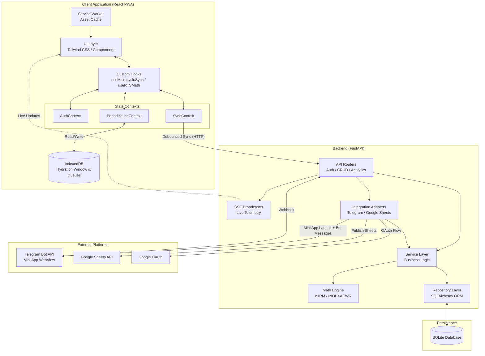
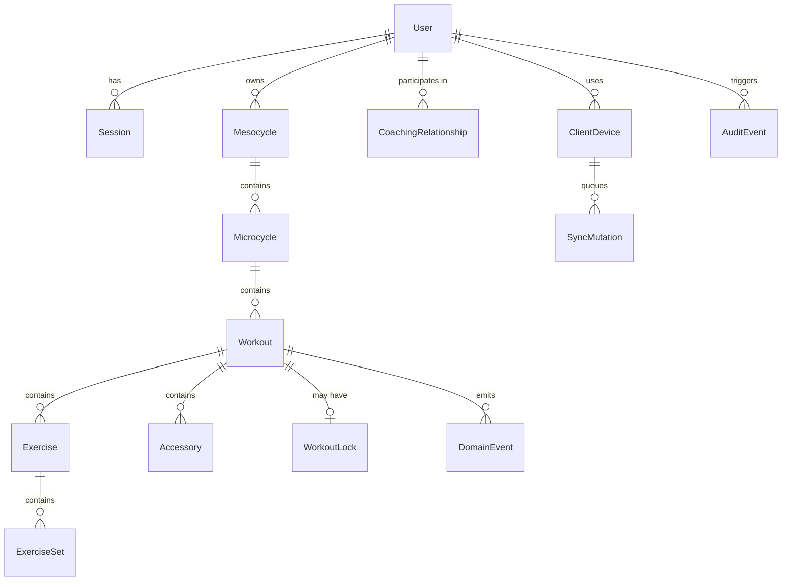
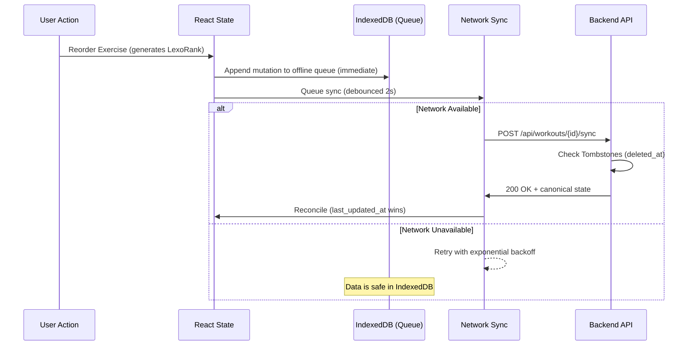
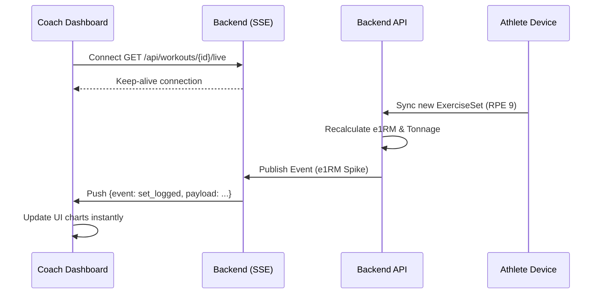
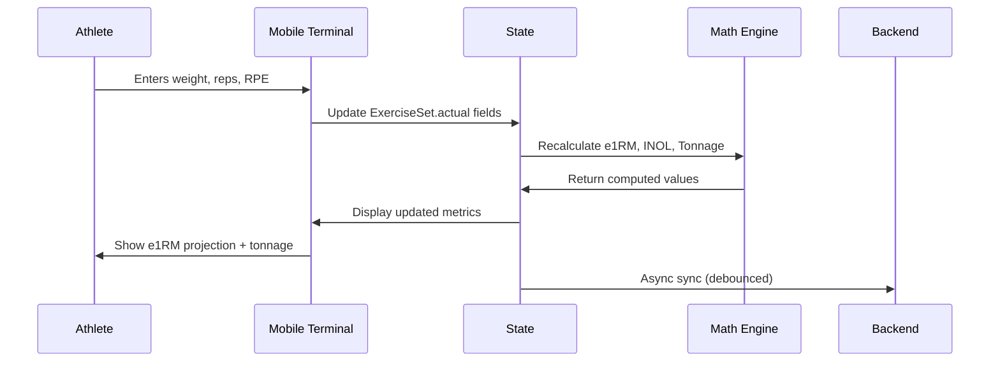
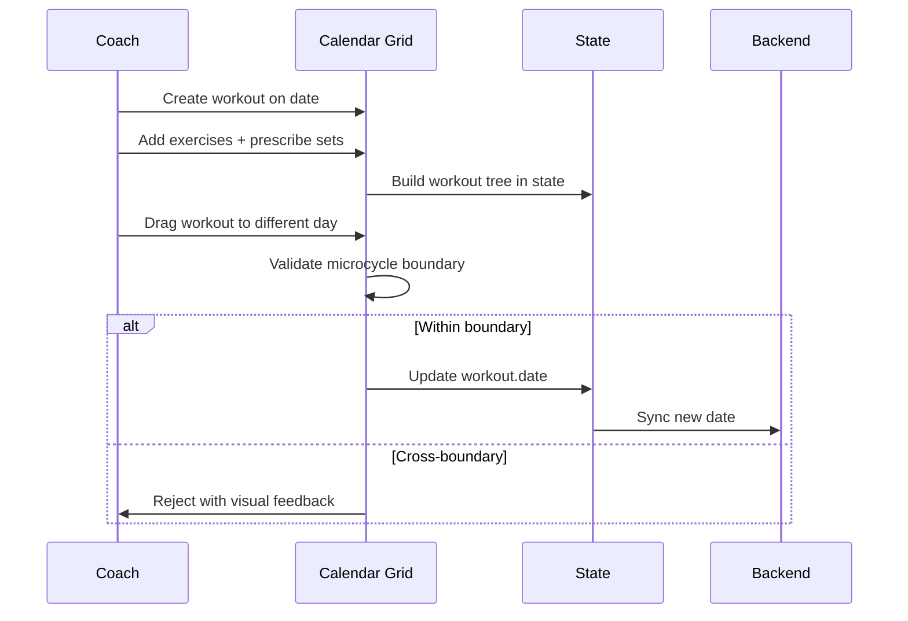
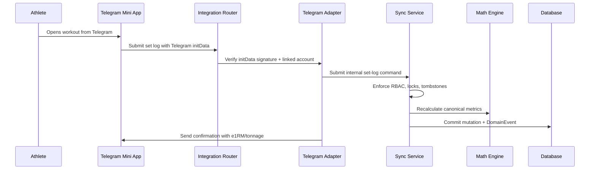
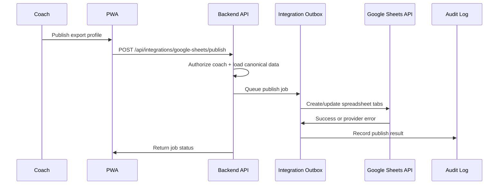
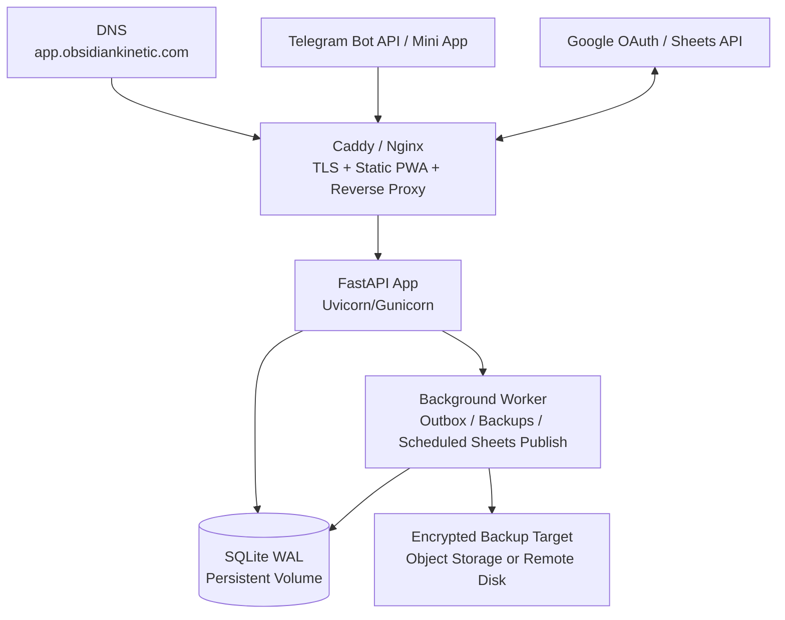

# Obsidian Kinetic - System Architecture

> **Document Status:** Architecture Reference  
> **System:** Obsidian Kinetic Periodization Dashboard  
> **Foundation:** Mike Tuchscherer's Reactive Training Systems (RTS) - Autoregulated Training  
> **Companion Document:** `design.md` (Visual Design System & Style Guide)

---

## Table of Contents

1. [Executive Summary](#1-executive-summary)
2. [Glossary of Domain Terminology](#2-glossary-of-domain-terminology)
3. [Architectural Tenets & Constraints](#3-architectural-tenets--constraints)
4. [System Context & Component Architecture](#4-system-context--component-architecture)
5. [Domain Model & Entity Relationships](#5-domain-model--entity-relationships)
6. [Mathematical Core & Physiological Models](#6-mathematical-core-physiological-models)
7. [State Management & Data Flow](#7-state-management--data-flow)
8. [Critical User Flows](#8-critical-user-flows)
9. [Security, Compliance & Access Control](#9-security-compliance--access-control)
10. [API Design & Contract](#10-api-design--contract)
11. [Error Handling, Observability & Resilience](#11-error-handling-observability--resilience)
12. [Testing & Quality Assurance](#12-testing--quality-assurance)
13. [Technology Stack & Project Structure](#13-technology-stack--project-structure)
14. [Data Exchange & Integration](#14-data-exchange--integration)
15. [Deployment & Operations](#15-deployment--operations)
16. [Performance Budget & Targets](#16-performance-budget--targets)
17. [Future Roadmap](#17-future-roadmap)
18. [Architecture Decision Log](#18-architecture-decision-log)

---

## 1. Executive Summary

Obsidian Kinetic is a powerlifting periodization dashboard that replaces rigid spreadsheets with a dynamic, auto-regulatory planning and logging system. It serves two distinct user personas - **Coaches** who design mesocycle-level training blocks and prescribe workouts, and **Athletes** who execute sessions on the gym floor, logging weight, reps, and RPE in real-time.

The system's core differentiator is its **RTS Math Engine**, which delivers real-time e1RM projections, INOL fatigue tracking, and ACWR workload diagnostics directly within the training grid. This gives coaches objective, chronologically-sound metrics to autoregulate loading without requiring complex external spreadsheets.

---

## 2. Glossary of Domain Terminology

Understanding the RTS methodology is essential for working with this system. All domain terms used throughout this document are defined here.

| Term | Definition |
| :--- | :--- |
| **RPE** | Rate of Perceived Exertion (Borg CR-10 scale). RPE 10 = absolute failure. RPE 8 = two reps remaining in reserve. |
| **RIR** | Reps In Reserve. The inverse representation of RPE. `RIR = 10 - RPE`. |
| **e1RM** | Estimated One-Rep Maximum. The projected maximum single-rep lift calculated from a submaximal set using RPE-adjusted formulas. |
| **INOL** | Intensity Number of Lifts. A per-lift fatigue metric quantifying how much training stress a single movement receives within a time window. |
| **ACWR** | Acute-Chronic Workload Ratio. A CNS recovery diagnostic comparing recent 7-day training load against the rolling 28-day average. |
| **Tonnage** | Total mechanical work in a session. `Sum(Weight * Reps)` across all working sets. |
| **Mesocycle** | A macro-level training block (typically 4-8 weeks) with a specific phase goal (hypertrophy, strength, peaking, deload). |
| **Microcycle** | A single training week within a mesocycle. The primary scheduling unit. |
| **Tier** | Exercise classification: **Comp** (competition lift), **Variation** (close derivative), **Accessory** (isolation/bodybuilding). |
| **Lift Category** | Movement pattern classifier: Squat, Bench, Deadlift, or Other. Used for INOL grouping and export gating. |
| **Top Set** | The heaviest or most fatiguing set in an exercise block. Flagged with `isTop` for e1RM tracking. |
| **Effective Reps** | The total number of reps the body treats as fatiguing, including the implied reps-in-reserve. Formalized as `Reps + (10 - RPE)`. Used by the RPE-Compensated Linear Decay e1RM formula. |
| **DOTS** | A bodyweight-normalized strength coefficient allowing cross-weight-class comparison of powerlifting totals. |

---

## 3. Architectural Tenets & Constraints

These are the non-negotiable principles governing all design decisions.

### 3.1 Core Tenets

1. **Data Integrity Above All**  
   Fatigue tracking depends on mathematical precision. Every calculation must produce identical results whether computed on the frontend or backend.
2. **Offline-Tolerant Reactivity (PWA First)**  
   Athletes train in environments with poor connectivity. The system must allow complete session logging, reordering, and viewing without network access, syncing transparently when connectivity returns. The application must boot offline as a true Progressive Web App.
3. **Chronological Binding**  
   Every workout is bound to a calendar date (`YYYY-MM-DD`). ACWR and INOL metrics rely on accurate chronological ordering. Drag-and-drop rescheduling must never silently break date assignments.
4. **Append-Only Immutability (Soft Deletes)**  
   Data is never hard-deleted. We utilize tombstones (`deleted_at`) to ensure sync conflict resolution logic can gracefully reject offline updates to entities that have been removed.
5. **Server-Canonical, Client-Responsive**  
   The client may compute provisional metrics for immediate feedback, but the backend always returns the canonical persisted state after sync. 

### 3.2 Key Constraints

* **Single-Writer per Workout**: Only one user (coach or athlete) may have a workout in an editable state at a time to prevent merge conflicts.
* **Microcycle Boundary Lock**: Workouts cannot be dragged across microcycle boundaries. This is a hard constraint.
* **Fractional Indexing for Order**: Array-based indexing is strictly forbidden for user-ordered lists (Exercises, Sets) to prevent offline sync conflicts.
* **Date-Only Scheduling**: Workout dates are stored as date-only values (`YYYY-MM-DD`). Timestamps are reserved for audit and sync metadata.

---

## 4. System Context & Component Architecture

### 4.1 High-Level System Diagram



### 4.2 Layer Responsibilities

| Layer | Responsibility | May NOT |
| :--- | :--- | :--- |
| **UI Components** | Render Tailwind markup, capture user input, display computed values | Contain business logic, call APIs directly |
| **Service Worker** | Aggressively cache static assets and HTML shell for offline boot | Mutate business data payloads |
| **Custom Hooks** | Orchestrate state reads/writes, trigger sync, compute derived values | Own persistent storage schemas or bypass service APIs |
| **State (Context)** | Hold the current client-side data tree across Auth, Sync, and Domain data | Perform network calls or encode API contracts |
| **API Routers** | Parse HTTP requests, validate input via Pydantic, enforce auth | Contain business logic or SQL queries |
| **SSE Broadcaster** | Push real-time metric updates to connected coach sessions | Persist data or block HTTP routers |
| **Integration Adapters** | Translate Telegram/Google payloads into internal commands and queued jobs | Bypass RBAC, mutate ORM models directly, or become canonical data stores |
| **Service Layer** | Execute business rules, orchestrate calculations, enforce constraints | Import SQLAlchemy models directly in routers |
| **Repository Layer** | Execute SQLAlchemy queries, map between ORM models and domain objects | Hard-delete records |
| **Math Engine** | Pure functions computing e1RM, INOL, ACWR, DOTS, and attempt suggestions | Read client state, database state, or wall-clock time |

### 4.3 Source-of-Truth Boundaries

The client is responsive and offline-capable, but the backend remains canonical for persisted data and analytics.

| Data Class | Client Responsibility | Backend Responsibility |
| :--- | :--- | :--- |
| Auth state | Hold derived login status only | Issue cookies, validate sessions, revoke sessions |
| Workout tree | Render optimistic state and queue mutations | Validate ownership, persist accepted mutations, return canonical payload |
| Math outputs | Compute provisional values for immediate feedback | Recompute canonical values after every accepted mutation |
| Ordering | Generate fractional ranks during local reorders | Validate rank format, persist rank, rebalance if rank strings become too long |
| Tombstones | Hide deleted records and purge acknowledged tombstones from active views | Reject writes to tombstoned entities and retain tombstones until sync horizon expires |
| Live telemetry | Subscribe and render SSE events | Publish committed domain events only after transaction success |
| External integrations | Display connection state and initiate link/unlink flows | Own provider credentials, webhook verification, and provider-specific retry state |

---

## 5. Domain Model & Entity Relationships

The core training hierarchy remains simple, while sync/session/audit entities sit beside it to support offline behavior and security.



### 5.1 Entity Definitions

All entities inherit an `updated_at` and `deleted_at` (tombstone) timestamp for sync resolution.

| Entity | Key | Core Attributes | Relationships |
| :--- | :--- | :--- | :--- |
| **User** | `id` (UUID) | `email`, `role`, `subscription_status` | Owns Mesocycles, participates in CoachingRelationships |
| **CoachingRelationship** | `id` (Int) | `coach_id`, `athlete_id`, `created_at`, `ended_at` | Links one coach to one athlete |
| **Mesocycle** | `id` (String) | `name`, `status`, `color`, `startDate`, `endDate` | Contains Microcycles |
| **Microcycle** | `id` (String) | `weekName`, `status`, `startDate`, `endDate` | Belongs to Mesocycle; contains Workouts |
| **Workout** | `id` (String) | `date`, `dayLabel`, `title`, `status`, `athlete_bw` | Belongs to Microcycle |
| **Exercise** | `id` (String) | `title`, `lexo_rank`, `tier`, `lift_category`, `deleted_at` | Belongs to Workout |
| **ExerciseSet** | `id` (String) | `lexo_rank`, `planned`, `actual`, `reps`, `executedRpe`, `deleted_at` | Belongs to Exercise |
| **Accessory** | `id` (String) | `name`, `lexo_rank`, `status`, `deleted_at` | Belongs to Workout |

### 5.2 Domain Invariants

| Invariant | Enforcement |
| :--- | :--- |
| **Tombstone Integrity**: Updates to records with `deleted_at != null` are strictly rejected. | Service-layer sync validation |
| **State Machine Lock**: A workout in `COMPLETED` state rejects execution mutations unless reverted to `IN_PROGRESS`. | Pydantic schema / Service layer |
| **LexoRank Order**: Ordering strings (`lexo_rank`) must maintain lexical sortability without integer collisions. | Client generation, DB indexing |
| `Workout.date` must fall within parent `Microcycle.startDate` and `endDate` | Server validation |

### 5.3 Lifecycle Status Values

Statuses are stored as enums rather than display strings. Transitions are strict state machines.

| Entity | Status Values | Execution Locks |
| :--- | :--- | :--- |
| `Mesocycle` | `DRAFT`, `ACTIVE`, `COMPLETED`, `ARCHIVED` | - |
| `Microcycle` | `DRAFT`, `ACTIVE`, `COMPLETED`, `LOCKED` | `LOCKED` prevents structural edits. |
| `Workout` | `PLANNED`, `IN_PROGRESS`, `COMPLETED`, `MISSED` | `COMPLETED` locks set-level mutations. |

Allowed transitions are explicit:

| Entity | Allowed Transitions |
| :--- | :--- |
| `Mesocycle` | `DRAFT -> ACTIVE -> COMPLETED -> ARCHIVED` |
| `Microcycle` | `DRAFT -> ACTIVE -> COMPLETED -> LOCKED` |
| `Workout` | `PLANNED -> IN_PROGRESS -> COMPLETED`; `PLANNED -> MISSED`; `COMPLETED -> IN_PROGRESS` only through explicit reopen |

Only one mesocycle may be `ACTIVE` per athlete at a time.

### 5.4 Persistence Support Entities

These entities are not part of the training hierarchy, but they are required to make offline sync, revocation, and auditability concrete.

| Entity | Key Fields | Purpose |
| :--- | :--- | :--- |
| **ClientDevice** | `id`, `user_id`, `device_label`, `last_seen_at`, `revoked_at` | Scopes offline mutation IDs and lets users revoke lost devices. |
| **Session** | `id`, `user_id`, `jwt_id`, `expires_at`, `revoked_at` | Makes cookie-based JWT sessions revocable despite signed tokens being stateless. |
| **SyncMutation** | `mutation_id`, `client_device_id`, `entity_type`, `entity_id`, `field_path`, `updated_at`, `applied_at`, `result` | Provides idempotency and replay protection for offline queue retries. |
| **WorkoutLock** | `workout_id`, `holder_user_id`, `mode`, `expires_at`, `version` | Enforces the single-writer-per-workout constraint. |
| **AuditEvent** | `id`, `actor_user_id`, `event_type`, `resource_type`, `resource_id`, `created_at`, `metadata_json` | Records security, export, deletion, and conflict events. |
| **InviteCode** | `id`, `coach_id`, `code_hash`, `expires_at`, `used_at` | Supports short-lived coach-athlete linking without storing raw invite codes. |
| **DomainEvent** | `id`, `workout_id`, `event_type`, `payload_json`, `created_at` | Feeds SSE telemetry after database commit. |
| **IntegrationConnection** | `id`, `user_id`, `provider`, `external_account_id`, `status`, `scopes`, `created_at`, `revoked_at` | Tracks Telegram and Google Sheets connections without exposing provider credentials. |
| **IntegrationCredential** | `connection_id`, `credential_type`, `encrypted_payload`, `expires_at`, `rotated_at` | Stores Telegram chat IDs, Mini App identifiers, webhook secrets, OAuth refresh tokens, and access-token metadata encrypted at rest. |
| **WebhookEvent** | `id`, `provider`, `external_event_id`, `received_at`, `processed_at`, `status` | Deduplicates Telegram webhook retries and preserves processing history. |
| **IntegrationOutbox** | `id`, `provider`, `connection_id`, `payload_json`, `status`, `retry_after`, `attempt_count` | Queues outbound Telegram messages and Google Sheets publish jobs. |
| **SheetPublication** | `id`, `coach_id`, `spreadsheet_id`, `worksheet_name`, `export_profile`, `last_published_at`, `status` | Stores a coach-controlled Google Sheets publishing target. |

### 5.5 Database Indexing Strategy

Indexes should be declared with migrations, not created opportunistically at runtime.

| Index | Reason |
| :--- | :--- |
| `workouts(microcycle_id, date)` | Fast calendar and boundary validation lookups. |
| `exercises(workout_id, lexo_rank)` | Stable exercise ordering inside a workout. |
| `exercise_sets(exercise_id, lexo_rank)` | Stable set ordering inside an exercise. |
| `exercise_sets(exercise_id, isTop)` | Fast top-set/e1RM extraction. |
| `exercises(lift_category, tier)` | Export and INOL grouping without string scanning. |
| `sync_mutations(client_device_id, mutation_id)` unique | Idempotency for offline replay. |
| `audit_events(actor_user_id, created_at)` | Account history and compliance review. |
| `domain_events(workout_id, created_at)` | SSE reconnect and event replay. |
| `integration_connections(user_id, provider)` | Fast integration settings lookup and one active connection per provider. |
| `webhook_events(provider, external_event_id)` unique | Provider webhook idempotency. |
| `integration_outbox(status, retry_after)` | Efficient retry scanning for outbound provider calls. |
| `sheet_publications(coach_id, status)` | Coach dashboard listing and scheduled publish jobs. |

---

## 6. Mathematical Core & Physiological Models

All formulas must be computed identically on both the client (for zero-latency UI reactivity) and the backend (for canonical data persistence). The backend remains the final arbiter of truth.

### 6.1 Math Engine Contract

The math engine is implemented as pure, stateless functions with explicit input and output units. Shared JSON test vectors are maintained to enforce complete calculation parity across the TypeScript/React frontend and the Python/FastAPI backend.

| Function | Required Inputs | Output | Precision & Rounding Rules |
| :--- | :--- | :--- | :--- |
| `calculateE1RM` | `weight: float`, `reps: int`, `rpe: float` | Numeric e1RM | Persisted at full precision; rounded to 2 decimals for display/DB storage. |
| `calculateINOL` | `reps: int`, `intensity_pct: float` | Numeric INOL | Persisted at full precision; rounded to 2 decimals. |
| `calculateACWR` | Array of workout structures | Array of day records | Trailing tonnage series filled daily; ratios rounded to 2 decimals. |
| `calculateDOTS` | `gender: str`, `bodyweight: float`, `total: float` | Numeric DOTS | Denominator absolute-valued; output rounded to 2 decimals. |

### 6.2 Estimated 1RM (e1RM) - RPE-Compensated Linear Decay

To align system behavior with the actual codebase, the estimated one-rep maximum (e1RM) is computed using an **RPE-Compensated Linear Decay** formula rather than the classic Brzycki equation. This model assumes a linear 3% performance reduction for each effective rep away from a true 1RM:

$$\text{Effective Reps} = \text{Reps} + (10 - \text{RPE})$$

$$\text{Effective Drop \%} = 0.03 \times (\text{Effective Reps} - 1) = 0.03 \times (\text{Reps} + 10 - \text{RPE} - 1)$$

$$\text{e1RM} = \frac{\text{Weight}}{1.0 - \text{Effective Drop \%}}$$

#### 6.2.1 Boundary Constraints & Guards
- **Null Inputs**: If `weight <= 0` or `reps <= 0`, return `0.0`.
- **Reliability Fallback**: If `RPE < 6.0` or `reps > 12`, e1RM calculations are physiologically unreliable. The calculator must bypass linear decay and return the raw `weight` as a safe fallback.
- **Metabolic Drop-off Cap**: For high-rep sets (e.g., backoffs), the linear decay is capped to prevent absurdly inflated 1RM projections. If `Effective Drop % > 0.25`, the value is constrained to `0.25` (representing a maximum 25% drop).
- **Zero-Division Guard**: If `denominator <= 0.1` (where `denominator = 1.0 - Effective Drop %`), the calculation is aborted, and the raw `weight` is returned.

### 6.3 INOL - Intensity Number of Lifts

Intensity Number of Lifts (INOL) quantifies the cumulative training stress of a single lift category across a given time frame. It prevents overtraining on competition lifts:

$$\text{Intensity \%} = \frac{\text{Weight}}{\text{e1RM}} \times 100$$

$$\text{INOL} = \frac{\text{Reps}}{100.0 - \text{Intensity \%}}$$

#### 6.3.1 Boundary Constraints & Guards
- **Intensity Cap**: If `Intensity % >= 100.0` (lifting at or above e1RM), the calculation is capped at `reps * 1.0` to avoid division-by-zero or negative fatigue scores.
- **Zero Work Guard**: If `Intensity % <= 0.0` or raw inputs are negative, return `0.0`.
- **Display Interpretation Thresholds** (per lift category, per week):
  - `< 1.0`: Recovery-compatible (optimal for deloads and general accumulation)
  - `1.0 - 2.0`: Productive overreach (normal training stimulus zone)
  - `> 2.0`: High injury / CNS overtraining risk (requires immediate load or volume review)

### 6.4 ACWR - Acute-Chronic Workload Ratio

The Acute-Chronic Workload Ratio (ACWR) monitors the relationship between short-term fatigue (acute workload) and long-term fitness/readiness (chronic workload). It is bound to chronological calendar dates (`YYYY-MM-DD`):

$$\text{ACWR} = \frac{\text{Acute Workload (7-day Tonnage Sum)}}{\text{Chronic Daily Average} \times 7}$$

Where $\text{Chronic Daily Average} = \frac{\text{Chronic Workload (28-day Tonnage Sum)}}{28}$. This simplifies the equation to a direct ratio:

$$\text{ACWR} = \frac{\text{Acute Tonnage Sum}}{\text{Chronic Tonnage Sum} / 4.0}$$

#### 6.4.1 Chronological Gap-Filling & Sparse History (Cold Start)
- **Tonnage Summation**: Daily tonnage is calculated as $\sum (\text{Actual Weight} \times \text{Reps})$ across all completed exercise sets.
- **Gap-Filling**: The time-series engine automatically generates all consecutive calendar dates between the first and last recorded workouts. Dates without workouts are explicitly filled with `0.0` tonnage to properly model biological fitness decay.
- **Pre-Padding (Cold Start Solution)**: To prevent mathematical "cold starts" and chart rendering crashes for athletes with less than 28 days of history, the engine automatically **pre-pads the timeline with 27 days of 0.0 tonnage** prior to the first workout date. This guarantees that every actual workout date has a valid, 28-day trailing window.
- **Zero-Division Guard**: If `Chronic Daily Average == 0.0`, the system returns `1.0` if `Acute Workload == 0.0`, and `0.0` otherwise (to handle theoretical floating point bounds safely).

#### 6.4.2 Workload Risk Zones
The ACWR outputs are categorized into discrete zones to guide auto-regulatory adjustments:
- `acwr < 0.8`: **UNDER_TRAINING** (detraining risk / insufficient physiological stimulus)
- `0.8 <= acwr <= 1.3`: **OPTIMAL_ZONE** (optimal progression / the "sweet spot" for adaptation)
- `1.3 < acwr <= 1.5`: **ELEVATED_FATIGUE** (elevated fatigue / caution advised for loading)
- `acwr > 1.5`: **DANGER_ZONE** (danger zone / critical spike in workload, high injury risk)

### 6.5 DOTS Lifter Coefficient

The DOTS coefficient normalizes powerlifting totals across bodyweight classes and sexes. The system utilizes high-precision, absolute-valued fifth-order polynomials:

$$\text{DOTS} = \frac{\text{Total} \times 500}{|A + B \cdot \text{BW} + C \cdot \text{BW}^2 + D \cdot \text{BW}^3 + E \cdot \text{BW}^4 + F \cdot \text{BW}^5|}$$

Where $\text{BW}$ is the athlete's bodyweight in kilograms and $\text{Total}$ is the sum of their squat, bench, and deadlift maximums in kilograms.

#### 6.5.1 Coefficient Values Table
The polynomial variables are strictly segregated by sex to maintain administrative domain accuracy:

| Coefficient | MALE | FEMALE |
| :--- | :--- | :--- |
| **A** | `-301.121601` | `-57.9628886` |
| **B** (linear) | `7.36780443` | `4.25433917` |
| **C** (quadratic) | `-0.0558457223` | `-0.0384807498` |
| **D** (cubic) | `0.000188177439` | `0.000177727402` |
| **E** (quartic) | `-0.000000282121544` | `-0.000000412850389` |
| **F** (quintic) | `0.000000000171720513` | `0.000000000416960297` |

#### 6.5.2 Boundary Guards
- If `bodyweight <= 0` or `total <= 0`, return `0.0`.
- The absolute value gate is applied to the denominator to prevent negative coefficient outcomes. If the denominator evaluates to `0`, return `0.0`.

### 6.6 Attempt Selection Calculator (Meet Day Planner)

To assist with competition day logistics, the system projects subsequent attempts from a designated 1st attempt (opener). Projections are strictly rounded to standard **2.5kg competition plate increments** to remain compatible with physical bar loading.

- **Opener (1st Attempt)**: Entered manually by the coach/athlete.
- **2nd Attempt Suggested Range**: Projected as `Opener * 1.075` (minimum) to `Opener * 1.10` (maximum), rounded to the nearest 2.5kg.
  - *Non-Overlapping Guard*: If `min_second >= max_second` after rounding, force `max_second = min_second + 2.5`.
- **3rd Attempt Suggested Ceiling**: Calculated based on lift type (profile) and sex:
  - **Squat and Deadlift**: `max_second * 1.10`, rounded to the nearest 2.5kg.
  - **Bench Press (Male)**: `max_second + 10.0` kg.
  - **Bench Press (Female)**: `max_second + 4.0` kg.

#### 6.6.1 Missed Attempt Transition Rules
Meet day attempt selection is highly volatile. If a lifter misses an attempt:
1. **Missed Opener/2nd due to Technicality**: Suggest repeating the target weight to secure a successful lift.
2. **Missed Opener/2nd due to Strength Failure**: Re-calculate subsequent ceilings, capping them at the failed weight, and prompt the coach to manually adjust downward.
3. **Human-in-the-Loop Override**: The calculator provides structured suggestions, but the UI must always allow the coach to input manual overrides to account for real-time tactical changes.

### 6.7 Velocity-Based Training (VBT) & Fatigue Percents

#### 6.7.1 Velocity-RPE Profiling
Mean Concentric Velocity (MCV) measured in meters per second (m/s) provides an objective measure of daily neuromuscular readiness. The system maps MCV to RPE for major compound lifts (Squat, Bench, Deadlift):

$$\text{RPE} = 10.0 - \frac{\text{MCV}_{\text{measured}} - \text{MCV}_{\text{limit}}}{\text{MCV}_{\text{step}}}$$

Where:
- $\text{MCV}_{\text{limit}}$ is the velocity at absolute failure (RPE 10), typically established as `0.15` m/s for Squat/Deadlift and `0.10` m/s for Bench.
- $\text{MCV}_{\text{step}}$ is the typical drop in velocity per rep remaining in reserve (usually `0.07` to `0.09` m/s per RPE unit).

#### 6.7.2 Fatigue Percent Backdown Calculations
Coaches prescribe backdown sets using a target **Fatigue Percent** (e.g., 5% fatigue drop). This represents the target drop in performance from the daily peak (the "top set"):

$$\text{Target Backdown Weight} = \text{Top Set Weight} \times (1.0 - \text{Fatigue \%})$$

When the athlete holds the weight constant, the 5% fatigue threshold is hit when the execution RPE rises by exactly one full RPE unit (representing a 5% drop in e1RM due to fatigue buildup) or when the execution velocity drops by a corresponding margin.

#### 6.7.3 VBT MCV Storage, Indexing, and Querying Engine Schema
To track daily neuromuscular velocity and fatigue progression, the database defines a specialized time-series telemetry table:

```sql
CREATE TABLE vbt_telemetry (
    id TEXT PRIMARY KEY,                       -- UUID v4
    set_id TEXT NOT NULL,                      -- References exercise_sets(id)
    athlete_id TEXT NOT NULL,                  -- References users(id)
    exercise_id TEXT NOT NULL,                 -- References exercises(id)
    rep_number INTEGER NOT NULL,               -- 1-based index of the rep within the set
    mcv_mps REAL NOT NULL,                     -- Mean Concentric Velocity (float32, in m/s)
    peak_velocity_mps REAL NOT NULL,           -- Peak Concentric Velocity (float32, in m/s)
    loss_percent REAL NOT NULL,                -- Percentage loss relative to first rep of the set
    measured_at TIMESTAMP DEFAULT CURRENT_TIMESTAMP,
    FOREIGN KEY(set_id) REFERENCES exercise_sets(id) ON DELETE CASCADE,
    FOREIGN KEY(athlete_id) REFERENCES users(id) ON DELETE CASCADE,
    FOREIGN KEY(exercise_id) REFERENCES exercises(id) ON DELETE CASCADE
);

-- Indexing structure for rapid dashboard plotting and time-series querying
CREATE INDEX idx_vbt_athlete_exercise ON vbt_telemetry(athlete_id, exercise_id, measured_at DESC);
CREATE UNIQUE INDEX idx_vbt_set_rep ON vbt_telemetry(set_id, rep_number);
```

For daily readiness assessments, the query aggregation engine evaluates the athlete's peak mean concentric velocity on submaximal sets compared against their rolling 28-day historical baseline:

$$\text{Readiness Index} = \frac{\text{MCV}_{\text{session\_opener}}}{\text{MCV}_{\text{baseline\_rolling\_28d}}}$$

### 6.8 Units, Precision, and Display Rules

- **Canonical Weight Unit**: All weight data is persisted and processed in **kilograms (kg)**. Metric representation ensures consistency across physiological models.
- **Unit Conversions (kg / lbs)**: Conversions for display are strictly visual. Pounds are calculated as $\text{lbs} = \text{kg} \times 2.20462$, and rounded to the nearest standard plate increment (typically 0.5 lbs or 1 lb) for user comfort.
- **RPE Inputs**: RPE must be entered in increments of `0.5` units on the Borg CR-10 scale.
- **Data Serialization**: Numeric training values must never be stored as strings. Raw values are kept as decimals in persistence, and visual rounding is isolated entirely to the rendering layer. Export headers must clearly indicate the canonical unit when outputting numeric fields (e.g., `planned_weight_kg`).

### 6.9 Systemic Central Nervous System (CNS) Fatigue Curve Equation
To model cumulative physical fatigue in the Readiness Wave, the engine uses a deterministic multi-factor exponential decay algorithm. CNS fatigue decays chronologically over a 7-day rolling window:

$$\text{CNS Fatigue}(t) = \sum_{d=0}^{6} \left( \sum_{s \in S_d} (\text{INOL}_s \cdot w_{\text{tier}(s)}) \cdot e^{-\lambda (t - d)} \right)$$

Where:
- $\text{INOL}_s$: The Intensity Number of Lifts fatigue score calculated for a single completed set $s$.
- $w_{\text{tier}(s)}$: Weighting multiplier based on exercise tier specificity:
  - **Competition Lift (`Comp`)**: `1.2`
  - **Variation Lift (`Variation`)**: `1.0`
  - **Accessory Lift (`Accessory`)**: `0.5`
- $\lambda$: Central nervous system fatigue exponential decay rate constant. It is strictly configured as $\lambda = 0.231$ per day, which represents a biological fatigue half-life $t_{1/2}$ of exactly 3.0 days ($e^{-0.231 \times 3} \approx 0.50$).
- $t$: Current chronological day index (0 to 6 within the microcycle).
- $d$: Historical day index (0 to 6) representing when the set was executed.
- $S_d$: The collection of completed exercise sets logged on day $d$.

The deterministic execution algorithm is run concurrently on both the frontend and backend:

```python
def calculate_systemic_cns_fatigue(workouts: list, target_date: datetime.date) -> float:
    total_fatigue = 0.0
    decay_constant = 0.231
    tier_weights = {"comp": 1.2, "variation": 1.0, "accessory": 0.5}
    
    for day_offset in range(7):
        eval_date = target_date - timedelta(days=day_offset)
        workout = find_workout_by_date(workouts, eval_date)
        if not workout or workout.status != "COMPLETED":
            continue
            
        daily_stress = 0.0
        for exercise in workout.exercises:
            w_tier = tier_weights.get(exercise.tier.lower(), 0.5)
            for set_record in exercise.sets:
                if set_record.actual_weight and set_record.actual_reps and set_record.executed_rpe:
                    inol = calculate_inol(set_record.actual_reps, set_record.intensity_pct)
                    daily_stress += inol * w_tier
                    
        # Apply exponential decay
        total_fatigue += daily_stress * math.exp(-decay_constant * day_offset)
        
    return round(total_fatigue, 2)
```

---

## 7. State Management & Data Flow

### 7.1 Offline-First Sync Architecture



### 7.1.1 IndexedDB Local Store Schema

The offline store is versioned independently from the API. Migrations must be additive when possible and must never drop unsynced mutations.

| Object Store | Key | Contents |
| :--- | :--- | :--- |
| `snapshots` | `entity_type:id` | Last canonical payload received from backend for workouts, microcycles, and analytics windows. |
| `mutations` | `client_device_id:mutation_id` | Pending and acknowledged mutations, including retry count and last error. |
| `tombstones` | `entity_type:id` | Deleted records retained until the backend confirms the sync horizon has passed. |
| `metadata` | `key` | Store version, active athlete, hydration window boundaries, and last successful sync timestamp. |

Mutation queue states are `PENDING`, `IN_FLIGHT`, `ACKED`, `REJECTED`, and `CONFLICTED`. On boot, any `IN_FLIGHT` mutation older than 30 seconds is returned to `PENDING` before retry.

### 7.2 Fractional Indexing (LexoRank) for Reordering

To solve the complex problem of offline drag-and-drop ordering, all ordered lists (`Exercises`, `ExerciseSets`) use a deterministic **Fractional Indexing** (LexoRank) algorithm.

#### 7.2.1 Core Lexical Specifications
- **Alphabet**: The sorting string relies on standard Base36 ASCII printable characters: `0123456789abcdefghijklmnopqrstuvwxyz`. Ranks are sorted lexically (character by character, left to right).
- **String Bounds**: Ranks must operate between `0` (inclusive lower bound) and `z` (inclusive upper bound). 
- **Active Buckets**: To support zero-downtime, conflict-free database rebalancing, the system defines three sequence buckets: `0`, `1`, and `2`. Active reorders by clients are written into the current active bucket (stored in system metadata). During database rebalances, the backend rewrites all elements into the next incremented bucket (e.g., from `0` to `1` or `2` to `0`), and updates the metadata to toggle client active write targets.
- **Rebalance Threshold**: If a rank string's length exceeds `32` characters, it triggers an asynchronous backend job to perform a linear rebalance across the sibling list.
- **Collision Override**: If simultaneous offline edits produce duplicate rank strings, the backend sync engine resolves the conflict by appending the smallest lexical character `1` (or incrementing the trailing character) to the lower-timestamp record to ensure index uniqueness.

#### 7.2.2 Precise Midpoint Calculation Logic
Let $L$ be the string rank to the left and $R$ be the string rank to the right. The client calculates the mid-point rank utilizing high-precision string calculations:

```typescript
function calculateMidpoint(prev: string | null, next: string | null): string {
    const ALPHABET = "0123456789abcdefghijklmnopqrstuvwxyz";
    const BASE = BigInt(36);
    
    const p = prev || "0";
    const n = next || "z";
    
    const maxLen = Math.max(p.length, n.length) + 8; // Buffer space
    
    // Helper to parse rank string to BigInt numeric base
    const rankToBigInt = (str: string): bigint => {
        let val = 0n;
        for (let i = 0; i < maxLen; i++) {
            const char = str[i] || "0";
            const index = BigInt(ALPHABET.indexOf(char));
            val = val * BASE + index;
        }
        return val;
    };

    // Helper to stringify BigInt numeric base back to rank
    const bigIntToRank = (num: bigint): string => {
        let str = "";
        let temp = num;
        for (let i = 0; i < maxLen; i++) {
            const rem = temp % BASE;
            str = ALPHABET[Number(rem)] + str;
            temp = temp / BASE;
        }
        return str;
    };
    
    const pVal = rankToBigInt(p.padEnd(maxLen, "0"));
    const nVal = rankToBigInt(n.padEnd(maxLen, "0"));
    
    if (nVal - pVal <= 1n) {
        // No space remaining in the padded window; append character to left
        return p + "h"; 
    }
    
    const midVal = pVal + (nVal - pVal) / 2n;
    const midStr = bigIntToRank(midVal).replace(/0+$/, "");
    
    // Strict separation guard
    if (midStr <= p) {
        return p + "h";
    }
    return midStr;
}
```

### 7.3 Soft Deletes (Tombstones)

When an entity is deleted, it is flagged with `deleted_at = current_timestamp`. 
- **The Client:** Filters out all entities where `deleted_at != null` in views.
- **The Sync Engine:** If an offline client attempts to modify an `ExerciseSet` that a coach deleted on the desktop, the backend detects `deleted_at != null` and rejects the mutation, passing down the tombstone to purge it from the client's local store.

### 7.4 State Machine Execution Locks

When an athlete finishes a workout, they mark it as `COMPLETED`. This locks the workout. Any subsequent offline mutations remaining in the queue, or accidental future touches on the screen, are rejected by the sync engine unless the user explicitly clicks "Re-open Session" (transitioning to `IN_PROGRESS`).

#### 7.4.1 Workout Lock Lease & Concurrency Engine
To enforce the single-writer-per-workout constraint and prevent state desynchronization during rapid multi-device logging or offline merging, the system implements a robust, SQL-backed distributed lease model.

##### A. Workout Locks Schema
```sql
CREATE TABLE workout_locks (
    workout_id TEXT PRIMARY KEY,
    holder_user_id TEXT NOT NULL,
    fencing_token BIGINT NOT NULL,           -- Auto-incrementing counter per workout lock cycle
    expires_at TIMESTAMP NOT NULL,
    acquired_at TIMESTAMP DEFAULT CURRENT_TIMESTAMP,
    FOREIGN KEY(workout_id) REFERENCES workouts(id) ON DELETE CASCADE,
    FOREIGN KEY(holder_user_id) REFERENCES users(id) ON DELETE CASCADE
);
```

##### B. Lease Parameters & Lock Rules
1. **Lease Time-To-Live (TTL)**: The lock lease is issued with a strict TTL of **10 minutes** (`600` seconds) from `acquired_at` or last renewal.
2. **Client Heartbeat Interval**: Clients actively holding the edit lock must transmit an asynchronous `/api/workouts/{id}/lock/renew` heartbeat every **2 minutes** (`120` seconds) to extend the lease expiry.
3. **Fencing Tokens (Split-Brain Prevention)**:
   - Every lock acquisition triggers a write that increments the `fencing_token` for that `workout_id`.
   - The client caches this `fencing_token` locally upon successful lock acquisition.
   - Every mutating request pushed in the sync queue **MUST** contain the client's cached `fencing_token` in its header payload.
   - On sync, the database validates:
     $$\text{fencing\_token}_{\text{request}} \geq \text{fencing\_token}_{\text{db}}$$
   - If the request token is lower than the database record, the backend immediately aborts the transaction, rolls back any partial writes, and responds with a `409 Conflict: Lock Lease Expired`.
4. **Offline Lock Recovery**: If an athlete logs a session offline, and their local lock lease expires and is subsequently acquired by a coach's device, the client device upon reconnecting will detect the `409 Conflict`. The UI must immediately isolate the conflicting offline set logs and display them side-by-side in the **Tombstone Conflict Review Panel** rather than overwriting the coach's changes.

---

### 7.5 Field-Level Timestamp Resolution

To maintain high performance and simplicity on mobile devices, the system avoids complex CRDTs (Conflict-free Replicated Data Types) in favor of **Field-Level Timestamp Resolution**.

1. Each field mutation carries `field`, `value`, `updated_at`, and `mutation_id`.
2. On sync, the backend compares `updated_at` values field-by-field and updates the parent entity's `last_updated_at` only after accepting the mutation.
3. **Last-write wins** resolves conflicts deterministically when the single-writer lock is not enough to prevent overlap.
4. Conflicting updates are preserved in an audit log for coach review to prevent silent data loss during simultaneous editing.
5. The sync response includes the accepted mutation IDs, rejected mutation IDs, canonical entity payload, and any conflict summaries.

Client clocks are treated as advisory. If `updated_at` is more than 5 minutes in the future relative to server time, the mutation is rejected with `CLIENT_CLOCK_SKEW`. The backend records both `client_updated_at` and `server_received_at` for auditability.

### 7.6 Drag & Drop Boundary Lock

Workouts are constrained within their parent microcycle:
- Dragging a workout from "Week 3" to "Week 4" is **rejected** at the UI layer.
- This prevents silent corruption of chronological fatigue metrics.
- The constraint is enforced both client-side (immediate UI feedback) and server-side (validation on sync).

### 7.7 Session (Workout) Creation & Prescription Engine

Before a microcycle can be templated, the baseline sessions must be authored. The UI flow enforces a structured hierarchy to ensure data integrity:
1. **Initialize Workout:** Coach creates a workout on a specific day (e.g., "Day 1").
2. **Add Exercises (Compound Lifts):** Coach selects an exercise from the canonical database. This automatically pulls and links standard lift categories and tags.
3. **Set Prescription Engine:** The system supports a multi-modal prescription syntax, allowing coaches to define loading parameters using Autoregulated (RPE), Percentage-based (% of e1RM / 1RM), or Open-ended (AMRAP) logic. This syntax is parsed by the backend to project expected tonnage and fatigue.
   - **Autoregulated (Top Set + Backdowns):** e.g., `1x3 @ RPE 8`, followed by `3x3 @ 5% fatigue drop`. Maximizes physiological precision by adjusting to daily readiness.
   - **Percentage-based (Straight Sets):** e.g., `4x5 @ 75%`. Utilizes classic periodization models for predictable, rigid progression.
   - **Open-ended (AMRAP):** e.g., `1xAMRAP @ 80%`. "As Many Reps As Possible." Frequently used as a microcycle testing protocol to recalculate e1RM ceilings without exposing the athlete to maximal loading risk.
   - **Hybrid Modalities:** e.g., `1x1 @ RPE 8` (to gauge daily strength), followed by `5x5 @ 70%` (anchored to the top set's performance).
4. **Add Accessories:** Coach adds secondary isolation movements (e.g., Bicep Curls) which are tracked for volume.

Prescription examples shown in the UI are display strings. Persisted prescriptions are structured JSON:

```json
{
  "mode": "TOP_SET_BACKDOWN",
  "top_set": { "sets": 1, "reps": 3, "target_rpe": 8 },
  "backdown": { "sets": 3, "reps": 3, "fatigue_drop_percent": 5 }
}
```

Supported `mode` values are `RPE_TARGET`, `PERCENTAGE`, `AMRAP`, `TOP_SET_BACKDOWN`, and `HYBRID`. The backend may render a human-readable prescription string from structured fields, but it must not parse business-critical instructions from freeform text.

### 7.8 Microcycle Templating & Block Generation

Because drag-and-drop is locked to single weeks, writing a full mesocycle (where weeks often share identical layouts) relies on **Microcycle Templating**.
- **Duplication Flow:** A coach designs Microcycle 1 (the baseline week) using the session creation flow above. They use a "Duplicate to Next Week" function, which copies the entire structure (Workouts, Exercises, Sets) into Microcycle 2.
- **Progression Editing:** The coach then only needs to adjust the specific progressions in Microcycle 2 (e.g., changing RPE 7 to RPE 8, or adding 5kg), vastly accelerating programming velocity without violating chronological boundary constraints.

### 7.9 Dynamic Volume Overload & Variation Match Resolution Engine
To display real-time microcycle-to-microcycle training progress, the system dynamically calculates progressive overload volume deltas. 

#### 7.9.1 Relational Matching Join Algorithm
When comparing a session's volume against the corresponding baseline session in the previous microcycle, the engine must handle on-the-fly exercise substitutions (e.g. replacing a Competition Squat with a Beltless Squat due to physiological feedback). 

To ensure comparison resilience, matching is resolved dynamically:
1. **Movement Type Matching**: The engine groups and matches exercises by their parent `lift_category` (Squat, Bench, Deadlift, Other) and their S&C hierarchy `tier` (Comp, Variation, Accessory).
2. **Day and Day-Sequence Alignment**: Baseline targets are resolved by locating the parent `Microcycle` with `week_sequence = current_week_sequence - 1` within the active `Mesocycle`, and aligning workouts by `day_sequence` (1-based chronological day of the week, e.g. Day 1, Day 2).

#### 7.9.2 Mathematical Formula for Volume Delta
$$\Delta \text{Volume} = \text{Tonnage}_{\text{current}} - \text{Tonnage}_{\text{baseline}}$$

Where $\text{Tonnage} = \sum (\text{Actual Weight} \times \text{Reps})$ across all successfully logged, non-deleted sets.

#### 7.9.3 Reference SQL Overload Query
```sql
SELECT 
    curr.lift_category,
    curr.tier,
    SUM(curr_sets.actual_weight * curr_sets.actual_reps) as curr_tonnage,
    SUM(base_sets.actual_weight * base_sets.actual_reps) as base_tonnage,
    (SUM(curr_sets.actual_weight * curr_sets.actual_reps) - SUM(base_sets.actual_weight * base_sets.actual_reps)) as volume_delta
FROM exercises curr
JOIN exercise_sets curr_sets ON curr_sets.exercise_id = curr.id
JOIN workouts curr_w ON curr.workout_id = curr_w.id
JOIN microcycles curr_m ON curr_w.microcycle_id = curr_m.id
-- Match with the preceding microcycle in the active mesocycle
JOIN microcycles base_m ON base_m.mesocycle_id = curr_m.mesocycle_id AND base_m.week_sequence = curr_m.week_sequence - 1
JOIN workouts base_w ON base_w.microcycle_id = base_m.id AND base_w.day_sequence = curr_w.day_sequence
JOIN exercises base ON base.workout_id = base_w.id AND base.lift_category = curr.lift_category AND base.tier = curr.tier
JOIN exercise_sets base_sets ON base_sets.exercise_id = base.id
WHERE curr_w.id = :current_workout_id
  AND curr_sets.deleted_at IS NULL
  AND base_sets.deleted_at IS NULL
GROUP BY curr.lift_category, curr.tier;
```

---

## 8. Critical User Flows

### 8.1 Real-Time Coach Telemetry (Server-Sent Events)

When a coach is monitoring an athlete remotely, polling is inefficient. 



### 8.2 Athlete Logs a Set (Mobile PWA / Telegram Mini App)



### 8.3 Coach Designs a Microcycle (Desktop)



### 8.4 Athlete Logs a Set via Telegram Mini App



### 8.5 Coach Publishes to Google Sheets



---

## 9. Security, Compliance & Access Control

### 9.1 Authentication & Threat Mitigation

- **Mechanism:** JSON Web Tokens (JWT) with `HS256` signing
- **Token Lifetime:** 7 days
- **Storage:** `HttpOnly` cookies (mitigates XSS token theft)
- **CSRF Protection:** CSRF tokens required on all mutating endpoints (`POST`, `PUT`, `DELETE`).
- **Rate Limiting:** IP-based throttling on `/api/auth/login` to prevent brute-force credential stuffing.

### 9.2 Role-Based Access Control (RBAC) Matrix

| Resource | COACH | ATHLETE |
| :--- | :--- | :--- |
| Mesocycle / Microcycle structure | Read/Write (own athletes) | Read Only |
| Exercise prescriptions | Read/Write | Read Only |
| Execution data (`actual`, `reps`, `executedRpe`) | Read Only | **Read/Write (own sets only)** |
| Velocity / HRV / Readiness | Read Only | Read/Write |
| Analytics & Export | Full Access | Own data only |

Authorization is enforced before service execution and again at repository query boundaries:

- Coach-scoped reads must join through `CoachingRelationship` and reject ended relationships.
- Athlete-scoped reads must use the authenticated `user_id` as the athlete boundary.
- Export endpoints must record an `AuditEvent` with filters, row count, and actor.
- SSE subscriptions must validate access to the workout before opening the stream and again before replaying missed events.

### 9.3 Coach-Athlete Linking

Athletes are linked to coaches via the `CoachingRelationship` entity. An athlete can have exactly one coach. Linking is performed via a short-lived (15-minute), cryptographically secure invite code generated by the coach, entered by the athlete on their device.

### 9.4 Biometric Ingestion & Privacy

- **Hardware Integrations:** The architecture explicitly supports external ingestion pathways (Apple HealthKit / Google Fit API) for `hrv`, `readiness`, and `athlete_bw` to reduce friction.
- **Consent Boundary:** Biometric ingestion is opt-in per athlete and can be disconnected without deleting the training log.
- **Raw Data Policy:** The system stores daily normalized values only, not raw vendor payloads or minute-level biometric streams.
- **Right to Erasure:** Athletes have a one-click "Delete Account" feature that cascades through `CoachingRelationship`, permanently dropping tombstones from the DB for GDPR/CCPA compliance.
- **Audit Pseudonymization:** Security audit rows are retained for abuse prevention but user-identifying fields are pseudonymized during account erasure.
- **Data Minimization:** Only performance-correlated biometric data is stored. No granular location tracking or irrelevant PII is ingested.

### 9.5 Session Revocation & Account Safety

- **Logout:** Clears the auth cookie server-side and invalidates the current session identifier.
- **Password Change:** Revokes all active sessions for the account and requires re-login on every device.
- **Invite Codes:** Stored as salted hashes, expire after 15 minutes, and are single-use.
- **Audit Events:** Login, logout, failed login, athlete link, athlete unlink, export, and account deletion events are written to an append-only audit log.

### 9.6 Cookie, JWT, and CSRF Contract

- **JWT Claims:** Tokens include `sub`, `role`, `session_id`, `jti`, `iat`, and `exp`. Authorization never trusts client-provided role values outside the signed token.
- **Revocation Check:** Every authenticated request validates that `session_id` exists and is not revoked in the `Session` table.
- **Cookie Attributes:** Auth cookies are `HttpOnly`, `Secure`, and `SameSite=Lax` in production.
- **CSRF Token:** Mutating requests must include a CSRF token header that matches a non-HttpOnly CSRF cookie scoped to the same session.
- **Secret Rotation:** JWT secrets are versioned with a `kid`; old keys remain valid only until their issued tokens expire.

---

## 10. API Design & Contract

### 10.1 Core Endpoints

| Method | Route | Purpose | Auth |
| :--- | :--- | :--- | :--- |
| `POST` | `/api/auth/register` | Create account (coach or athlete) | Public |
| `POST` | `/api/auth/login` | Authenticate, issue JWT | Public |
| `POST` | `/api/auth/logout` | Revoke current session and clear auth cookie | Coach / Athlete |
| `GET` | `/api/auth/sessions` | List active device sessions | Coach / Athlete |
| `DELETE` | `/api/auth/sessions/{id}` | Revoke a device session | Coach / Athlete |
| `POST` | `/api/auth/link` | Link athlete to coach via invite code | Athlete |
| `GET` | `/api/microcycles` | Retrieve active periodization tree | Coach / Athlete |
| `POST` | `/api/workouts/{id}/sync` | Push workout delta (with tombstones/LexoRank) | Coach / Athlete |
| `GET` | `/api/workouts/{id}/live` | SSE stream for committed workout events | Coach |
| `POST` | `/api/integrations/health` | Ingest HRV/bodyweight from mobile health APIs | Athlete |
| `POST` | `/api/integrations/telegram/link-token` | Generate short-lived Telegram Mini App deep-link token | Coach / Athlete |
| `POST` | `/api/integrations/telegram/miniapp/session` | Verify Telegram Mini App `initData` and issue app session | Coach / Athlete |
| `POST` | `/api/integrations/telegram/webhook` | Receive Telegram updates and convert approved commands to mutations | Provider webhook |
| `DELETE` | `/api/integrations/telegram` | Disconnect Telegram account/chat | Coach / Athlete |
| `GET` | `/api/integrations/google-sheets/auth-url` | Start Google OAuth flow for Sheets publishing | Coach |
| `GET` | `/api/integrations/google-sheets/callback` | Complete Google OAuth callback | Coach |
| `POST` | `/api/integrations/google-sheets/publish` | Publish selected training data to a configured spreadsheet | Coach |
| `DELETE` | `/api/integrations/google-sheets` | Revoke Google Sheets connection | Coach |
| `POST` | `/api/sets/{id}/log` | Log actual execution data for a set | Athlete |
| `POST` | `/api/accessories/{id}/log` | Log accessory execution | Athlete |
| `GET` | `/api/analytics/inol` | INOL time-series by lift category | Coach / Athlete |
| `GET` | `/api/export/csv` | Flat CSV export of set data | Coach |
| `GET` | `/api/export/json` | Hierarchical JSON export | Coach |
| `GET` | `/api/health` | Liveness and dependency health check | Public |

### 10.2 Sync Payload Structure

The frontend sends delta payloads - only changed fields, not full entities, minimizing bandwidth on poor cellular connections:

```json
{
  "schema_version": 1,
  "client_device_id": "dev-456",
  "workout_id": "w-abc-123",
  "last_updated_at": "2026-05-29T09:30:00Z",
  "changes": [
    {
      "entity": "ExerciseSet",
      "id": "s-xyz-789",
      "mutation_id": "m-001",
      "updated_at": "2026-05-29T09:30:00Z",
      "fields": {
        "actual": 180,
        "reps": 3,
        "executedRpe": 8
      }
    }
  ]
}
```

### 10.3 Sync Response Structure

The backend responds with the canonical entity state and mutation acknowledgement metadata:

```json
{
  "workout_id": "w-abc-123",
  "canonical_last_updated_at": "2026-05-29T09:30:02Z",
  "accepted_mutation_ids": ["m-001"],
  "rejected_mutations": [],
  "conflicts": [],
  "workout": {
    "id": "w-abc-123",
    "date": "2026-05-29",
    "tonnage": 540
  }
}
```

### 10.4 API Error Envelope

All non-2xx API responses use one stable envelope so the frontend can render errors consistently:

```json
{
  "error": {
    "code": "MICROCYCLE_BOUNDARY_VIOLATION",
    "message": "Workout date must remain within the parent microcycle.",
    "details": {
      "workout_id": "w-abc-123",
      "attempted_date": "2026-06-05"
    },
    "request_id": "req-789"
  }
}
```

| Status | Usage |
| :--- | :--- |
| `400` | Malformed request or invalid numeric input |
| `401` | Missing or expired authentication |
| `403` | Authenticated user lacks access to the resource |
| `404` | Entity does not exist or is not visible to the caller |
| `409` | Sync conflict, single-writer lock conflict, or microcycle boundary violation |
| `422` | Schema-valid JSON that fails domain validation |
| `429` | Rate limit exceeded |

Common domain error codes include `MICROCYCLE_BOUNDARY_VIOLATION`, `CLIENT_CLOCK_SKEW`, `WORKOUT_LOCKED`, `TOMBSTONE_CONFLICT`, `CLIENT_SCHEMA_UNSUPPORTED`, and `AUTH_SESSION_REVOKED`.

### 10.5 API Versioning, Pagination, and Request Identity

- **Versioning:** Public routes are exposed under `/api/v1` once external clients exist. Internal development may keep `/api` aliases, but generated clients must target the versioned path.
- **Request ID:** Every response includes `X-Request-ID`; clients include that value in telemetry when reporting failures.
- **Pagination:** Historical analytics and export previews use cursor pagination based on `(date, id)`, never offset pagination.
- **Schema Version:** Sync payloads carry `schema_version`; unsupported versions return `409` with `CLIENT_SCHEMA_UNSUPPORTED`.
- **SSE Reconnect:** SSE streams support `Last-Event-ID` and replay committed `DomainEvent` rows newer than that event ID.

---

## 11. Error Handling, Observability & Resilience

### 11.1 PWA Boot & Local Data Lifecycle (Hydration Window)

- **PWA Boot:** A Service Worker aggressively caches the HTML shell, Tailwind CSS, and core React bundles. The application is guaranteed to boot in airplane mode.
- **Hydration Window & Eviction Policy:** To prevent IndexedDB from ballooning and crashing older mobile devices, local storage enforces a strict Least Recently Used (LRU) eviction policy:
  1. Retains the current active Mesocycle in its entirety.
  2. Retains the trailing 28 days of historical data (necessary for ACWR workloads).
  3. Data older than 28 days is aggressively evicted from IndexedDB and only fetched via API when accessing historical analytics graphs.

#### 11.1.1 Local Storage Eviction-Safety Guards
To ensure absolute resilience against data loss during unexpected browser memory flushing or auto-eviction cycles, the IndexedDB engine operates under strict transaction checkpoint constraints:

##### A. Dirty-Flag Outbox Safeties
Before executing any eviction sweep or data purging, the hydration engine performs a check on the `mutations` store.
- Any record (workout, exercise, set) linked to a `SyncMutation` where the status is `PENDING` or `IN_FLIGHT` is flagged as **Dirty**.
- **The Eviction Guard Rule**: The eviction sweep **MUST** explicitly skip any dirty entity. No local record with unsynced mutations may be evicted, regardless of its age or chronological creation timestamp.

##### B. Eviction Guard Algorithm
The client-side engine executes the sweep via a transactional check:

```typescript
async function performSafeEviction(db: IndexedDB): Promise<void> {
    const activeMesocycleId = await db.metadata.get("active_mesocycle_id");
    const boundaryDate = new Date();
    boundaryDate.setDate(boundaryDate.getDate() - 28);
    
    // Fetch all pending or in-flight mutations from the local outbox queue
    const pendingMutations = await db.mutations.getAllUnsynced();
    const dirtyEntityIds = new Set(
        pendingMutations.map(m => `${m.entity_type}:${m.entity_id}`)
    );
    
    const cachedWorkouts = await db.snapshots.getAllWorkouts();
    for (const workout of cachedWorkouts) {
        const workoutDate = new Date(workout.date);
        
        // Exclude active mesocycle and trailing 28-day window from deletion
        if (workout.mesocycle_id === activeMesocycleId || workoutDate >= boundaryDate) {
            continue;
        }
        
        // Audit dirty flag state for the workout and all nested child elements
        const isDirty = 
            dirtyEntityIds.has(`Workout:${workout.id}`) || 
            workout.exercises.some(e => 
                dirtyEntityIds.has(`Exercise:${e.id}`) || 
                e.sets.some(s => dirtyEntityIds.has(`ExerciseSet:${s.id}`))
            );
            
        // Safe delete from local storage only if all components are clean
        if (!isDirty) {
            const tx = db.transaction(["snapshots", "tombstones"], "readwrite");
            await tx.snapshots.delete(`Workout:${workout.id}`);
            await tx.commit();
        }
    }
}
```

##### C. Fallback State-Restoration Hooks
- **Crash Recovery**: If the application crashes or terminates mid-transaction, on the next boot hook, the Service Worker intercepts lifecycle initialization and queries the `mutations` outbox.
- **State Reconstitution**: If uncommitted mutations are found, the engine reconstructs the current in-progress workout tree in React state and presents the athlete with a prominent alert banner: `"Session Restored: Uncommitted changes recovered successfully."` This completely prevents visual jumpiness or data corruption.

---

### 11.2 Frontend Resilience

- **Global Error Boundary:** Catches React render crashes. Displays a "Reload Data" recovery UI instead of a white screen, preserving unsynced IndexedDB mutations.
- **Offline Store Corruption Guard:** On boot, the app validates the structure of the IndexedDB mutation queue and cached snapshots. Corrupt records are quarantined and skipped without deleting pending valid mutations.
- **Input Sanitization:** Weight/Reps/RPE fields enforce numeric-only input at the component level. Non-numeric characters are silently rejected.

### 11.3 Backend Math Protection

- **Zero-Division Guard:** If the linear decay denominator (`1.0 - (10.0 - RPE + Reps - 1) * 0.03`) resolves to <= 0, return the raw weight as a safe fallback.
- **INOL Intensity Cap:** If `Intensity >= 1.0`, cap INOL at `Reps * 1.0` to prevent infinity.

### 11.4 Observability & APM

- **Structured Logging:** FastAPI emits structural JSON logs (e.g., structlog) containing `user_id`, `endpoint`, and `duration_ms` for indexing in ELK or Datadog.
- **Math Anomaly Tracking:** Any fallback triggers in the Math Engine (e.g., zero-division catches) emit a `WARN` metric to identify potential edge cases in lifter inputs.
- **Client-Side Telemetry:** The frontend logs non-fatal exceptions (e.g., failed syncs) to an external error tracking service (e.g., Sentry) without exposing PII.

### 11.5 Transaction & Idempotency Rules

- **Workout Sync:** Each sync request is processed in a single database transaction. Partial application is not allowed.
- **Idempotency:** `mutation_id` is unique per client device. Replayed mutations return the original acknowledgement rather than applying twice.
- **Canonical Recalculation:** After accepted mutations, the backend recalculates tonnage, e1RM, INOL, and affected ACWR windows before responding.
- **Lock Expiry:** Editable workout locks expire after 10 minutes of inactivity and can be force-released by the owning coach.

### 11.6 SSE Resilience

- **Event Source:** SSE emits only committed `DomainEvent` rows, never speculative in-memory state.
- **Keepalive:** Server sends a comment heartbeat every 20 seconds to keep proxies and mobile networks from closing idle streams.
- **Reconnect:** Clients reconnect with exponential backoff capped at 30 seconds and send `Last-Event-ID`.
- **Replay Limit:** Backend replays missed events for the active workout for up to 24 hours. Older reconnects require a normal snapshot refetch.
- **Backpressure:** If a client falls behind by more than 500 events, the server closes the stream with a `snapshot_required` event.

---

## 12. Testing & Quality Assurance

### 12.1 Unit Tests (Backend - `pytest`)

| Test Area | Key Scenarios |
| :--- | :--- |
| e1RM calculation | RPE 10, RPE 6, RPE < 6 fallback, high-rep cap, zero weight, zero reps |
| INOL calculation | Standard intensity, 100% intensity cap, zero intensity |
| DOTS coefficient | Male coefficients, female coefficients, zero bodyweight guard |
| Attempt Calculator | Correct rounding to 2.5kg, non-overlapping 2nd/3rd ranges |

### 12.2 Integration Tests (Database)

- Microcycle boundary enforcement: Verify server rejects workout date changes that cross boundaries.
- Auth flow: Register -> Login -> Token validation -> Protected route access.
- Sync reconciliation: Push ordered and out-of-order mutations; verify accepted/rejected mutation IDs and canonical payload.

### 12.3 End-to-End Tests (Playwright)

- Drag-and-drop within microcycle boundary -> success.
- Drag-and-drop across microcycle boundary -> rejection with visual feedback.
- Full set logging flow: Enter weight -> reps -> RPE -> verify e1RM, INOL, tonnage update.
- Offline logging: Disconnect network -> log sets -> reconnect -> verify sync.

### 12.4 Contract, Storage, and Security Tests

- **Math Parity Vectors:** Shared JSON fixtures are consumed by both frontend and backend tests to prove formula parity.
- **OpenAPI Contract Tests:** Generated client types must match FastAPI response schemas before release.
- **IndexedDB Migration Tests:** Seed older local store versions and verify migrations preserve pending mutations.
- **Idempotency Tests:** Replay the same `mutation_id` multiple times and verify workload metrics are not double-counted.
- **RBAC Tests:** Verify coaches cannot access unrelated athletes and athletes cannot mutate prescriptions.
- **Session Revocation Tests:** Logout, password change, and device revocation must reject previously valid cookies.
- **Telegram Webhook Tests:** Duplicate webhook updates are ignored, invalid secrets are rejected, and `/log` creates normal sync mutations.
- **Google Sheets Publish Tests:** OAuth revocation disables jobs, publish retries are idempotent, and generated sheets use canonical backend calculations.
- **Integration RBAC Tests:** Telegram and Sheets commands cannot access unrelated athletes or mutate coach-only prescription fields.

---

## 13. Technology Stack & Project Structure

### 13.1 Stack

| Layer | Technology | Rationale |
| :--- | :--- | :--- |
| **Frontend Framework** | React 18 (TypeScript) + Vite | Fast HMR, strong typing, component ecosystem |
| **Styling** | Tailwind CSS v4 | Utility-first, zero-runtime, matches the obsidian dark theme system |
| **State Management** | React Context + Custom Hooks | Lightweight, no external deps, sufficient for single-user session state |
| **Offline Storage** | IndexedDB | Durable structured storage for mutation queues and cached workout trees |
| **Backend API** | FastAPI (Python 3.10+) | Async-native, auto-generated OpenAPI docs, Pydantic validation |
| **ORM** | SQLAlchemy | Mature, flexible, excellent migration ecosystem |
| **Database** | SQLite | Zero-config, single-file, appropriate for single-coach deployments |
| **Auth** | PyJWT + bcrypt | Industry-standard JWT signing with secure password hashing |
| **Telegram Integration** | Telegram Mini App + Bot Webhooks | Low-friction Telegram-native surface for workout logging, summaries, and coach alerts |
| **Google Sheets Integration** | Google OAuth + Sheets API | Coach-controlled spreadsheet publishing without making Sheets canonical |

### 13.2 Directory Structure

```
adaptive_lifting/
+-- src/                            # React Frontend
|   +-- App.tsx                     # Root component, routing, master state
|   +-- types.ts                    # TypeScript interfaces (domain shape)
|   +-- index.css                   # Tailwind config + obsidian theme tokens
|   +-- services/
|   |   +-- api.ts                  # HTTP client (fetch wrapper)
|   |   +-- mathEngine.ts           # Frontend math replication (e1RM, INOL)
|   |   +-- offlineStore.ts         # IndexedDB mutation queue + snapshots
|   |   \-- liveTelemetry.ts        # SSE connection and replay handling
|   \-- components/
|       +-- layout/                 # Sidebar, Header, navigation shells
|       +-- calendar/               # Coach CalendarGrid, drag-drop workouts
|       \-- sessions/               # ExerciseCard, SetTable, AccessoryLedger
|
\-- backend/                        # FastAPI Server
    +-- main.py                     # App entrypoint, routers, middleware
    +-- database.py                 # SQLAlchemy engine, session factory, models
    +-- schemas.py                  # Pydantic request/response models
    +-- services/
    |   +-- sync_service.py          # Mutation validation, idempotency, reconciliation
    |   +-- lock_service.py          # Workout edit locks
    |   +-- telemetry_service.py     # DomainEvent publishing and SSE replay
    |   +-- telegram_service.py      # Mini App auth, bot linking, command parsing, webhook processing
    |   \-- sheets_service.py        # OAuth, export profiles, Sheets publication jobs
    \-- math_utils.py               # Canonical math (e1RM, INOL, ACWR, DOTS)
```

---

## 14. Data Exchange & Integration

### 14.1 CSV / Excel Export

Designed for coaches who need to import data into existing spreadsheet workflows or academic research tools.

- **Row Granularity:** One row per `ExerciseSet`
- **Column Set:** `Date`, `Lift Category`, `Tier`, `Exercise Title`, `Planned Weight`, `Actual Weight`, `Reps`, `RPE`, `e1RM`, `INOL`, `Tonnage`
- **Filtering:** Exports are gated by `lift_category` and `tier` to prevent naming drift in pivot tables
- **Date Ordering:** Rows are strictly ordered by `Workout.date` (chronological) for time-series analysis

### 14.2 Hierarchical JSON Export

For deep analysis or AI model ingestion, the full microcycle tree is exportable as nested JSON:

```
Microcycle -> Workouts[] -> Exercises[] -> Sets[]
```

Each node includes all computed analytics (e1RM, INOL, ACWR) alongside raw inputs.

### 14.3 Telegram Mini App Integration

Telegram is delivered as a **Telegram Mini App launched from the bot**, with bot messages used for entry points, reminders, and compact command fallbacks. The Mini App is a convenience surface for athletes and coaches, not an alternative source of truth.

**Primary use cases:**
- Athletes open the Telegram Mini App from the bot to log today's workout in a Telegram-native WebView.
- Athletes receive today's workout summary and next-set reminders through bot messages.
- Athletes may use simple bot command fallbacks when opening the Mini App is inconvenient.
- Coaches receive high-signal alerts such as missed sessions, RPE spikes, PR e1RM estimates, or completed workouts.

**Linking flow:**
1. Authenticated user requests a short-lived Telegram link token from the PWA or opens the bot from Telegram.
2. The user opens the Telegram Mini App through a bot deep link.
3. The Mini App sends Telegram `initData` to `/api/integrations/telegram/miniapp/session`.
4. Backend verifies the `initData` signature, validates the link token when present, links the Telegram user/chat to `IntegrationConnection`, and stores provider identifiers in encrypted credential storage.

**Mini App session contract:**
- Telegram `initData` is verified server-side before any account link or workout data access.
- The Mini App receives the same role-scoped app session model as the PWA after verification.
- Mini App set logging submits normal internal commands/mutations and must pass RBAC, locks, tombstones, idempotency, and backend math recalculation.
- If Telegram WebView storage is unavailable or unreliable, the Mini App degrades to online-only logging and clearly states that offline logging requires the standalone PWA.

**Command model:**

| Command | Actor | Behavior |
| :--- | :--- | :--- |
| `/today` | Athlete | Returns the athlete's scheduled workout for the current date. |
| `/log` | Athlete | Opens the Mini App focused on the active set; falls back to guided numeric prompts if needed. |
| `/done` | Athlete | Requests `IN_PROGRESS -> COMPLETED` transition for the active workout. |
| `/status` | Coach | Returns athlete session completion and sync status summaries. |

Telegram Mini App actions and bot commands are translated into the same internal service commands used by the PWA. Telegram never writes directly to database tables and never bypasses workout locks, RBAC, tombstones, or math recalculation.

**Webhook safety:**
- Webhook requests must include the configured Telegram secret token header and pass provider signature/secret validation.
- `WebhookEvent(provider, external_event_id)` deduplicates provider retries.
- Multi-step chat flows store only minimal pending state with a short TTL; incomplete flows expire without creating partial workout data.
- Ambiguous freeform messages are rejected with a prompt for structured numeric input.

### 14.4 Google Sheets Integration

Google Sheets is designed for coach-facing reporting and external analysis. The first implementation is **one-way publish/export** from Obsidian Kinetic to Sheets.

**Supported modes:**
- **Manual publish:** Coach selects an export profile and pushes the current canonical data to a spreadsheet.
- **Scheduled publish:** Coach enables periodic refresh for selected athletes, microcycles, or analytics windows.
- **Template creation:** System creates a spreadsheet with stable tabs for Sets, Workouts, INOL, ACWR, and PR/e1RM summaries.

**Non-goals for initial release:**
- Bidirectional editing from Google Sheets.
- Parsing edited cells back into prescriptions or logged sets.
- Treating a spreadsheet as canonical storage.

These are excluded because Sheets cell edits are weakly typed, hard to attribute to an authenticated actor, and easy to desynchronize from tombstones, locks, and field-level timestamps.

**OAuth and scopes:**
- Google OAuth connections are coach-scoped.
- Requested scopes must be the minimum needed to create/update spreadsheets selected by the coach.
- Refresh tokens are encrypted at rest in `IntegrationCredential`.
- Revoking the integration deletes stored tokens and disables scheduled publication jobs.

**Publish contract:**

| Tab | Rows | Notes |
| :--- | :--- | :--- |
| `Sets` | One row per `ExerciseSet` | Stable columns, canonical kg values, display units in headers. |
| `Workouts` | One row per workout | Tonnage, completion status, bodyweight, and session notes. |
| `INOL` | One row per lift category per week | Uses backend canonical calculations only. |
| `ACWR` | One row per date | Includes risk-zone label and ratio. |
| `e1RM` | One row per top set | Used for PR tracking and coach review. |

Publishing uses `IntegrationOutbox` with retries and audit events. Failed provider calls never roll back workout data; they only mark the publication job as failed and surface an actionable error to the coach.

---

## 15. Deployment & Operations

### 15.1 Development Environment

- Frontend: `npm run dev` (Vite dev server with HMR)
- Backend: `uvicorn backend.main:app --reload`
- Database: SQLite file created automatically on first boot

### 15.2 Target Runtime Topology

The initial production deployment target is a **single Dockerized Linux VPS/VM** with persistent disk, public HTTPS, and scheduled backups. This is the simplest runtime that supports SQLite, SSE, Telegram Mini App sessions, Telegram webhooks, Google OAuth callbacks, and background integration jobs without prematurely adopting multi-service infrastructure.



| Component | Runtime | Responsibility |
| :--- | :--- | :--- |
| Reverse proxy | Caddy or Nginx container | TLS termination, gzip/brotli, static PWA serving, API reverse proxy, webhook endpoint exposure. |
| Backend API | FastAPI container | Auth, sync, analytics, SSE, integrations, OpenAPI. |
| Worker | Same image as backend, separate process | Integration outbox retries, scheduled Google Sheets publication, backup orchestration, cleanup jobs. |
| Database | SQLite file on persistent volume | Canonical production data for single-coach/small-team deployments. |
| Frontend | Static Vite build served by proxy | PWA shell, asset cache, IndexedDB offline client. |
| Backups | Encrypted remote target | Nightly database snapshots and restore drill inputs. |

### 15.3 Environment Strategy

| Environment | Deployment | Purpose |
| :--- | :--- | :--- |
| Local | Developer machine | Fast iteration with Vite, Uvicorn, and local SQLite. |
| Staging | Same Docker Compose topology as production | OAuth/webhook validation, migration testing, backup restore drills. |
| Production | Single VPS/VM Docker Compose topology | Real users, persistent volume, HTTPS, encrypted backups. |

Staging and production must use different Telegram bots, Google OAuth clients, database files, JWT secrets, webhook secrets, and backup buckets/paths.

### 15.4 Production Considerations

| Concern | Strategy |
| :--- | :--- |
| **JWT Secrets** | Must be loaded from `JWT_SECRET_CURRENT` and optional `JWT_SECRET_PREVIOUS`, never hardcoded |
| **CORS Origins** | Restrict to specific frontend domain(s) |
| **Database Migrations** | Transition from inline `ALTER TABLE` to Alembic for versioned schema evolution |
| **HTTPS** | Required for all production traffic (JWT in cookies mandates secure transport) |
| **Backup** | SQLite file can be backed up via simple file copy on a cron schedule |
| **Scaling** | SQLite is appropriate for single-coach deployments. Multi-tenant SaaS would require PostgreSQL migration |

### 15.5 Backup & Restore Contract

- **Backup Cadence:** Nightly encrypted database backup with at least 14 retained restore points.
- **Restore Drill:** Restore must be tested against a staging environment before relying on the backup strategy in production.
- **Export Safety:** CSV/JSON exports are generated from a read-only transaction to avoid mixing partially updated workout data.
- **Disaster Recovery Target:** For single-coach deployments, target RPO <= 24 hours and RTO <= 4 hours.

### 15.6 Runtime Configuration

| Variable | Required | Purpose |
| :--- | :--- | :--- |
| `JWT_SECRET_CURRENT` | Yes | Current JWT signing key. |
| `JWT_SECRET_PREVIOUS` | No | Previous key retained during rotation. |
| `DATABASE_URL` | Yes | SQLite file path in initial deployments; PostgreSQL URL after SaaS migration. |
| `CORS_ALLOWED_ORIGINS` | Yes | Comma-separated production frontend origins. |
| `COOKIE_SECURE` | Yes | Must be `true` outside local development. |
| `SENTRY_DSN` | No | Client/server error reporting endpoint. |
| `BACKUP_ENCRYPTION_KEY` | Production | Encrypts database backups. |
| `TELEGRAM_BOT_TOKEN` | Telegram enabled | Bot token used for outbound Telegram API calls. |
| `TELEGRAM_WEBHOOK_SECRET` | Telegram enabled | Secret used to verify Telegram webhook requests. |
| `GOOGLE_OAUTH_CLIENT_ID` | Sheets enabled | Google OAuth client identifier. |
| `GOOGLE_OAUTH_CLIENT_SECRET` | Sheets enabled | Google OAuth client secret. |
| `INTEGRATION_ENCRYPTION_KEY` | Integrations enabled | Encrypts provider credentials at rest. |

### 15.7 SQLite Operating Mode

- **WAL Mode:** Production SQLite runs with write-ahead logging enabled to improve reader/writer concurrency.
- **Busy Timeout:** Connections use a bounded busy timeout so temporary write contention retries before returning `503`.
- **Foreign Keys:** `PRAGMA foreign_keys = ON` is mandatory for every connection.
- **Migration Gate:** Application startup fails if database migrations are pending or partially applied.
- **Upgrade Boundary:** Sustained write-lock contention, coach count above 50, or multi-tenant billing requirements trigger PostgreSQL migration planning.

### 15.8 Deployment Non-Goals

- **Static-only hosting:** Not sufficient because Telegram Mini App session verification, Telegram webhooks, Google OAuth callbacks, SSE, auth cookies, and sync require a backend.
- **Pure serverless:** Deferred because SQLite persistent storage, long-lived SSE connections, and background outbox jobs are awkward in stateless function runtimes.
- **Kubernetes:** Deferred until multi-tenant SaaS scale or multiple independently scalable services justify the operational overhead.

---

## 16. Performance Budget & Targets

For Obsidian Kinetic to feel like a high-performance, professional tool, it must adhere to strict performance budgets, particularly on the mobile terminal.

| Metric | Target | Rationale |
| :--- | :--- | :--- |
| **Time to Interactive (TTI)** | < 1.5s (Mobile) | Athletes must be able to open the app and log a set immediately between lifts. |
| **Sync Debounce** | 2000ms | Batches rapid inputs (e.g., typing weight and reps consecutively) into a single API payload. |
| **Animation Frame Rate** | 60 FPS | Drawer slide-ups and stepper button micro-animations must not drop frames. |
| **Offline Store Limit** | < 50MB | IndexedDB can safely store queued mutations and recent workout snapshots. Past microcycles are pruned from active client state and fetched on-demand. |
| **Backend P95 Latency** | < 150ms | Sync responses must be near-instant to confirm state resolution cleanly. |
| **Sync Payload Size** | < 64KB typical | Delta sync should stay usable on poor mobile networks. |
| **SSE Event Latency** | < 500ms P95 after commit | Coach telemetry should feel live without forcing WebSocket complexity. |
| **Initial Query Count** | <= 6 backend queries for active tree load | Prevents N+1 queries as workouts and sets grow. |

### 16.1 Data Volume Assumptions

Initial performance targets assume:

| Dimension | Assumption |
| :--- | :--- |
| Athletes per coach | 1-50 |
| Active mesocycles per athlete | 1 |
| Workouts per microcycle | 2-7 |
| Exercises per workout | 3-10 |
| Sets per exercise | 1-8 |
| Offline mutation burst | Up to 250 queued mutations per device |

If any dimension is exceeded by more than 2x in production telemetry, the team must revisit pagination, query indexes, and the SQLite/PostgreSQL boundary.

---

## 17. Future Roadmap

| Phase | Feature | Description |
| :--- | :--- | :--- |
| **Next** | CSV/Excel Export | Implement the `/api/export/csv` endpoint with e1RM and INOL columns |
| **Medium** | ACWR Time-Series Chart | Rolling 28-day workload ratio visualization with risk zone shading |
| **Later** | SaaS Multi-Tenancy | PostgreSQL migration, Stripe billing, coach subscription tiers |
| **Later** | Program Template Marketplace | Coaches can sell pre-written periodization blocks |
| **Later** | Google Sheets Import Review | Optional controlled import workflow with validation, preview, and explicit coach approval |
| **Later** | AI Training Recommendations | Use exported JSON to feed ML models for auto-regulation suggestions |

---

## 18. Architecture Decision Log

| Decision | Status | Rationale |
| :--- | :--- | :--- |
| Fractional Indexing (LexoRank) | Accepted | Deeply resolves offline array-reordering conflicts without rewriting siblings. |
| Tombstones (Soft Deletes) | Accepted | Resolves "zombie data" resurrection when syncing offline edits of deleted records. |
| SSE for Live Telemetry | Accepted | Allows coaches to monitor meet-day execution without browser refreshes. |
| Strict Hydration Window | Accepted | Prevents mobile IndexedDB from blowing up memory limits over a lifter's multi-year career. |
| Use IndexedDB for offline queueing instead of LocalStorage | Accepted | Structured mutation queues need durability, larger capacity, and safer record-level recovery. |
| Keep backend math canonical while duplicating formulas on frontend | Accepted | Athletes need instant feedback, but persisted analytics must be server-authoritative. |
| Enforce microcycle boundary locks on client and server | Accepted | Chronological workload metrics fail if workouts silently move across week boundaries. |
| Start with SQLite for deployment simplicity | Accepted | The initial target is single-coach or small-team deployment; PostgreSQL migration is reserved for multi-tenant SaaS. |
| Use mutation IDs for offline sync idempotency | Accepted | Mobile reconnects and retries must not duplicate set logs or inflate workload metrics. |
| Store lifecycle statuses as enums | Accepted | Analytics, filtering, and exports need stable machine values independent of UI copy. |
| Use session-backed JWT revocation | Accepted | Logout, device revocation, and password changes require server-side session invalidation. |
| Store canonical weights in kilograms | Accepted | Formula parity and export consistency require one storage unit regardless of display preference. |
| Emit SSE from committed domain events | Accepted | Live telemetry must never show data that later rolls back. |
| Enable SQLite WAL in production | Accepted | Read-heavy dashboard views need better concurrency while preserving deployment simplicity. |
| Treat Telegram Mini App as an adapter over internal commands | Accepted | Telegram-native logging must reuse RBAC, locks, tombstones, and math recalculation instead of creating a parallel write path. |
| Start Google Sheets as one-way publish | Accepted | Spreadsheet cells are weakly typed and should not become canonical training data without an explicit import review workflow. |
| Deploy initial production on one Dockerized VPS/VM | Accepted | SQLite, SSE, Telegram Mini App sessions, webhooks, OAuth callbacks, background jobs, and persistent backups need a long-running host with durable disk. |
