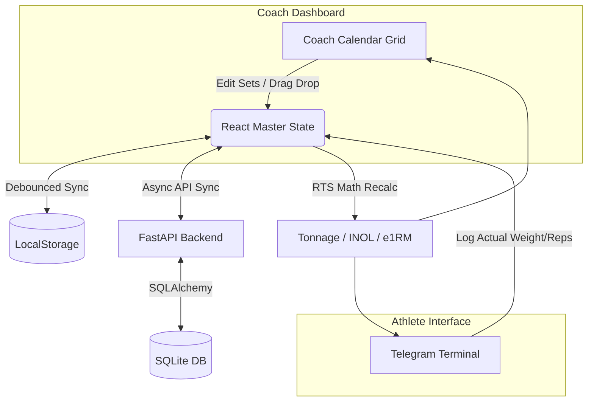

# Obsidian Kinetic Periodization Architecture

This document defines the core architecture, layout principles, and state flow for the **Obsidian Kinetic Periodization Dashboard**—a premium, high-fidelity, cross-platform training system designed for elite powerlifting coaches and athletes.

---

## 1. Core Philosophy & System Goal

Obsidian Kinetic is designed to transcend standard spreadsheets and rigid training logs by offering a highly dynamic, auto-regulatory planning grid. It bridges the gap between structured coaching plans (Mesocycles & Microcycles) and real-time athletic execution.

* **Target Audience**: Powerlifting coaches managing multiple athletes, and competitive athletes logging high-intensity sessions.
* **Core Design Theme**: Sleek dark mode ("Obsidian Dark") with HSL-tailored accents (RTS Blue, Obsidian Jade, CNS Orange), micro-animations, and fluid layout transitions.
* **Auto-Regulation & Integrity**: High-fidelity drag-and-drop capabilities locked behind periodization boundaries to prevent load-fatigue tracking drift.

### ── DEVELOPMENT FIRST RULE: Functionality First, Aesthetics Second ──
While a premium, immersive visual theme is a key target, **functional robustness, state stability, and data integrity always take absolute priority**. Core logical mechanisms (drag-and-drop locks, calculation algorithms, data schema parses, conflict resolutions) must be fully established and verified to work *before* investing effort in refining typography, micro-animations, or advanced layout styling.

---

## 2. Implementation Status Tracking

| Component | Status | Description |
| :--- | :--- | :--- |
| **Frontend Setup (Vite/React)** | ✅ Implemented | Core scaffolding, routing, and theme configured. |
| **Backend API (FastAPI)** | ✅ Implemented | SQLite database connection and REST endpoints. |
| **Coach Calendar Grid** | 🚧 In Progress | Fluid n-day grid rendering, drag-and-drop boundary locks. |
| **Athlete Mobile Terminal** | 📋 Planned | Telegram-style logging interface for rapid data entry. |
| **Data Sync Engine** | 🚧 In Progress | LocalStorage ↔ API sync conflict resolution. |
| **Spreadsheet Integration** | 📋 Planned | CSV/Excel export for microcycles and research graphs. |

---

## 3. Tech Stack & Best Programming Methodologies

To maintain developer agility, fast loading speeds, and robust state management, the codebase follows a structured stack layout. 

### A. Preferred Stack (Keep it simple and robust)
* **Frontend**: React (TypeScript) + Vite for extremely fast compile/HMR times.
* **Styling**: Tailwind CSS v4 for direct utility-first assembly of reactive UI grids.
* **Backend**: FastAPI (Python) for high-performance, asynchronous REST API controllers.
* **State Management**: Simple, localized React hooks with automated, fail-safe JSON synchronization to `localStorage`.
* **Database/Storage**: SQLite via SQLAlchemy. The schema maps chronologically (dates, UUIDs).

### B. Avoided Stack (Avoid complexity overhead)
* **Heavy State Managers**: Avoid Redux, MobX, or heavy global state wrappers. Localized React state + direct sync reduces boilerplate.
* **Premature UI Kit Dependencies**: Avoid bulky UI libraries (e.g., Material UI, Chakra). Custom Tailwind components are preferred.

### C. Key Architectural Decisions & Rationale
1. **Hybrid State (LocalStorage + SQL)**: Coaches need instant UI response when dragging workouts. Relying solely on network requests causes lag. We use LocalStorage as the source of truth for the UI, with asynchronous syncs to the SQL backend.
2. **Columnar Prescription Splits**: To ensure data integrity, we reject unstructured string prescriptions (e.g., `"150kg x 1 @ 8"`). Instead, we enforce discrete numeric columns (`planned_weight`, `planned_reps`, `planned_rpe`).
3. **Chronological Time-Spacing**: Fatigue metrics (ACWR, INOL) are calculated strictly on actual calendar dates (`YYYY-MM-DD`), not arbitrary sequence labels (e.g., D1, D2), ensuring scientific validity.
4. **Variation Tracking**: Every lift variation (e.g., "High Bar Squat", "Paused Deadlift") is tracked separately. `lift_category` (Squat/Bench/Dead/Other) and `tier` (Comp/Variation/Accessory) govern data grouping.

---

## 4. File Structure Tree

```text
src/                          # React Frontend App
├── App.tsx                   # Main entry, Master State, Router
├── types.ts                  # TypeScript interfaces (State Shape)
├── index.css                 # Tailwind & Theme configuration
├── services/
│   └── api.ts                # API service layer & RTS math formulas
└── components/
    ├── layout/               # Sidebar, Header, wrappers
    ├── calendar/             # Coach CalendarGrid, Draggable Workouts
    ├── sessions/             # ExerciseCard, AccessoryLedger
    └── mobile/               # TelegramSessionTerminal

backend/                      # FastAPI Backend Server
├── main.py                   # API Endpoints & Bootstrapping
├── database.py               # SQLAlchemy setup
├── models.py                 # SQLAlchemy DB schemas
└── schemas.py                # Pydantic validation models
```

---

## 5. Data Flow & Integrity Controls

### A. System Diagram


### B. Drag & Drop Boundary Lock
* Workouts are restricted to stay within their active microcycle week boundary. 
* Prevents coaches or athletes from accidentally drifting workouts across microcycle boundaries which would compromise fatigue tracking metrics (Delta / Tonnage).

### C. Robust Error Boundary Startup Guard
* Sanitizes state upon application boot. Detects and isolates corrupted JSON structures in local caches, resetting to safe default states automatically to eliminate startup failures.

---

## 6. State Shape & Data Models

TypeScript interfaces enforce our columnar prescription approach and chronological boundaries.

```typescript
// Example from src/types.ts
export interface ExerciseSet {
  id: string;
  // Discrete Columnar Fields (No string parsing)
  planned_weight: number | null;
  planned_reps: number;
  planned_rpe: number | null;
  // Execution Fields
  actual_weight: number | null;
  actual_reps: number | null;
  actual_rpe: number | null;
}

export interface Exercise {
  id: string;
  title: string;          // e.g., "High Bar Squat"
  lift_category: string;  // "Squat" | "Bench" | "Deadlift" | "Other"
  tier: string;           // "Competition" | "Variation" | "Accessory"
  sets: ExerciseSet[];
}

export interface Workout {
  id: string;
  date: string;           // YYYY-MM-DD for accurate chronological ACWR calculation
  dayLabel: string;       // Sequence rank (D1, D2) for UI grouping
  exercises: Exercise[];
}
```

---

## 7. Role-Based Access & Planned Screens

### Roles
* **Coach**: Full read/write access to microcycles. Capable of bulk-editing, dragging workouts, and planning multi-week blocks. Views the **Interactive Calendar Grid**.
* **Athlete**: Read access to planned prescriptions. Write access strictly limited to actual execution logs (weight, reps, RPE). Views the **Mobile Tracking Terminal**.

### Planned Screens
1. **Coach Calendar Grid**: Fluid n-day grid layout featuring two toggleable rendering modes:
    * **Continuous Calendar View**: Capsules map chronologically onto standard calendar weeks, wrapping from one row to the next.
    * **Linear Capsule View**: Condenses each microcycle strictly onto a single horizontal row. Includes dynamic controls to hide or show empty rest days between sessions to optimize screen real estate.
2. **Stitch Side Panel**: A premium slide-out detail inspector for deep-diving into session logs and coach annotations.
3. **TelegramSessionTerminal**: High-performance, mobile-first athlete interface for logging sets intra-workout.

---

## 8. API Endpoint Summary

The FastAPI backend exposes the following REST interfaces:

* `GET /api/workouts` - Fetch all workouts for the current user/athlete.
* `POST /api/workouts` - Create a new workout.
* `PUT /api/workouts/{workout_id}` - Update workout details (syncing local changes).
* `POST /api/sync` - Batch synchronization endpoint to reconcile LocalStorage with the DB.
* `GET /api/export` - Triggers the Spreadsheet Exchange payload.

---

## 9. Spreadsheet Exchange Specification

Elite coaches prefer spreadsheet logic for bulk mathematical programming. Obsidian Kinetic supports direct integration for both data ingress and academic export.

* **Format**: Flat CSV / Excel XLSX.
* **Export Payload**: Every row represents a single `ExerciseSet`, containing columns for `Date`, `Lift Category`, `Tier`, `Title`, `Planned Weight`, `Actual Weight`, `e1RM`, `INOL`, etc.
* **Data Grouping Gate**: All exported data is strictly gated by `lift_category` and `tier` to prevent naming drift when generating research graphs.

---

## 10. Development Workflow & Deployment Strategies

* **Local Dev**: Run `npm run dev` for Vite frontend, and `uvicorn main:app --reload` for FastAPI backend.
* **Testing**: Rely on browser-level testing for drag-and-drop boundaries. Ensure the API gracefully rejects mismatched types.
* **Deployment**: The frontend is bundled via `npm run build` and served as static files. The backend is containerized (Docker) or deployed via ASGI servers (e.g., Gunicorn) linked to a managed SQL database.

---

## 11. Reference Documentation

* [UI/UX Design Specifications](design.md)
* [Design Tokens & Structure](stitch_design.md)
* [Project README](README.md)
