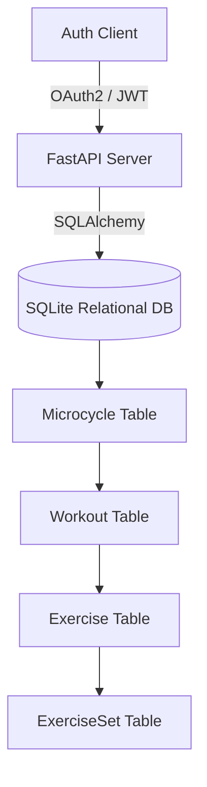

# Design Specification: Iron Box Terminal

This design document specifies the layout, system architecture, color palettes, interactive behaviors, and mathematics for the **Iron Box Terminal**—a dual-plane powerlifting application based on Mike Tuchscherer's **Reactive Training Systems (RTS)** autoregulated training principles.

---

## 1. Core Visual Design System (Obsidian & HSL Specs)

The visual theme combines a sleek, premium dark-mode dashboard (desktop progression plane) with a tactile, low-friction mobile console designed to match native Telegram UI constraints.

### 🎨 Color Palette
* **Background Obsidian Scale**:
  * Root Space (`--color-obsidian-950`): `#0A0A0A` (Deep pure black)
  * Secondary Containers (`--color-obsidian-900`): `#131313` (Mid-tone coal)
  * Active Cards & Panels (`--color-obsidian-800`): `#161616` (Obsidian glass)
  * Borders & Dividers (`--color-obsidian-700`): `#20201F` (Muted wireframe)
* **Accents & Brand Identifiers**:
  * Primary Accent (`--color-mac-blue`): `#007AFF` (RTS Comp Blue / Interactive)
  * Secondary Accent (`--color-mac-green`): `#34C759` (Supercompensation Green / Safe load)
  * Critical Highlight (`--color-orange` / `--color-red`): `#F5A623` / `#E74C3C` (CNS Fatigue Warning)
  * Mobile Neon Accent (Obsidian Jade): `#75FF9E` (Keypad highlights, active buttons, neon glow)

### ✍️ Typography & Font Stack
* **Brand Sans**: `Inter`, `-apple-system`, `sans-serif` (Crisp, modern, high legibility under physical strain)
* **Data Mono**: `JetBrains Mono`, `ui-monospace`, `SFMono-Regular`, `monospace` (Perfect vertical digit alignment for tabular loads, reps, times, and e1RM numbers)

### 🎛️ Design Tokens & Layout Utilities
* **Glassmorphic Blurs**:
  * Headers / Sidebars: `rgba(28, 27, 27, 0.7)` with `backdrop-filter: blur(30px)`
  * Glass Card: `#161616` with `border: 1px solid rgba(255, 255, 255, 0.1)`
* **Kinetic Micro-Animations**:
  * Double-stepper click scaling: active scale compression `scale(0.95)` for haptic replication.
  * Drawer slide-up: Cubic-bezier transitions `cubic-bezier(0.3, 1, 0.4, 1)` for organic momentum.

---

## 2. Desktop Progression Plane (Desktop App UI)

Optimized for 16:9 displays, the desktop view provides a comprehensive coaching center and athlete progression dashboard.

```
+-------------------------------------------------------+
|  Sidebar   |  Header: Welcome & Active Mesocycle     |
| [Dashboard]|  -------------------------------------  |
| [Sessions] |  Summary Cards (Squat, Bench, DL, Tonn) |
| [Insights] |  +------------------------------------+ |
| [Coach]    |  |  CNS Diagnostics / Recovery Index  | |
|            |  +------------------------------------+ |
|            |  |  Interactive SVG Performance Graph | |
|            |  |  (Bezier curves, lines, bar charts)  | |
|            |  +------------------------------------+ |
|            |  |  Attempt Selection Calculator Panel| |
|            |  +------------------------------------+ |
+-------------------------------------------------------+
```

### Key Components
1. **Summary Cards Row**: 5-column grid tracking lift performance (Squat Peak, Bench Peak, Deadlift Peak, Cumulative Tonnage, and relative DOTS Score).
2. **CNS stress Dial**: Dynamic recovery index calculating stress fatigue from active workloads using an **Acute-Chronic Workload Ratio (ACWR)** and listing Squat, Bench, and Deadlift microcycle INOL splits.
3. **Pure SVG Graph Engine**: Custom plotting workspace. Renders responsive Bezier curves for e1RM progression paths and gradient-filled bar charts for daily workout tonnages.
4. **Attempt Selection Planner**: Dynamic calculator predicting suggest 2nd attempts (1.075-1.10x multiplier) and 3rd attempt ceilings from target opener weights.

---

## 3. Obsidian Jade Console (Mobile / Telegram UI)

Designed exclusively for on-the-floor training logging, the mobile terminal fits perfectly within the Telegram WebApp pane, minimizing input latency through an integrated drawer keyboard.

```
+-----------------------------------+
| Active Session Banner   Tonnage   |
| [Tab 1: Squat]  [Tab 2: Bench]    |
|-----------------------------------|
| Set Log Feed                      |
| [✓] Set 1: 150kg x 1 @RPE 8       |
| [✓] Set 2: 137kg x 4 @RPE 7       |
| [*] Set 3: --kg x 4 @RPE -- (ACTV)|
|     +-------------------------+   |
|     |  WEIGHT  |  REPS |  RPE |   |
|     |  [ 150 ] |  [5]  | [7.5]|   |
|     +-------------------------+   |
|     [     LOG SET & COMPUTE   ]   |
+-----------------------------------+
| Numeric Drawer Keypad (Slide-up)   |
| [ 1 ]   [ 2 ]   [ 3 ]             |
| [ 4 ]   [ 5 ]   [ 6 ]             |
| [ 7 ]   [ 8 ]   [ 9 ]             |
| [ . ]   [ 0 ]   [ BACK ]          |
+-----------------------------------+
```

### Mobile Layout & Interaction Principles
1. **Header Switcher**: Swipable navigation pill-tabs letting users swipe between exercises and accessories.
2. **Auto-Focus Active Set**: The app auto-detects the first unlogged set and focuses the logging card, highlighting inputs in neon green (`#75FF9E`).
3. **Slide-Up Keypads**: Standard keyboard is blocked. Clicking Weight triggers an obsidian slide-up numpad. Clicking Reps/RPE triggers a double-stepper with increment/decrement buttons.
4. **Haptic Fallbacks**: All inputs trigger double-vibration clicks. Uses the native `Telegram.WebApp.HapticFeedback` API inside Telegram, falling back to standard `navigator.vibrate` in conventional mobile browsers.
5. **Advanced Parameters**: Toggle drawer reveals inputs for *Bar Velocity (m/s)*, *Readiness (1-10)*, and *Heart Rate Variability (HRV)*.

---

## 4. System Architecture & Relational Schema



### Relational Database Schema & Terminology Alignment
* **User**: `id (UUID)`, `email (String)`, `hashed_password (String)`, `role (COACH | ATHLETE)`
* **CoachingRelationship**: `coach_id (User.id)`, `athlete_id (User.id)`
* **Microcycle**: `id`, `weekName`, `focus`, `status`, `active`, `owner_id (User.id)`
* **Workout**: `id`, `date` (YYYY-MM-DD for accurate chronological graphing), `dayLabel` (Sequence rank: D1, D2), `title`, `tonnage`, `delta`, `color`, `status`, `microcycle_id`
* **Exercise**: `id`, `title` (e.g., "High Bar Squat"), `lift_category` (Squat|Bench|Deadlift|Other), `tier` (Comp|Variation|Accessory), `top`, `vol`, `workout_id`. *Note: Accessories are also stored here (`tier='Accessory'`) to enable individual set-by-set logging for all movements.*
* **ExerciseSet**: `id`, `label`, `planned_weight`, `planned_reps`, `planned_rpe`, `actual_weight`, `actual_reps`, `actual_rpe`, `isTop`, `note`, `velocity`, `readiness`, `hrv`, `exercise_id`

---

## 5. Algorithmic Specifications (Strength Math)

*Note: All algorithms must be rendered mathematically using standard MathJax `$$` formatting across UI tooltips.*

### Estimated 1RM (e1RM) Formula
Calculated using an **RPE-compensated Brzycki equation**. In RTS principles, RPE serves as fatigue-equivalent reps (e.g. less than RPE 10 acts like doing additional reps):

$$\text{Effective Reps} = \text{Reps} + (10 - \text{RPE})$$

$$\text{e1RM} = \frac{\text{Weight}}{1.0278 - 0.0278 \times \text{Effective Reps}}$$

### INOL (Intensity Number of Lifts) Formula
Measures microcycle single-lift stress exposure, tracked chronically across actual chronological dates:

$$\text{INOL} = \frac{\text{Logged Reps}}{100 \times (1 - \text{Intensity \%})}$$
*Where Intensity % is $\frac{\text{Weight}}{\text{e1RM}}$.*

### DOTS Lifter Coefficient Formula
Calculates relative lifter score based on body weight and aggregate lift totals, allowing sex-neutral strength index comparisons.
$$\text{DOTS} = \frac{\text{Total} \times 500}{A \times \text{BW}^4 + B \times \text{BW}^3 + C \times \text{BW}^2 + D \times \text{BW} + E}$$

### ACWR (Acute-Chronic Workload Ratio) Formula
CNS recovery diagnostic ratio based on **chronological dates**:

$$\text{ACWR} = \frac{\text{Acute Workload (Recent 7-day volume)}}{\text{Chronic Workload (Rolling 28-day average)}}$$
*Optimal training zone represents an ACWR score between $0.8$ and $1.3$.*
