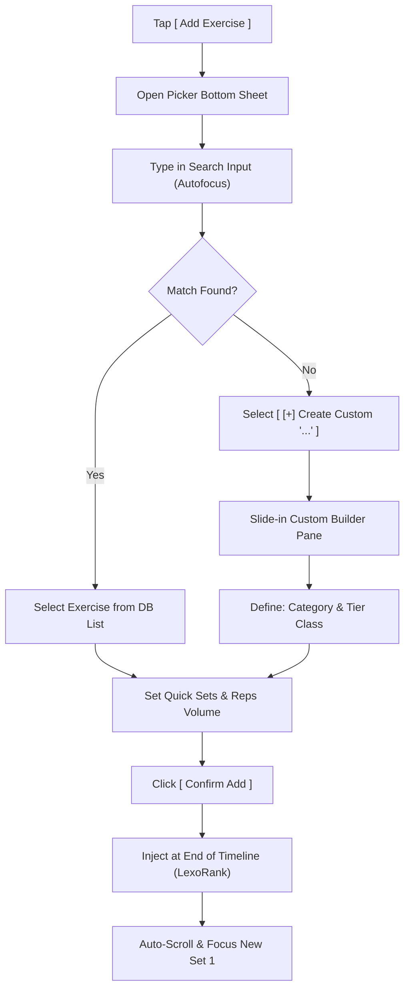
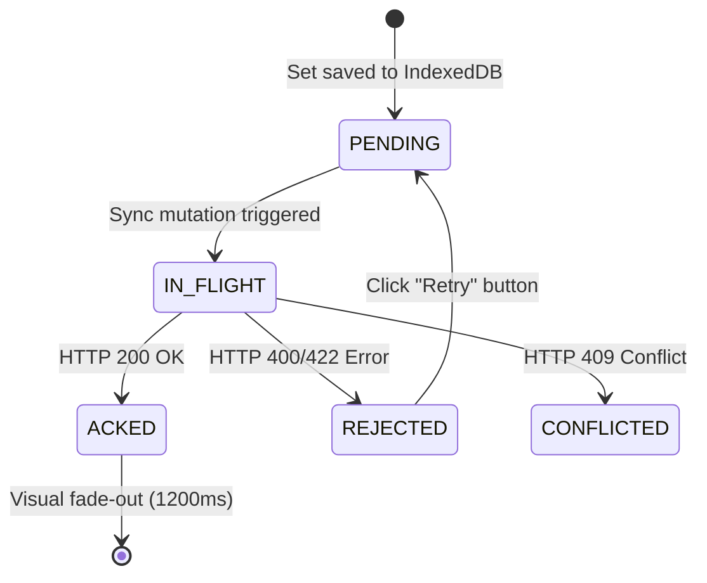

# Adaptive Lifting - Product Design System

> **Document Status:** Canonical Design Reference  
> **System:** Adaptive Lifting Periodization Dashboard & Active Logging Console  
> **Companion Document:** `architecture.md`  
> **Design Scope:** React PWA, coach desktop dashboard, athlete mobile console, Telegram Mini App + bot entry points, Google Sheets publishing flow, and session security panels.

---

## Table of Contents

0. [Implementation Directives](#0-implementation-directives)
1. [Design Intent & Principles](#1-design-intent--principles)
2. [Product Surfaces & Scale](#2-product-surfaces--scale)
3. [Visual System & Surface Tokens](#3-visual-system--surface-tokens)
4. [Typography & Strict Data Formatting](#4-typography--strict-data-formatting)
5. [Multi-Device Layout & Responsive Matrix](#5-multi-device-layout--responsive-matrix)
   * 5.1 [Responsive Breakpoint Grid Specifications](#51-responsive-breakpoint-grid-specifications)
   * 5.2 [Dynamic Space Reclamation & Viewport Budgeting (The Collapsible Primitive)](#52-dynamic-space-reclamation--viewport-budgeting-the-collapsible-primitive)
6. [Coach Desktop Console Experience](#6-coach-desktop-console-experience)
7. [Athlete Mobile Gym Logging Experience](#7-athlete-mobile-gym-logging-experience)
8. [Telegram Mini App WebView Companion](#8-telegram-mini-app-webview-companion)
9. [Google Sheets One-Way Publishing Flow](#9-google-sheets-one-way-publishing-flow)
10. [State, Sync & Extreme Resilience UI](#10-state-sync--extreme-resilience-ui)
11. [Interaction Patterns & Gym Physical Constraints](#11-interaction-patterns--gym-physical-constraints)
12. [Accessibility, Contrast & Ergonomics](#12-accessibility-contrast--ergonomics)
13. [Component Inventory & API Contracts](#13-component-inventory--api-contracts)
14. [Motion, Telemetries & Haptic Feedback](#14-motion-telemetries--haptic-feedback)
15. [Visual Design Decisions](#15-visual-design-decisions)
16. [Implementation Acceptance Checklist](#16-implementation-acceptance-checklist)

---

## 0. Implementation Directives

This section is strictly prescriptive. When generating UI, follow these rules before making any local design choice.

### 0.1 Build Order

Implement screens in this order unless the user explicitly requests a different feature:

1. `AppShell` with navigation, global status strip, and responsive layout.
2. Athlete mobile active-session logging flow.
3. Coach workout calendar and structured workout builder.
4. Sync queue, conflict review, lock banners, and offline states.
5. Coach analytics dashboard.
6. Telegram Mini App integration settings and command/status panels.
7. Google Sheets publish settings and outbox status.
8. Audit/security/device/session views.

### 0.2 Hard Prohibitions

Do not build:

- **No marketing landing page** as the first screen.
- **No decorative hero section** or generic SaaS filler banners.
- **Nested cards allowed** along the product tree (Block → Week → Session; day → session → lifts). No dummy extra wraps. See `.cursor/scopes/cal-theme/10-nested-cards.md`. Still no decorative hero or gradient orbs.
- **No gradient orb, bokeh, or abstract decorative backgrounds.**
- **No freeform text parsing** for prescriptions, set logging, or Sheets import.
- **No Google Sheets bidirectional editing** (Sheets is strictly one-way export/publish).
- **No Telegram chat commands** as the primary mobile UI (Mini App WebView is canonical).
- **No UI that hides sync state**, lock state, or rejected mutations.
- **No charts or dashboards without empty/loading/error states**.
- **No numeric training input stored or handled as a string** (must stay numeric end-to-end).

### 0.3 Required Global UI

Every authenticated PWA screen must include:

- Current athlete or account context.
- **Coach Roster workspace and athlete switcher**: coaches use Roster to find and manage linked athletes; the global selector quickly scopes Calendar, Sessions, and Insights.
- Environment label when not production.
- Online/offline indicator.
- Sync queue count.
- Last successful sync timestamp when available.
- Re-auth/session-revoked handling.
- Clear route back to Settings and Integrations.

### 0.4 Default Assumptions

If implementation context is missing, assume:

| Decision | Default |
| :--- | :--- |
| Units | kg canonical, kg display unless user preference says otherwise |
| Theme | Light default + Dark toggle (`al_theme`). Cal.com token language — `.cursor/rules/cal-theme.mdc` |
| Mobile first screen | Today's active workout |
| Coach navigation | Calendar, Sessions, Insights, and a dedicated Roster workspace with Active and Past athletes; the athlete switcher remains available for active scope changes |
| Empty athlete plan | Show empty Calendar/Sessions states — never inject demo weeks |
| Session create | Date required; Block/Week labels optional anytime |
| Athlete link | Enter coach code (not email); unlink keeps plan |
| Integrations | Disconnected until explicitly linked |
| Offline state | Allowed for logging; publish/export requires network |
| Role conflict | Prefer least privilege and show read-only UI |

---

## 1. Design Intent & Principles

Adaptive Lifting is work software for powerlifting coaches and athletes. It must feel fast, precise, and calm under physical fatigue. The interface prioritizes reliable logging, clean comparison, and immediate workload visibility over decorative presentation.

The design system follows three product principles:

1. **Training data first:** Weight, reps, RPE, e1RM, INOL, ACWR, status, and sync state must be more visible than chrome.
2. **Offline confidence:** Athletes must always know whether a set is saved locally, syncing, accepted, rejected, or conflicted.
3. **Architecture-visible UX:** Locks, tombstones, canonical backend math, Telegram adapters, Google Sheets publishing, and session revocation are visible through clear UI states rather than hidden system behavior.

---

## 2. Product Surfaces & Scale

| Surface | Primary User | Purpose | Design Constraint |
| :--- | :--- | :--- | :--- |
| Coach desktop PWA | Coach | Program design, athlete monitoring, analytics, exports, integrations | Dense, scannable, keyboard/mouse efficient; athlete switcher scopes Calendar/Sessions |
| Athlete mobile PWA | Athlete | Later: gym logging on a phone | Deferred. Current athletes use the same web session screen as coaches. |
| Calendar workspace | Coach / Athlete | Date-first session timeline | Cal light/dark skin: hairline 7-col month grid, nested session/note cards, lift-filter dialog (multiple chips per category / pattern / tier; OR within a row, AND across rows; stored fields). Session chips show name, Day/Week/Block, and a short lift-code line (no kg×reps@RPE). Hover actions fill a reserved in-flow dock (do not grow the day on hover; do not cover session/note cards; do not overflow to a neighbor). No accent inset ring around the day cell — quiet fill + dock, 180ms; today is the date numeral only. Week row may grow at rest when chips plus that dock need room. Session/note chips rest flat (surface-card + hairline); the chip under the pointer uses `--cal-shadow-lift`. Saved notes render as a distinct day card at rest. Copy to then click the destination day on the same calendar. |
| Web session screen | Coach / Athlete | Add, name, reorder, prescribe, and log lifts | Name is the large session title; Day · Week · Block + tonnage + Edit are muted meta. Lifts render in `lexo_rank` order. Up/Down persist rank. Bar/tempo/ROM/gear open from Edit lift, not always-open chips. Completed sessions remain editable; Complete is a status label, not a lock. There is no Open/reopen step. |
| Sessions workspace | Coach / Athlete | Group/filter by optional Block/Week labels | Ungrouped bucket for unlabeled sessions. Each card leads with **Name**, then Day · date (Block/Week live on the group headers). Every set is a Plan vs Log row — not set 0 only, not `150×5@6 150×5@6` unlabeled. Edit opens a dialog for Name, then Day/Block/Week as ComboBoxes (Name list never includes Day slots) |
| Roster | Coach | Find active athletes, unlink, and inspect past-link snapshots | Active and Past athletes are separate views. Past sessions are read-only snapshots frozen at unlink. |
| Coach code / link | Coach / Athlete | Athlete enters coach code to grant shared write | Show code + copy for coach; enter-code + unlink (plan stays) for athlete |
| Athlete profile | Athlete | Set or clear an optional display name | Self-edited in Security; linked coaches see name and full email |
| Telegram Mini App + bot | Athlete / Coach | Later: Telegram-native logging and alerts | Deferred until the web constructor is done. Do not gate current session UI on Mini App. |
| Google Sheets publish flow | Coach | One-way reporting/export to Sheets | Must clearly communicate that Sheets is not canonical |
| Staging/admin runtime views | Operator / Coach-owner | Connection health, webhook/OAuth status, backup status | Quiet operational dashboard, not marketing UI |

---

### 3. Visual System & Surface Tokens

### 3.1 Color Tokens (Mathematical HSL Color Space)

The visual palette is strictly dark, restrained, and functional, optimized mathematically to eliminate backlight glare in dark lifting environments. Avoid neon gradients, heavy overlay blur layers, and decorative filler surfaces.

```css
:root {
  /* Core App Grayscale (Ink Black Scheme) */
  --ok-bg: hsl(0, 0%, 4%);             /* Deepest base workspace background */
  --ok-surface-1: hsl(0, 0%, 7%);     /* Structural headers, left side navigation panel */
  --ok-surface-2: hsl(0, 0%, 9%);     /* Primary workout grid cards, table outlines */
  --ok-surface-3: hsl(0, 0%, 12%);    /* Active form fields, cell dropdown values, toolbars */
  --ok-border: hsl(0, 0%, 16%);       /* Grid cell dividers, interactive element borders */
  
  /* Text Contrast System */
  --ok-text: hsl(240, 5%, 96%);        /* Primary data, numeric stats, active text fields */
  --ok-text-muted: hsl(240, 5%, 67%);  /* Secondary helper copy, description subheaders */
  --ok-text-faint: hsl(240, 4%, 46%);  /* Disabled values, inactive tab navigation selectors */
  
  /* Semantic Core (Borg-Scale Fatigue Alerts) */
  --ok-blue: hsl(217, 91%, 60%);       /* Focused interactive state, stopwatch timers, SSE live pulses */
  --ok-green: hsl(142, 70%, 45%);      /* Sync accepted state, logged work, optimal ACWR (0.8-1.3) */
  --ok-amber: hsl(38, 92%, 50%);       /* Sync pending offline queues, caution zones, high INOL */
  --ok-red: hsl(0, 84%, 60%);          /* Auth session revoked, sync errors, danger zones (ACWR > 1.3) */
  --ok-cyan: hsl(188, 86%, 53%);       /* External Telegram integrations, live SSE telemetry state */
  --ok-violet: hsl(263, 90%, 65%);     /* High-coefficient DOTS score, meet planners attempts indicators */
}
```

### 3.2 Semantic Status Colors

Every component visualizes execution states using HSL alerts combined with dedicated iconography to maintain WCAG AAA compliance without relying solely on color indicators.

| State | CSS Variable | Visual Treatment | Icon |
| :--- | :--- | :--- | :--- |
| `PENDING` / Local | `--ok-amber` | Clean amber text with 10% solid surface fill | Quiet Clock |
| `IN_FLIGHT` / Sync | `--ok-blue` | Interactive blue border with animated background pulse | Rotating Loader |
| `ACKED` / Accepted | `--ok-green` | Fades to solid green border, dismisses after 1200ms | Check Mark |
| `REJECTED` | `--ok-red` | Strong red left-border accent row, inline troubleshooting button | Exclamation Circle |
| `CONFLICTED` | `--ok-amber` | Solid 1px amber border with contrasting red side-by-side alert panel | Alert Shield |
| `LOCKED` | `--ok-text-faint` | Gray background, input disabled, cursor-not-allowed | Solid Lock |
| `TOMBSTONED` | None | Entire row height transitions to 0px, elements hidden | Trash / Bin |

### 3.3 Shape, Spacing, and Density

Adaptive Lifting enforces sharp, high-density structural grids. Page cards and sections must not use nested margins.

| Token | Value | Applied Element Target |
| :--- | :--- | :--- |
| `--radius-sm` | `4px` | Table check fields, navigation indicators, small alert tags |
| `--radius-md` | `6px` | Interactive grid buttons, active text field inputs, tab lists |
| `--radius-lg` | `8px` | Outer boundaries of main exercise tables and dashboard panels (Maximum limit) |
| `--space-1` | `4px` | Metric badge borders, icon gaps |
| `--space-2` | `8px` | Cell internal borders, compact grid rows |
| `--space-3` | `12px` | Horizontal form fields, input margins |
| `--space-4` | `16px` | Inner boundaries of dashboard grids and mobile sheets |
| `--space-6` | `24px` | Section gaps, calendar grid columns |

Page layouts use full-width operational workspaces. Nested cards follow the product tree (Block → Week → Session; day → session; lift → PLAN/LOG table). Dummy chrome wraps that do not name an object are still forbidden. See `.cursor/scopes/cal-theme/10-nested-cards.md`.

---

## 4. Typography & Strict Data Formatting

### 4.1 Font Stack

Typography is optimized strictly to prevent visual reading skew during heavy physical lifting.

| Role | CSS Font Stack | Primary Design Constraint |
| :--- | :--- | :--- |
| **UI sans** | `Inter`, `-apple-system`, `BlinkMacSystemFont`, `Segoe UI`, `sans-serif` | Labels, subheads, menus, display titles (600, negative tracking) |
| **Training numbers** | `Inter` + `tabular-nums` | kg/reps/RPE/e1RM. Not JetBrains Mono. Trial 2: IBM Plex Sans if columns drift — `.cursor/scopes/cal-theme/11-typography.md` |

### 4.2 Type Scale

Font sizes are strictly locked to standard responsive tokens. Avoid fluid text resizing.

| Token | CSS Font Size / Line Height | Targeted UI Element |
| :--- | :--- | :--- |
| `text-xs` | `12px / 16px` | Technical metadata tags, sync badges, lower error tags |
| `text-sm` | `14px / 20px` | Main grid values, column headings, calendar list items |
| `text-base` | `16px / 24px` | Mobile inputs, navigation link labels |
| `text-lg` | `18px / 28px` | Exercise card titles, planner section headers |
| `text-2xl` | `24px / 32px` | Peak metrics totals, main dashboard digits |
| `text-4xl` | `36px / 40px` | Active mobile logger digits, set-entry display inputs |

### 4.3 Numeric Formatting Specs

Training numbers must keep **tabular figures** and WCAG AA contrast against the active theme canvas (`--cal-*`), not a required coding font.

| Metric | Storage Type | Canonical Precision | Export Display Format |
| :--- | :--- | :--- | :--- |
| **Weight** | Decimal float | Kilograms (kg) canonical | `180.0 kg` (unit label always visible) |
| **RPE** | Decimal float | Borg CR-10 scale | `8.5 RPE` or `8 RPE` (omit .0 decimals when integer) |
| **e1RM** | Decimal float | Projected max | Rounded to nearest 0.5kg at display boundaries |
| **INOL** | Decimal float | Accumulation ratio | Capped at 2 decimal points: e.g., `1.42 INOL` |
| **ACWR** | Decimal float | Trailing CNS ratio | Capped at 2 decimal points: e.g., `1.15 ACWR` (Optimal) |
| **DOTS** | Decimal float | Lifter coefficient | Capped at 1 decimal point: e.g., `425.4 DOTS` |
| **Velocity** | Decimal float | Meters/second (m/s) | Capped at 2 decimal points: e.g., `0.38 m/s` |

---

## 5. Multi-Device Layout & Responsive Matrix

### 5.1 Responsive Breakpoint Grid Specifications

The layout scales systematically, adapting touch target sizing and information density to match the physical device form factor in real-time.

| Breakpoint | Targeted Form Factor | Column Strategy | Interaction & Padding Specifications |
| :--- | :--- | :--- | :--- |
| **`< 360px`** | Compact mobile | Single-column app layout with touch-safe session controls. | Keep the active session and its controls usable without horizontal page overflow. |
| **`360px - 479px`** | Mobile | Responsive app layout; session details adapt to the narrow viewport. | Touch targets are at least 44px; avoid requiring swipe-only navigation. |
| **`480px - 767px`** | Large mobile | Responsive session layout sized to the available width. | Keep plan, log, and sync states readable and operable by touch. |
| **`768px - 1199px`** | Tablet / compact desktop | Responsive workspace layout with a collapsible navigation sidebar. | Calendar and session content reflow to the available width. |
| **`>= 1200px`** | Desktop | Dense coach workspace with persistent navigation and a responsive content area. | Support pointer and keyboard interaction; retain visible focus states. |

### 5.2 Dynamic Space Reclamation & Viewport Budgeting (The Collapsible Primitive)

Layouts use the available viewport and reflow content when the navigation sidebar collapses.

#### 5.2.1 Core Space Reclamation Primitive (The Sidebar Rule)
Collapsing the navigation sidebar gives the active workspace more room. It must not create a fixed minimum width that causes horizontal overflow.

#### 5.2.2 Primitive Classifications
* **Persistent Panels**: Structural containers locked to a specific width at designated breakpoints. (e.g., Left Sidebar is persistent at 240px width on desktop viewports `>= 1200px` by default).
* **Toggleable/Collapsible Panels**: The navigation sidebar may collapse to give the active workspace more room. Other panels are specified by the feature that uses them.
* **Dynamic Space Reclamation**: A programmatic layout behavior where collapsing any Toggleable Panel recalculates available horizontal viewport budgets and reallocates the reclaimed space instantly to the primary core workspace.
* **Viewport Budget (min-width rules)**: The hard visual boundary below which a container cannot be compressed without triggering column truncation, optical fatigue, or overflow errors.

#### 5.2.3 Repeatable Spatial Blueprint Schema
Every Web UI component and view within this design reference is organized and audited using the following strict structural schema:

| Schema Section | Technical Requirements |
| :--- | :--- |
| **Dimensional Constraints** | Hard CSS `min-width`, `max-width`, heights (`dvh`, `vh`, `px`), border radii, and internal/external padding mappings strictly to spacing tokens (`--space-1` to `--space-6`). |
| **Spatial Allocation** | Grid templates (`grid-template-columns`), flexbox layouts (`flex-grow`, `flex-shrink`, `flex-basis`), border alignments, and dynamic proportional splits. |
| **State Transitions (Default vs. Maximized)** | A strict comparison between the **Default State** (layout when neighboring toggleable panels are visible) and the **Maximized State** (layout after Dynamic Space Reclamation is triggered). |

---

---

## 6. Coach Desktop Console Experience

The desktop console is a high-density, keyboard-efficient workspace designed for multi-athlete program authoring, analytics diagnostics, and live session monitoring.

### 6.1 Console Layout Diagram

```
+--------------------------------------------------------------------------------------------------+
| Top Navigation: Athlete Scope | Environment / Sync Status | User |
+-------------------+------------------------------------------------------------------------------+
| Persistent Sidebar| Top KPI Strip: Squat Max (kg) | Bench Max (kg) | Deadlift Max (kg) | ACWR    |
| [240px width]     |------------------------------------------------------------------------------|
| - Athlete switcher| Primary Work Area:                                                           |
| - Calendar        |                                                                              |
| - Sessions        |   [Structured Builder Card | Meet Day Planner Table | Telemetry Streams]     |
| - Insights        |                                                                              |
| - Roster (Coach)  |                                                                              |
| - Integrations    | Right Drawer Rail: Writer Locks status | Tombstone Conflict Review Panel     |
| - Security        |                                                                              |
+-------------------+------------------------------------------------------------------------------+
```

#### 6.1.1 Persistent left Sidebar Layout Detail (240px Width)

```
+====================================+
| [K] ADAPTIVE LIFTING               |
+====================================+
| Current Monitored Athlete:         |
| +--------------------------------+ |
| | (o) Athlete: John Doe          | |
| | [✓] Live SSE Connected         | |
| +--------------------------------+ |
+====================================+
| Primary Workspaces:                |
|                                    |
| [ ] Calendar                       |
|     (Date-first month grid)        |
|                                    |
| [ ] Sessions                       |
|     (Block/Week grouped list)      |
|                                    |
| [✓] Insights                       |
|     (Composable saved cards)       |
+====================================+
| Operations & Integrations:         |
|                                    |
| [ ] Google Sheets Publisher        |
|     (One-way outbox setup)         |
|                                    |
| [ ] Telegram Mini App WebView      |
|     (Account link managers)        |
|                                    |
| [ ] Security & Session Audit       |
|     (Device revocation panels)     |
+====================================+
| System Metrics & Status:           |
|                                    |
| Env:    [ STAGING ] (Amber warning)|
| Local:  [✓] IndexedDB hydrated     |
| Version: App Core v1.4.2           |
|                                    |
|         [ FORCE FULL SYNC ]        |
+====================================+
```


##### Dimensional Constraints
* **Width**: Default expanded state is locked to `240px` (`min-width: 240px; max-width: 240px`). Collapsed state is `60px` (`min-width: 60px; max-width: 60px`) to display icon-only navigation, or hidden entirely (`0px`).
* **Height**: Locked to `100dvh` (Dynamic Viewport Height) to eliminate scrollbars on the outer shell wrapper.
* **Internal Padding**: Mapped strictly to design system tokens: `--space-4` (16px) vertical for headers and footers, and `--space-3` (12px) horizontal for link lists.

##### Spatial Allocation
* **Layout Model**: Flexbox stack: `display: flex; flex-direction: column; justify-content: space-between; align-items: stretch;`.
* **Outer Borders**: Vertical structural border: `1px solid var(--ok-border)` (`hsl(0, 0%, 16%)`) on the right boundary.
* **Component Groupings**:
  * **Top**: Brand Header and Monitored Athlete Scope Panel.
  * **Middle**: Primary Workspaces navigation items (Calendar, Sessions, Insights).
  * **Bottom**: Operations & Integrations (Integrations, Security) and the System Metrics Footer.

##### State Transitions (Default vs. Maximized)
* **Default State (Expanded Layout)**: The left sidebar consumes `240px` of horizontal space. The main content workspace operates in a reduced viewport budget of `calc(100vw - 240px)`.
* **Maximized State (Dynamic Space Reclamation)**: User collapses the left sidebar to icon-only (`60px`) or hides it completely (`0px`). This frees `180px` or `240px` of horizontal space respectively. The AppShell dynamically reallocates this space to the main active view container (e.g. expanding the Calendar Grid to 100% viewport width), preventing high-density column compression.

* **Brand Header:** Sleek geometric symbol alongside all-caps title `"ADAPTIVE LIFTING"` utilizing `Inter` font, mapped strictly with a `9:1 contrast ratio` against the background.
* **Monitored Athlete Scope Panel:** High-contrast widget showing:
  * Athlete's thumbnail circle.
  * Active name and real-time SSE stream status: Mapped in `--ok-green` if connection is streaming, or pulsing `--ok-amber` if syncing offline mutations queue.
* **Workspace Links Navigation Group:** Navigation items highlighted in `--ok-blue` border tags when active:
  * **Calendar:** Date-first month grid for the scoped athlete plan.
  * **Sessions:** List grouped by Block/Week labels when present. Cards lead with Name and show every set as Plan vs Log.
  * **Insights:** Composable saved cards (server-canonical metrics). Coaches pick a linked athlete from the global switcher above this list.
  * **Roster (coaches):** Search and manage linked athletes, then open an athlete plan. Athletes do not see Roster or the switcher.
* **Operations & Integrations Navigation Group:**
  * **Sheets Publisher:** Controls one-way spreadsheet target mappings.
  * **Telegram Mini App:** Links Telegram adapter connections.
  * **Security & Session Audit:** Exposes active device logs and session revocation actions.
* **System status footer:**
  * **Environment Tag:** Displays `[ STAGING ]` in `--ok-amber` if not production to prevent operational mistakes.
  * **Local Database Status:** Verification badge displaying IndexedDB hydration status: `[✓] IndexedDB hydrated`.
  * **Force Sync Trigger:** High-contrast, borders-only button `[ FORCE FULL SYNC ]` allowing immediate manual sync overrides if browser sandbox limits automatic timing loops.

#### 6.1.2 Calendar workspace

The Calendar is a date-first month view of dated sessions. A session may be unlabeled or carry optional Block and Week labels; the calendar does not require microcycle or Mon–Sun training containers. Show the real month and year, with no placeholder mesocycle or microcycle banners.

- Render a seven-column calendar grid that adapts to the available viewport. Preserve usable session content at mobile widths; do not impose desktop minimum widths that cause page overflow.
- Session chips show the session name, Day/Week/Block metadata, and short lift codes. Do not put prescribed set strings or training analytics in the chips. Chips rest flat and gain the defined lift treatment on pointer hover.
- A day has a reserved action dock for **New session**, **Copy to** when it contains a session, and **Notes**. Showing actions must not resize the day on hover, cover session or note cards, or spill into a neighboring day. Today is indicated by its date numeral, not an inset cell ring.
- Saved notes appear as separate day cards, including on days without sessions. Notes belong to the calendar date and athlete plan.
- Clicking a session opens the session screen. Copying preserves relative date gaps and offers plan-only or plan-plus-logged-sets copies. The destination calendar date sets the copied session's first date.
- Calendar and Sessions share a lift-filter dialog. It matches stored lift category, movement pattern, and tier fields; choices combine with OR within a field and AND across fields.
- Coach Calendar follows the active athlete switcher. Provide loading, empty, error, permission-denied, rejected, and locked states where applicable. Empty plans remain empty.

#### 6.1.3 Coach Roster workspace and athlete switcher

Coaches have a dedicated **Roster** workspace for finding and managing linked athletes as their roster grows. The Active athletes view is searchable by athlete display name and full email, shows the name first and email as a secondary identifier, and opens the live athlete plan. Coaches can unlink an active athlete after a confirmation that explains access ends and the athlete keeps the plan. Do not create athlete subprofiles inside the coach account.

The Past athletes view lists ended relationships separately and opens a read-only snapshot captured when unlinking. It shows sessions dated during that relationship through the unlink date. The snapshot is frozen; later logs, edits, notes, analytics, and sessions are unavailable to the former coach. Past athletes never become active scope choices.

The sidebar `AthleteScopeSelector` remains available as the fast global scope switch on Calendar, Sessions, and Insights. Selecting an active athlete in Roster sets the active athlete and opens that athlete's Calendar. Athletes do not see Roster or the switcher; each athlete has one plan. Each athlete registers a separate account; the coach generates a coach code in Security and the athlete enters it there. Roster may link to Security for coach-code onboarding; it must not replace that flow. Athlete-managed optional display names are edited in Security; linked coaches see and search by both name and full email.

Roster has loading, empty, error, and permission-denied states for active and past lists, plus loading/error/empty states for archived history. The active empty state explains that athletes join with a coach code and links to Security. Search and selection remain keyboard accessible. Archived sessions are read-only and identify the unlink-time cutoff. Keep training analytics in Insights. Do not show Live / Queue / Offline under the selector (sync is the corner overlay, see section 10.3). Push-program acknowledgement remains a Plan actions item on the selector.

`#/roster` and `?view=roster` open the Roster workspace. Legacy `#/athletes` and `?view=athletes` redirect to `#/roster`. `panel=athlete-scope` continues to open the quick selector on Calendar.

Insights (formerly a hardcoded three-lift tonnage/e1RM strip) is a dedicated workspace of user-composed cards. Card configuration is a structured inspector form. Results come from `POST /api/analytics/query`; the client does not compute RTS metrics for cards. Pattern-scoped cards use the stored `movement_pattern` on each exercise row.

### 6.2 Workout Builder & Structured Prescription Editor

##### Dimensional Constraints
* **Width**: Overlay modal locked to `90vw` (Viewport Width), with `min-width: 800px` and `max-width: 1200px` constraints.
* **Height**: Flex boundary set to `85dvh` (Dynamic Viewport Height).
* **Padding & Margins**: Modal container utilizes `--space-4` (16px) margins. Outer card border-radius: `--radius-lg` (`8px`).

##### Spatial Allocation
* **Layout Model**: Flex columns split into side-by-side workspace panels (`display: grid; grid-template-columns: 1fr 1fr; gap: var(--space-4);`).
* **Column Divisions**:
  * **Left Pane (Search & Database)**: Mapped to search database list blocks, with scroll overflow set to `auto` and vertical padding of `--space-3`.
  * **Right Pane (Parameter Configurator)**: Dynamic form stack managing Category, Tiering, ROM, tempo options, and supportive gear.
* **Borders**: Interior split vertical border is `1px solid var(--ok-border)` (`hsl(0, 0%, 16%)`).

##### State Transitions (Default vs. Maximized)
* **Default State**: Modal centered in viewport on viewports `>= 1024px`. Background elements are visible but dimmed by an absolute scrim overlay.
* **Maximized State (Dynamic Space Reclamation)**: On compact screen boundaries or landscape tablet layouts (`< 1024px`), the modal transitions to a full-screen sheet overlay (`100%` viewport width & height, `0px` border-radius), maximizing input form sizing and avoiding vertical list clipping.

The desktop Workout Builder uses a **two-pane split dialog layout** to allow coaches to search the canonical exercise database, customize movement modifications (Tempo, ROM, Gear), and write structured set prescriptions in a single, high-velocity workflow.

#### 6.2.1 Desktop Exercise Selector & Custom Builder Split Dialog Layout

```
+==================================================================================================+
| Add Exercise / Custom Creator Split Console (Desktop Dialog Panel)                               |
+-----------------------------------------------------------------+--------------------------------+
| Search & Database Panel (Left Pane)                             | Parameter Configurator (Right) |
| Search: [ Squat Variation A                                 [x] ] | Base Name: [ Squat           ] |
| +-------------------------------------------------------------+ | Category:  [Squat]* [Bench]... |
| | [Comp Lifts] | [Variations]* | [Accessories] | [Custom Lifts] | | Tier:      [Comp] [Var]* [Acc] |
| +-------------------------------------------------------------+ |                                |
|                                                                 | Tempo Mod:                     |
| Mapped Results list (dense, click to select):                   | [Standard] [Paused]* [Slow Ecc]|
| +-------------------------------------------------------------+ | ROM Setup:                     |
| | [ Squat ] Competition Squat                     (Tier: Comp)| | [Full ROM]* [Deficit] [Pin]    |
| +-------------------------------------------------------------+ |                                |
| | [ Squat ] Pause Squat                           (Var)       | | Accommodating & Support Gear:  |
| +-------------------------------------------------------------+ | [✓] Beltless *active*          |
|                                                                 | [ ] Bands                      |
| Custom Creator Button:                                          | [ ] Chains                     |
| +-------------------------------------------------------------+ |                                |
| | | [+] Create Custom "Squat Variation A"                       | | Compiled:                      |
| +-------------------------------------------------------------+ | "[Beltless] Pause Squat (320)" |
+-----------------------------------------------------------------+--------------------------------+
| Structured Prescription Injector Footer:                                                         |
| Mode: [TOP_SET_BACKDOWN]*  Top: 1 x 3 @ 8.0 RPE  Backdown: 3 x 3 @ 5% load drop                  |
|                                                                                                  |
| Keyboard: [Esc] Cancel                                           [Ctrl+Enter] Commit and Inject  |
+==================================================================================================+
```

#### 6.2.2 Form and Keyboard Specifications
* **Unified Database & Custom Parameter Mapping:** The desktop right configurator pane mirrors the exact custom parameters of the mobile client, utilizing identical HSL tag selectors for:
  * **Lift Category:** `Squat`, `Bench`, `Deadlift`, `Other` (to ensure 100% mathematical parity in INOL and ACWR models).
  * **Tiering:** `Comp`, `Variation`, `Accessory`.
  * **Tempo Toggles:** `Standard (1-0-1)`, `Paused (3-2-0)`, `Slow Eccentric (3-0-0)`, `Isometric (1-3-1)`, and custom string inputs.
  * **ROM Setup:** `Full ROM`, `Deficit`, `Pin/Board Blocked`, `Partial`.
  * **Accommodating Resistance & Support Equipment Checklist:** Multi-select checkbox grid categorizing:
    * **Accommodating Resistance (Strength Curve Modifiers)**: `Bands` (elastic resistance), `Chains` (variable link weight).
    * **Support Equipment & Gear Extras (Leverage Modifiers)**: `Beltless` (abdominal wall tracking), `Wraps/Sleeves` (heavy joint supports), `SlingShot` (overload bench assistance).
* **Structured Prescription Injector (Footer):** Integrates the prescription builder directly into the adding drawer:
  * The coach selects the loading mode (`RPE_TARGET`, `PERCENTAGE`, `AMRAP`, `TOP_SET_BACKDOWN` (featuring auto-computed Load Drop / Fatigue Limits), `HYBRID`) and sets target reps, sets, and intensities *before* injection.
  * Displays the read-only preview string compiled live. Tapping `[Ctrl+Enter]` saves the custom movement parameters, templates the planned set structure, and injects the exercise block directly into the microcycle calendar day in a single action, saving the coach from multi-screen hopping.
* **Keyboard Bindings:**
  * `Esc`: Immediately cancels, closes the overlay, and returns focus to the active calendar grid block.
  * `Tab` / `Shift-Tab`: Cyclically rotates focus across inputs, segmented toggles, and checklists.
  * `Ctrl+Enter`: Submits form, validates parameters, and injects the new exercise block.
* **Database Micro-Previews:** Hovering over any item in the Left results list displays a floating micro-panel containing the selected athlete's trailing e1RM peak trend line and most recent logged sets history, allowing the coach to make precise programming decisions based on real-time fatigue curves.

### 6.3 Meet Day Planner & Attempt Selector Table

##### Dimensional Constraints
* **Minimum Width**: `720px` to fit 6 data columns side-by-side without overlapping headers.
* **Height**: Auto-adjusts to fit precisely 3 rows (Squat, Bench, Deadlift) and header/summary rows (approx `200px`).
* **Padding & Margins**: Table cells use strict `--space-2` (8px) padding constraints.

##### Spatial Allocation
* **Layout Model**: HTML `<table>` or CSS grid (`display: grid; grid-template-columns: 1.5fr repeat(5, 1fr); gap: 1px; background-color: var(--ok-border);`).
* **Columns split**: Opener Target, 2nd Attempt Projection, 2nd Target override, 3rd Attempt Projection, and 3rd Target override.
* **Inputs**: Dynamic input fields inside "Target" columns centered and sized dynamically to `--space-6` (24px) vertical footprint.

Coaches and athletes collaborate on competition day selections using the highly interactive **Meet Day Planner Grid**:

| Lift Category | Opener Target (Editable) | 2nd Attempt Projection (Read-only) | 2nd Target (Editable Override) | 3rd Attempt Projection (Read-only) | 3rd Target (Editable Override) |
| :--- | :--- | :--- | :--- | :--- | :--- |
| **Squat** | `[ 180.0 ] kg` | `190.0 - 194.0 kg` (95-97% 1RM) | `[ 192.5 ] kg` | `198.0 - 203.0 kg` (99-101.5% 1RM) | `[ 200.0 ] kg` |
| **Bench Press** | `[ 120.0 ] kg` | `128.0 - 131.0 kg` (95-97% 1RM) | `[ 130.0 ] kg` | `133.5 - 137.0 kg` (99-101.5% 1RM) | `[ 135.0 ] kg` |
| **Deadlift** | `[ 225.0 ] kg` | `237.5 - 242.5 kg` (95-97% 1RM) | `[ 240.0 ] kg` | `247.5 - 253.5 kg` (99-101.5% 1RM) | `[ 250.0 ] kg` |

* **Projections Calculation Logic (Peak e1RM Bracketed Percentages):**
  * All attempt projections are anchored to the athlete's **Competition Peak e1RM** (the highest calculated e1RM achieved during peak training cycles), protecting selections from arbitrary opener bias.
  * **1st Attempt (Opener)**: Set at `90.0% - 92.0%` of Peak e1RM. A secure weight the athlete can confidently triple on their worst recovery day.
  * **2nd Attempt Projection**: Calculated as `95.0% - 97.0%` of Peak e1RM. Typically a 5% to 6% increment from the opener, securing a sub-maximal competitive total contribution.
  * **3rd Attempt Projection**: Calculated as `99.0% - 101.5%` of Peak e1RM, representing a maximal, optimal performance ceiling.
  * Dynamic rounding forces all output projections to the nearest standard `2.5 kg` plate combination.
* **Manual Override Capability:** The ranges serve strictly as mathematical guidance. Lifters and coaches can directly type specific values in the "Target" columns to override projections, ensuring real-time response to dynamic game-day variables (referee decisions, warming-up bar speed, competitor adjustments).

#### 6.3.1 Meet Day Planner Grid Layout Spec

```
+==================================================================================================+
| Meet Day Planner: Opener Target and Attempt Selectors                                            |
+--------------------------------------------------------------------------------------------------+
| Athlete Profile: [ John Doe ]     Weight Class: [ 93 kg ]     Gender: [ Male ]     DOTS: 425.4   |
+==================================================================================================+
| Lift Category | Opener (Edit) | 2nd Attempt Projection   | 2nd Target (Edit) | 3rd Attempt Projection   | 3rd Target (Edit) |
+---------------+---------------+--------------------------+-------------------+--------------------------+-------------------+
| Squat         | [ 180.0 ] kg  | 190.0 - 194.0 kg (95-97%)| [ 192.5 ] kg      | 198.0 - 203.0 kg (99-101%)| [ 200.0 ] kg      |
| Bench Press   | [ 120.0 ] kg  | 128.0 - 131.0 kg (95-97%)| [ 130.0 ] kg      | 133.5 - 137.0 kg (99-101%)| [ 135.0 ] kg      |
| Deadlift      | [ 225.0 ] kg  | 237.5 - 242.5 kg (95-97%)| [ 240.0 ] kg      | 247.5 - 253.5 kg (99-101%)| [ 250.0 ] kg      |
+---------------+---------------+--------------------------+-------------------+--------------------------+-------------------+
| Summary Info: Total Projected Meet Total: 585.0 kg  | Projected DOTS: 423.6 | Status: [ ] Out of Sync  |
+==================================================================================================+
```

### 6.4 SSE Live Telemetry Stream Panel

##### Dimensional Constraints
* **Minimum Width**: `480px` to fit tabular logging structures.
* **Height**: Flex height to fit container boundaries, standard allocation is `400px` scrollable area.
* **Padding & Margins**: Spacing locked to `--space-3` (12px) padding surrounding borders.

##### Spatial Allocation
* **Layout Model**: Vertical flex column stack: `display: flex; flex-direction: column; align-items: stretch;`.
* **Grid Split**: Header telemetry pulses take `36px` vertical space. Table rows allocate space using `display: grid; grid-template-columns: 1fr 2fr 3fr 3fr 1.5fr 1.5fr;`.
* **Borders**: Separator border is `1px solid var(--ok-border)` (`hsl(0, 0%, 16%)`).

##### State Transitions (Default vs. Maximized)
* **Default State**: Displayed as a sliding sidebar rail drawer (320px collapsed, or 480px default) on the right side of the main console.
* **Maximized State (Dynamic Space Reclamation)**: The telemetry container can be expanded or detached to fill `100%` viewport width (`min-width: 960px`). Columns stretch to wider sizes, showing full timestamp details, movement tier indicators, and expanded historical trends inline.

When athletes log their gym execution sets in real-time, details are pushed instantly to the coach's desktop console via a Server-Sent Events stream:

* **Live Status Heartbeat Pulse:** A 10px circular telemetry dot located in the header:
  * Breathing green heartbeat pulse (`hsl(142, 70%, 45%)` scaling between 0.6 and 1.0 opacity every 2s) indicates an active SSE session.
  * Rapid red pulse (`hsl(0, 84%, 60%)` flashing at 0.5s intervals) indicates connection drop, actively executing automatic reconnect retries.
* **Execution Telemetry Feed Log:** A chronological tabular stream of athlete performance rows:
  * Newly received sets enter the top of the feed, triggering an **80ms fade-out blue highlight** (`hsl(217, 91%, 60%, 0.15)`) to immediately draw the coach's eye to incoming data.
  * Columns: Time, Athlete name, Movement title, Set details (weight x reps @ RPE), Calculated e1RM, INOL warning delta.

#### 6.4.1 SSE Live Telemetry Stream Panel Layout Spec

```
+==================================================================================================+
| Live Telemetry: [ ● LIVE ] (Breathing green pulse, 142, 70%, 45%)   Active SSE Session Count: [ 4 ] |
+--------------------------------------------------------------------------------------------------+
| Chronological Tabular Feed (newest on top, triggers 80ms blue fade highlight hsl(217, 91%, 60%)):  |
+---------+-----------------+---------------------------+-----------------------+--------+---------+
| Time    | Athlete Name    | Movement Title            | Set Details           | e1RM   | INOL Δ  |
+---------+-----------------+---------------------------+-----------------------+--------+---------+
| 16:45   | John Doe        | Competition Squat         | 180.0kg x 3 @ 8.5 RPE | 200.5kg| 0.42 Opt|
| 16:42   | Alice Smith     | Pause Bench Press (3-2-0) | 90.0kg x 5 @ 9.0 RPE  | 104.5kg| 0.50 Caut|
| 16:38   | Bob Johnson     | Competition Deadlift      | 240.0kg x 2 @ 8.0 RPE | 260.0kg| 0.32 Opt|
| 16:30   | John Doe        | Competition Squat         | 170.0kg x 3 @ 7.5 RPE | 188.5kg| 0.28 Opt|
+---------+-----------------+---------------------------+-----------------------+--------+---------+
| [ ] Pause Stream Feed      [ ] Clear Feed History      [ ] Export Stream Log (CSV/JSON)          |
+==================================================================================================+
```

### 6.5 Analytics Diagnostics Engine & Performance Curves Layout Spec

##### Dimensional Constraints
* **Minimum Width**: `960px` budget to prevent line graph overlapping.
* **Height**: Core layout is `500px` vertical footprint.
* **Padding & Margins**: Spacing locked to `--space-4` (16px) margins. Graph panels use `--space-2` (8px) borders.

##### Spatial Allocation
* **Layout Model**: Flex columns split into dynamic blocks (`display: grid; grid-template-columns: 2fr 1fr; gap: var(--space-4);`).
* **Section Divisions**:
  * **Left Plot Panel**: Renders line charts of ACWR CNS fatigue or rolling e1RM maximum trajectories.
  * **Right KPI Deck**: Vertical list summarizing volume averages, dot coefficients, e1RM peaks, and INOL stress indicators.
* **Borders**: Interior borders are standard `1px solid var(--ok-border)` (`hsl(0, 0%, 16%)`).

##### State Transitions (Default vs. Maximized)
* **Default State**: Standard view with active Left Sidebar. Graphic plots are bounded to a `min-width: 580px` width.
* **Maximized State (Dynamic Space Reclamation)**: Sidebar collapses. Reclaimed horizontal space (`240px`) stretches the line graphs horizontally. Plot resolution scales up to wider layouts, revealing individual week markers and secondary overlay parameters without visual crowdedness.

The Analytics Diagnostics Engine provides coaches with a high-density, mathematical workspace to assess training stress, rolling strength peaks, and cumulative microcycle fatigue metrics.

```
+==================================================================================================+
| Analytics Engine: [ Monitored Athlete: John Doe ]            Time Range: [ 1M ] [ 3M ]* [ 6M ]   |
+--------------------------------------------------------------------------------------------------+
| Diagnostic Performance Diagnostics (e1RM, INOL, ACWR curves)                                     |
+-----------------------------------------------------------------+--------------------------------+
| Rolling ACWR CNS Fatigue Stress Chart (Right Side Plot)         | Diagnostic benchmarks          |
|                                                                 | Rolling 7d Vol: 28,450.0 kg    |
| Ratio                                                           | Rolling 28d Vol: 98,200.0 kg   |
|  2.0 +---------------------------------------------------------+ | Current ACWR:  1.12 (Optimal)  |
|      |                                                         | | ACWR Status:   [ OPTIMAL ]*   |
|  1.5 | - - - - - - - - - - - - - - - - - - [ Amber Caution ] - | |                                |
|      |                                   _/\_                  | | e1RM Peaks:                    |
|  1.3 | ................................./....\..... [ Green ]  | | - Squat:      185.0 kg         |
|      |               _/\               /      \                | | - Bench:      132.5 kg         |
|  1.0 | _____________/___\_____________/________\______________ | | - Deadlift:   235.0 kg         |
|      |  _/\_       /     \           /                         | |                                |
|  0.8 | ./...\...../.......\........./......................... | | Rolling INOL:                  |
|      | /     \___/         \_______/                           | | - Squat:      0.82 (Optimal)   |
|  0.5 +---------------------------------------------------------+ | - Bench:      1.14 (Caution)   |
|        Wk 01   Wk 02   Wk 03   Wk 04   Wk 05   Wk 06   Wk 07     | - Deadlift:   0.65 (Optimal)   |
+-----------------------------------------------------------------+--------------------------------+
| Historical Rolling Peak e1RM Curve Plot (Weekly maximum snapshots)                               |
| Weight                                                                                           |
|  240kg +----------------------------------------------------------------------------------- [DL] |
|        |                                                                 _.-'                    |
|  180kg | --------------------------------------------------------__..--''------------- [SQ]      |
|        |                                              _..---'''-'                                |
|  120kg | --------------------------------_..---'''''''--------------------------------- [BP]      |
|        |                  _..---'''''''''                                                        |
|   60kg +-----------------------------------------------------------------------------------------+
|        Wk 01      Wk 02      Wk 03      Wk 04      Wk 05      Wk 06      Wk 07      Wk 08          |
+==================================================================================================+
```

* **ACWR (Acute-to-Chronic Workload Ratio) Chart:**
  * Visualizes rolling physical adaptation stress using a monospaced line curve.
  * Dashed horizontal markers represent the RTS-derived stress thresholds:
    * **Optimal Training Zone `[0.8 - 1.3]`:** Plotted in a clean HSL green (`hsl(142, 70%, 45%)`). Indicates that chronic work capacity is safely ahead of acute fatigue.
    * **Caution Training Zone `[1.3 - 1.5]`:** Plotted in HSL amber (`hsl(38, 92%, 50%)`). Serves as a buffer warning representing overreaching thresholds.
    * **Danger Spikes Zone `[> 1.5]`:** Plotted in HSL red (`hsl(0, 84%, 60%)`). Indicates acute workload spikes with high injury probability.
* **Rolling Peak e1RM Curve Plot:**
  * Tracks calculated rolling maximum e1RM strength trends for Squat (SQ), Bench Press (BP), and Deadlift (DL) over weekly snapshots.
  * All plotting metrics calculate peak estimations strictly using the RTS-compensated Brzycki formula.
* **Diagnostic KPI Deck (Right Panel):**
  * Displays high-density text summaries: rolling 7-day and 28-day tonnage aggregates, current ACWR ratio status, movement-specific rolling peak estimates, and rolling INOL accumulation thresholds (underlining movement spikes).
* **Interactive Tooltips & Hover States:**
  * **Coordinate Tracing:** Hovering over any week node on the ACWR or e1RM plots displays a small floating monospaced overlay showing absolute values and percentage deltas relative to the baseline start: e.g. `Wk 05: ACWR 1.42 (+8.5% Overreach)`.
  * **Export Action Controls:** Standard buttons to export raw data streams as clean CSV or structured JSON formats for analytical auditing.

#### 6.5.1 Volume & Intensity Profile Tab Layout Spec

##### Dimensional Constraints
* **Minimum Width**: `960px`.
* **Height**: Centered grid of `420px`.
* **Padding & Margins**: Interior panels use `--space-3` (12px) padding boundaries.

##### Spatial Allocation
* **Layout Model**: Flex columns grid split (`display: grid; grid-template-columns: 2fr 1fr; gap: var(--space-4);`).
* **Divisions**: Left side chart representing Tonnage & RPE zone volume distributions, Right side representing percentage load distributions.

##### State Transitions (Default vs. Maximized)
* **Default State**: Bounded inside the primary container. Left side graph has a `min-width: 580px` constraint.
* **Maximized State (Dynamic Space Reclamation)**: Collapsing the Left Sidebar allows charts to stretch to 100% width, boosting vertical grid alignments.

The Volume & Intensity Profile tab provides a specialized visual breakdown of session workloads, tracking progressive overload stress and mapping relative volume and perceived exertion (RPE) distributions across specific lifting categories:

```
+==================================================================================================+
| Analytics Engine: [ Monitored Athlete: John Doe ]            Time Range: [ 1M ] [ 3M ]* [ 6M ]   |
+--------------------------------------------------------------------------------------------------+
| Diagnostic Tabs: [ CNS Stress ] [ Strength Peaks ] [ Volume & Intensity ]* [ AI Coach ]           |
+-----------------------------------------------------------------+--------------------------------+
| Tonnage & RPE Zone Volume Distribution Chart                    | Load Distribution (% e1RM):    |
|                                                                 |                                |
| Volume (kg)                                                     | Reps by Absolute Intensity:    |
|  8,000 +-----------------------------------------------------+  |  - High Intensity (>= 85% e1RM)|
|        |                  _/_                                |  |    [====>                 ] 15%|
|  6,000 |                 /   \                  _/_          |  |  - Mod. Intensity (70-85% e1RM) |
|        |   _/_          /     \                /   \         |  |    [=================>   ] 65%*|
|  4,000 |  /   \        /       \   _/_        /     \        |  |  - Low Intensity (< 70% e1RM)   |
|        | /     \______/         \_/   \______/       \______ |  |    [=====>               ] 20%|
|  2,000 +-----------------------------------------------------+  |                                |
|        Wk 01   Wk 02   Wk 03   Wk 04   Wk 05   Wk 06   Wk 07     | Movement Volume Split:         |
|                                                                 |  - Squats:   42,800.0 kg (45%) |
| Workload Distribution by RPE (Effort Split):                    |  - Bench:    32,450.0 kg (33%) |
| [ RPE < 7 ] 15% | [ RPE 7-8.5 ] 45%* | [ RPE >= 8.5 ] 40%        |  - Deadlifts:22,950.0 kg (22%) |
+==================================================================================================+
```

#### 6.5.2 Movement Variation Drill-Down Sub-Page Spec

##### Dimensional Constraints
* **Minimum Width**: `960px` to prevent table columns from wrapping.
* **Height**: Flex boundary matching screen depth (`600px` standard target).
* **Padding & Margins**: Frame padding locked to `--space-4` (16px).

##### Spatial Allocation
* **Layout Model**: Side-by-side split grid (`display: grid; grid-template-columns: 1.5fr 1fr; gap: var(--space-4);`).
* **Pane splits**: Left side shows variation e1RM progressive overload curves, Right side shows historical paging tables of logged attempts.

##### State Transitions (Default vs. Maximized)
* **Default State**: Displayed in standard dashboard space.
* **Maximized State (Dynamic Space Reclamation)**: Hiding Left Sidebar expands chart widths, letting coaches review multi-month curves and attempts side-by-side without vertical clipping.

To prevent high-density strength data from cluttering the main console, coaches can click on any specific movement variation (e.g. Pause Squats) within the analytics ledger to open this dedicated, full-screen variation monitoring sub-page:

```
+==================================================================================================+
| [<-] Back to Dashboard   Performance Deep-Dive: [ pause squat (3-2-0) ]      Variation: [ Beltless] |
+--------------------------------------------------------------------------------------------------+
| Variation Fitness & Fatigue Metrics:                                                             |
| Peak e1RM: [ 162.5 kg ]      Active Weeks Logged: [ 8 Weeks ]     RPE Fatigue Index: [ Optimal ] |
+-----------------------------------------------------------------+--------------------------------+
| Variation e1RM Progressive Overload Curve Plot                  | Set-by-Set Historical Log      |
| Weight                                                          |                                |
|  180kg +-----------------------------------------------------+  | Date       | Set  | Executed   |
|        |                                                     |  +------------+------+------------+
|  160kg | ------------------------------------------_.-'----- |  | 2026-05-31 | 1    | 145kg x 3  |
|        |                                  __..--''           |  | 2026-05-31 | 2    | 145kg x 3  |
|  140kg | --------------------__..--'''''-------------------- |  | 2026-05-24 | 1    | 140kg x 3  |
|        |        __..--'''''                                  |  | 2026-05-24 | 2    | 142.5kg x 3|
|  120kg +-----------------------------------------------------+  | 2026-05-17 | 1    | 137.5kg x 5|
|        Wk 01   Wk 02   Wk 03   Wk 04   Wk 05   Wk 06   Wk 07     | [ Page 1 of 4 ]  [Next Page]   |
+==================================================================================================+
```

### 6.6 Security & Session Audit Panel Layout Spec

##### Dimensional Constraints
* **Minimum Width**: `640px` to fit 4 columns of the active terminals table.
* **Height**: Auto-height bounding box fitting standard operations (approx `400px`).
* **Padding & Margins**: Inner panels use `--space-3` (12px) padding boundaries.

##### Spatial Allocation
* **Layout Model**: Flex columns stack (`display: flex; flex-direction: column; gap: var(--space-4);`).
* **Divisions**: Top table displays connected device lists, Bottom displays idempotent audit event log streams.

##### State Transitions (Default vs. Maximized)
* **Default State**: Fits within standard workspace padding with 240px sidebar expanded.
* **Maximized State (Dynamic Space Reclamation)**: Reclaims Left Sidebar. The connected devices table columns expand, preventing truncation of device metadata or IP strings, and audit logs expand to wider rows.

```
+==================================================================================================+
| Security & Session Audit: Active Credentials & Terminal Access Revocation Panel                  |
+--------------------------------------------------------------------------------------------------+
| Connected Devices & Active Terminals (Dense Tabular View):                                       |
+-------------------------+--------------------+---------------------+-----------------------------+
| Device Type / OS        | IP Address / City  | Last Active Time    | Session Action              |
+-------------------------+--------------------+---------------------+-----------------------------+
| Windows 11 Chrome (Current) 192.168.1.45 (Local) Active Now        | [ CURRENT ACTIVE TERMINAL ] |
| Apple iPhone 15 Mobile  | 203.0.113.12 (SEO) | 2026-05-31 16:32:00 | [ REVOKE ACCESS TOKEN ]     |
| Linux Admin CLI Terminal| 198.51.100.5 (NYC) | 2026-05-30 08:14:15 | [ REVOKE ACCESS TOKEN ]*    |
+-------------------------+--------------------+---------------------+-----------------------------+
| Audit Event Logs Stream (Idempotent Logs):                                                       |
| [16:45:10] Session initiated successfully from terminal IP 192.168.1.45                          |
| [16:32:00] IndexedDB sync outbox flushed 4 sets to database. Status: 200 OK                     |
| [16:15:22] Token rotation executed. Previous session revoked safely.                            |
+==================================================================================================+
```

### 6.7 AI Coach Analysis Panel Layout Spec

##### Dimensional Constraints
* **Minimum Width**: `480px`, max-width `800px` to keep readabilities tight.
* **Height**: Flex bounds matching content height (`360px` standard target).
* **Padding & Margins**: Container padding set to `--space-4` (16px).

##### Spatial Allocation
* **Layout Model**: Flex column container with centered content block.
* **Divisions**: Header (Athlete & Loader), Body (Diagnostic response & recommendations), and Footer actions.

##### State Transitions (Default vs. Maximized)
* **Default State**: standard view centered floating card.
* **Maximized State (Dynamic Space Reclamation)**: Sidebar collapses. Reclaimed width stretches layout boundaries, expanding loading spinners and adjusting inline action button scales.

```
+==================================================================================================+
| AI Coach Diagnostics: Neural Autoregulation Engine                                                |
+--------------------------------------------------------------------------------------------------+
| Current Monitored Athlete: John Doe                                                             |
| Performance Analysis Trigger:                                                                    |
| [ DECOMPRESSING NEURAL CORE... ] (Pulsing blue text loader, hsl(217, 91%, 60%))                  |
+--------------------------------------------------------------------------------------------------+
| AI Diagnostic Summary Response:                                                                  |
| * Squat e1RM has stabilized at 185.0 kg over the last 14 days, demonstrating fatigue-resistant    |
|   adaptation curves.                                                                             |
| * Bench Press INOL is currently at 1.14 (Caution zone), indicating high cumulative fatigue.      |
|                                                                                                  |
| AI Autoregulation Prescription Recommendation:                                                   |
| > "Decrease Bench Press target volume by 5% in the next microcycle to recover optimal INOL."      |
|                                                                                                  |
| [ APPLY PRESCRIPTION ADJUSTMENT ]                   [ RE-EVALUATE ATHLETE PROFILE ]              |
+==================================================================================================+
```

---

## 7. Athlete Mobile Gym Logging Experience

The mobile logging console is structured as a unified, chronological, top-down workout feed. This completely eliminates multi-tab swiping, presenting the athlete's entire training session as a continuous physical timeline.

### 7.1 Viewport Chronological Timeline Layout

##### Dimensional Constraints
* **Width**: Fits standard mobile viewports `min-width: 320px` to `max-width: 480px`. Scales to `100%` viewport width.
* **Height**: Centered layout fits `100dvh` (locked dynamic viewport height budget to prevent double scrollbars).
* **Padding & Margins**: Base container horizontal spacing is locked to `--space-3` (12px), grid rows use `--space-2` (8px) gaps.
* **Touch Targets**: Minimum `48px x 48px` boundaries for stepper inputs and confirmation buttons.

##### Spatial Allocation
* **Layout Model**: 1-Column strict vertical stack (`display: flex; flex-direction: column; align-items: stretch;`).
* **Header/Footer Allocations**:
  * Sticky Session Header consumes a static `44px` height.
  * Mobile Action Bottom Bar consumes a static `56px` height.
  * Center scrollable timeline feed dynamically claims remaining viewport budget (`flex: 1 1 auto; overflow-y: auto;`).

##### State Transitions (Default vs. Maximized)
* **Default State**: Displayed in standard view mode. Workout set rows are rendered in a compact layout (`40px` height) to present full session overview.
* **Maximized State (Inline Set Editor Expansion)**: Tapping any set row expands it inline to reveal its active logging steppers (increasing cell height from `40px` to `260px`). Viewport auto-centers the active card (`200ms ease-out`), applying a dark focus backdrop scrim to maximize visual contrast in direct gym lighting, while other rows remain collapsed.

```
+--------------------------------------------------------------------------+
| Sticky Session Header: [Date] | Status Badge | Sync Queue [n] | Timer    |
+--------------------------------------------------------------------------+
| Scrollable Timeline Workout Feed:                                       |
|                                                                          |
| === [Block 1]: SQUAT (Comp Lift) ======================================= |
|  [✓] Set 1: 170.0 kg x 3 @ 7.5 RPE  --  Accepted  (Compact Row)          |
|                                                                          |
|  [~] Set 2: Active Set Expanded Row (Inline Controller Panel)            |
|             +----------------------------------------------+             |
|             |              [  180.0 kg  ]                  |             |
|             |            [ -2.5 ]  [ +2.5 ]                |             |
|             |                                              |             |
|             |          [ 3 Reps ]   [ 8.0 RPE ]            |             |
|             |          [ - ]  [ + ]   [ - ]  [ + ]          |             |
|             |                                              |             |
|             |        e1RM Projection: 205.5 kg             |             |
|             |        INOL Volume Stress: 0.42              |             |
|             |                                              |             |
|             |                 [ LOG SET ]                  |             |
|             +----------------------------------------------+             |
|                                                                          |
|  [ ] Set 3: 180.0 kg x 3 @ 8.0 RPE  --  Planned   (Compact Row)          |
|  [ ] Set 4: 180.0 kg x 3 @ 8.0 RPE  --  Planned   (Compact Row)          |
|                                                                          |
| === [Block 2]: BENCH PRESS (Comp Lift) ================================= |
|  [ ] Set 1: 120.0 kg x 4 @ 8.0 RPE  --  Planned                          |
|  [ ] Set 2: 120.0 kg x 4 @ 8.0 RPE  --  Planned                          |
|                                                                          |
+--------------------------------------------------------------------------+
| Mobile Action Bottom Bar: [ Add Exercise ] | [ Notes ] | [ Done ]       |
+--------------------------------------------------------------------------+
```

### 7.2 Gym-Safe Chronological Feed Interaction Rules
* **Inline Card Expansion:** Selecting any set in the timeline (or the system programmatically auto-focusing the next unlogged set) expands that specific row inline to reveal its active stepper panel. All other sets in the timeline remain collapsed as compact, space-efficient rows to maintain complete visual context of the session.
* **Auto-Scroll Centering:** When a set row expands, the viewport automatically executes a smooth, hardware-accelerated scroll transition (200ms ease-out) to center the active logging inputs in the middle of the screen, ensuring that high-fatigue steppers are always perfectly positioned for the thumb.
* **Top-Down Sequential Progression:** Once the athlete clicks `LOG SET`, the active row collapses into a compact logged state showing `✓ Set Details -- Accepted`, and focus programmatically transitions down to the very next unlogged set row in the feed (even if it resides in the subsequent exercise block), expanding it automatically. This allows logging the entire gym session top-down with zero manual page/tab navigation.
* **Frictionless Superset Support:** Alternating between Squats and Bench Press (supersets) is completely native. The athlete simply taps any set row in any exercise block in the feed to immediately expand it inline and type or step values, without losing tracking history or resetting other active inputs.
* **Touch Bounding & Plate Steps:** Active buttons (`+`, `-`, `LOG SET`) are locked to a minimum touch target size of **48px x 48px**, with a strict `12px` padding buffer between elements to prevent fat-finger double entries. Standard weight adjustments default to dynamic plate steps: `2.5 kg` or `5 lbs` for primary jumps, with full support for microloading/fractional increments (`1.25 kg`, `0.5 kg`, or `1 lb` adjustments) configured via athlete profile preferences to allow precise upper-body progression.
* **Direct Numeric Input Override (Tap-to-Type):** Tapping directly on the main weight display `[ 180.0 kg ]`, rep display `[ 3 Reps ]`, or RPE display `[ 8.0 RPE ]` instantly focuses the field and brings up the device's native numeric keypad (decimal-supported) as a modal overlay. This allows the athlete to directly type specific values (e.g. typing `142.5` or `6` reps) in a single action instead of repeatedly pressing stepper buttons, bypassing high-repetition tapping fatigue.
* **Keyboard Viewport Adaptability & Easing Animations (Visibility Specs):**
  - **Dynamic Viewport Centering**: When the virtual software keyboard slides up (occupying ~45% of the mobile screen height), the timeline container immediately triggers a hardware-accelerated scroll transition (`250ms cubic-bezier(0.1, 0.76, 0.55, 0.94)` matching native OS keyboard easing). It auto-centers the active card in the exact middle of the *reduced* visible viewport, ensuring the input fields are never covered or obscured.
  - **Focus Isolation Scrim**: A dark, semi-transparent backdrop scrim (`rgba(0, 0, 0, 0.5)`) smoothly fades in (`150ms ease-in-out`) over all other background elements in the chronological feed. This isolates the active logging card visually and maximizes contrast under harsh gym lighting.
  - **Dismissal Transitions**: Tapping `[ LOG SET ]`, pressing keyboard `Done`/`Enter`, or executing a downward drag gesture on the background dismisses the keyboard. This immediately fades out the background scrim and returns the timeline viewport to its normal scroll state via a smooth `200ms ease-out` transition.
  - **Virtual Keyboard Animation Scenarios & Spacing Safeguards (Zero-Clipping Rules)**:
    - **Scenario A: Keyboard Slide-Up (Viewport Resize)**: Viewport height must dynamically adapt using `dvh` (Dynamic Viewport Height) rather than static percentage bounds. During the standard `250ms` OS entrance transition, the logging card must animate upwards concurrently to prevent the active input boundary from being clipped by the incoming virtual numpad, maintaining a strict `16px` structural clearance above the keyboard.
    - **Scenario B: Cross-Field Focus Hop (e.g. Weight -> Reps -> RPE)**: When the athlete switches focus between numeric inputs on the same card, the software keyboard remains locked in the active position. To prevent the layout from collapsing and re-snapping (causing optical jitter), the scroll container must remain vertically anchored. Only the horizontal highlight ring transitions (`150ms ease-out`), ensuring completely stable card placement.
    - **Scenario C: Viewport Rebound (Keyboard Dismissal)**: Upon input blur, standard viewport bounds snap back to 100%. The scroll offsets must return to baseline using a matching deceleration curve (`200ms cubic-bezier(0.1, 0.76, 0.55, 0.94)`). This prevents visual jumping or leaving unhydrated empty space at the bottom of the container.
    - **Scenario D: Collision with Action Bars (Bottom Bar Clearance)**: To prevent the sticky action bottom bar (`Add Exercise`, `Done`) from being pushed up by the incoming keyboard and overlapping the focused input card, the bottom bar is programmatically hidden on focus (`translateY(100%)` over `100ms ease-in`), sliding back up only after the virtual keyboard has fully retracted.


### 7.3 Mobile Exercise Adding, Picking & Creation Flow

##### Dimensional Constraints
* **Width**: Fits standard mobile width `min-width: 320px` to `max-width: 480px`. Occupies `100%` viewport width.
* **Height**: Drawer slides up to occuping `max-height: 90dvh` (Dynamic Viewport Height). Custom builder inner slides consume `100%` width and height of the sheet container.
* **Padding & Margins**: Base padding is locked to `--space-4` (16px). Stepper adjustment rows use `--space-2` (8px) gaps.
* **Touch Targets**: Stepper buttons, segment filters, and confirmation buttons have a strict `48px x 48px` min interactive boundary.

##### Spatial Allocation
* **Layout Model**: Flex columns container (`display: flex; flex-direction: column; align-items: stretch;`).
* **Section Divisions**:
  * **Step 1 (Picker)**: Search bar consumes fixed `48px` vertical bounds; result list occupies scrollable list space (`flex: 1 1 auto; overflow-y: auto;`).
  * **Step 2 (Builder)**: Segmented toggles for categories, tempos, ROM splits, and checkbox equipment matrices.
  * **Step 3 (Sets Configuration)**: Dense table mapping individual set entries with inline deletion buttons.

##### State Transitions (Default vs. Maximized)
* **Default State**: Picker drawer is collapsed or hidden. Bottom action bar shows `[ Add Exercise ]` option.
* **Maximized State (Drawer Entrance)**: Bottom sheet transitions up (`180ms ease-out` sliding from screen bottom). Left/right sliding sub-panes transition horizontally (`150ms ease-in-out` translateX splits) when stepping through Picker -> Custom Builder -> Set Editor, preventing vertical layout resizing.

When an athlete or coach needs to modify the workout on the fly, tapping `[ Add Exercise ]` on the sticky action bottom bar triggers the multi-step exercise integration flow:



#### 7.3.1 Step 1: The Exercise Picker (Bottom Drawer Sheet)

```
+--------------------------------------------------------------------------+
| Today's Session | Workout Status Badge | Local Sync Queue Count Badge    |
+--------------------------------------------------------------------------+
| Scrollable Timeline Workout Feed:                                       |
|  [✓] Set 1: 170.0 kg x 3 @ 7.5 RPE  --  Accepted                         |
|  [ ] Set 2: 180.0 kg x 3 @ 8.0 RPE  --  Planned                          |
|                                                                          |
| +======================================================================+ |
| | [===] Bottom Sheet Drag Handle Indicator                             | |
| |                                                                      | |
| | Search: [ Squat Variation A                                     [x] ]| |
| |                                                                      | |
| | +------------------------------------------------------------------+ | |
| | | [Comp Lifts] | [Variations] *active* | [Accessories] | [Custom]  | | |
| | +------------------------------------------------------------------+ | |
| |                                                                      | |
| | Mapped Database Lifts:                                               | |
| | +------------------------------------------------------------------+ | |
| | | [ Squat ] Competition Squat                     (Tier: Comp)     | | |
| | +------------------------------------------------------------------+ | |
| | | [ Squat ] Pause Squat                           (Tier: Variation)| | |
| | +------------------------------------------------------------------+ | |
| |                                                                      | |
| | Custom Creator Trigger Option:                                       | |
| | +------------------------------------------------------------------+ | |
| | | [+] Create Custom "Squat Variation A"                            | | |
| | +------------------------------------------------------------------+ | |
| +======================================================================+ |
+--------------------------------------------------------------------------+
```

* **Visual Structure:** Slides up as a full-width bottom sheet (`--radius-lg` border-radius, background `--ok-surface-1`).
* **Autofocus Search Input:** A prominent text field with a 1px border highlighted in `--ok-blue` on focus, holding placeholder: `"Search canonical lifts..."`. Keyboard triggers immediately upon slide completion.
* **Segmented Filter Tabs:** Horizontal selectors below the search input:
  * `Comp Lifts` (Filters strictly tier-comp, e.g. Competition Squat)
  * `Variations` (Filters close derivatives, e.g. Pause Bench)
  * `Accessories` (Filters isolation movements, e.g. Dumbbell Lateral Raise)
  * `Custom Lifts` (Filters previously defined user movements)
* **Database Results List:** Fast-filtering list displaying match items with HSL tags:
  * Mapped with category tag (e.g. `Squat` tag in `--ok-green` or `Bench` tag in `--ok-violet`).
  * If no matches exist in the DB, typing "Squat Variation A" reveals a primary actionable item: `[+] Create Custom "Squat Variation A"`.

#### 7.3.2 Step 2: Custom Exercise Builder (Slide-in Sub-Pane)

Selecting `"Create Custom"` slides in a secondary nested sub-pane from the right boundary to define the physiological execution parameters of the new movement:

```
| +======================================================================+ |
| | [<-] Back   Custom Exercise Builder (Step 2 of 4)                     | |
| |                                                                      | |
| | Base Name:  [ Squat                                             [x] ]| |
| |                                                                      | |
| | Category:   [ Squat ]*   [ Bench ]     [ Deadlift ]   [ Other ]      | |
| | Tier Class: [ Comp ]     [ Variation ]*  [ Accessory ]               | |
| |                                                                      | |
| | Tempo Mod:  [ Std (101) ] [ Paused (320) ]* [ Slow Ecc (3-0-0) ] [C] | |
| | ROM Setup:  [ Full ROM ]* [ Deficit (2") ]  [ Pin / Block ]   [Part] | |
| | Accommodating Resistance & Equipment Toggles (Multi-select tags):    | |
| |  [✓] Beltless *active*  [ ] Bands (Choked)  [ ] Chains (40kg)        | |
| |                                                                      | |
| | Generated Name Preview:                                              | |
| | +------------------------------------------------------------------+ | |
| | | "[Beltless] Pause Squat (3-2-0)"                                 | | |
| | +------------------------------------------------------------------+ | |
| |                                                                      | |
| |                               [ CONTINUE ]                           | |
| +======================================================================+ |
```

* **Interactive Form Attributes:**
  * **Base Exercise Name:** An editable text field initialized with the search string, carrying a simple clear button `[x]`.
  * **Physiological Category Selector:** Segmented control button sets (`Squat`, `Bench`, `Deadlift`, `Other`). Selecting a category binds the movement to its canonical fatigue engine equations.
  * **Tier Classification Selector:** Segmented button sets (`Comp`, `Variation`, `Accessory`) mapping directly to intensity limits.
  * **Tempo Modifier Selector:** Horizontal toggle options:
    * `Standard (1-0-1)`: Default lifting tempo.
    * `Paused (3-2-0)`: 3s eccentric, 2s pause, explosive concentric.
    * `Slow Eccentric (3-0-0)`: 3s lowering phase, no pauses.
    * `Isometric (1-3-1)`: Highlighted pause in static transition zone.
    * `Custom string`: Reveals text input for custom tempo notations (e.g. `5-3-0`).
  * **Range of Motion (ROM) Selector:** Segmented buttons:
    * `Full ROM`: Default joint articulation.
    * `Deficit / Extended`: Deficit pulls or deep deficit squats.
    * `Pin / Board Blocked`: Partial ROM blocks (board benching, pin presses).
    * `Partial / High Box`: Restricted articulation bounds.
  * **Accommodating Resistance & Equipment Extras (Multi-select list):** Interactive checkbox tags that dynamically adjust structural attributes:
    * `Beltless` (Increases trunk stabilization demand notation).
    * `Bands (Choked)` (Accommodating resistance).
    * `Chains` (Accommodating loading curves).
    * `Wraps / Sleeves` (Knee wraps / heavy elbow sleeves).
    * `SlingShot` (Bench overload modifier).
* **Dynamic Compiler Name Preview:** Renders in a dedicated read-only block (`--ok-surface-3` with 1px border highlighted in `--ok-blue`). The UI engine dynamically combines the selected parameters to display the compiled canonical name string (e.g. `"[Beltless] [Deficit] Pause Squat (3-2-0)"`) so the user can verify the formatting before proceeding.
* **Navigation Stepper:** The `"Continue"` button (touch boundary `48px x 48px`, background `--ok-blue`) advances the drawer to Step 3 (Quick sets/reps volume set).

#### 7.3.3 Step 3: Quick Sets & Reps Volume Set
After choosing or creating a movement, the picker transitions to a quick volume definition card which builds the prescription set-by-set (with no sliders allowed):
* **Set-by-Set Editor Table**: Lists each set individually. The athlete/coach specifies target reps and RPE/Weight intensity for each individual set row.
* **Row Deletion (`[x]` trigger)**: Each set row features a high-contrast delete trigger `[x]` at the right edge. Tapping `[x]` triggers a confirmation popup modal before deletion, ensuring no accidental loss.
* **Sets Manager controls**: An inline button `[ (+) Add Set ]` adds a new set row to the bottom of the table.
* **Direct adjustments**: Uses `+` / `-` buttons for fine-tuning reps and target intensities directly on a set-by-set basis without slider interfaces.

##### 7.3.3.1 Step 3 Layout Diagram: Quick Sets & Reps Volume Set

```
| +======================================================================+ |
| | [<-] Back   Prescription Builder (Step 3 of 4)                       | |
| |                                                                      | |
| | Prescribed Sets (Set-by-Set Configuration - No Sliders):             | |
| | +------------------------------------------------------------------+ | |
| | | SET 1:  [  5 Reps ] [-] [+]   [ 8.0 RPE ] [-] [+]   [x] Delete   | | |
| | +------------------------------------------------------------------+ | |
| | | SET 2:  [  5 Reps ] [-] [+]   [ 8.0 RPE ] [-] [+]   [x] Delete   | | |
| | | SET 3:  [  5 Reps ] [-] [+]   [ 8.5 RPE ] [-] [+]   [x] Delete   | | |
| | +------------------------------------------------------------------+ | |
| |                                                                      | |
| | [ (+) Add Set ]                                                      | |
| |                                                                      | |
| |                               [ CONTINUE ]                           | |
| +======================================================================+ |
```

##### 7.3.3.2 Set Deletion Confirmation Dialog Spec

When a user taps `[x] Delete` on any set row, a focused modal dialog is displayed to prevent accidental deletion:

```
+==========================================================================+
| Delete Set Confirmation                                                  |
+--------------------------------------------------------------------------+
| Are you sure you want to delete SET 3?                                   |
| This action will permanently remove this set from the prescription.      |
|                                                                          |
|         [ CONFIRM DELETE ]                [ CANCEL ]                     |
+==========================================================================+
```

#### 7.3.4 Step 4: Append & Scroll Anchor
Tapping `[ Confirm Add ]` (minimum target size `48px x 48px`, background `--ok-blue` active) executes the following sequence:
1. **Optimistic Rank Calculation:** Generates an optimistic fractional sort rank string (`lexo_rank` positioned chronologically at the end of the existing exercise list).
2. **Timeline Injection:** Closes the bottom sheet, generates the new exercise block containing the targeted planned sets, and appends it to the bottom of the scrollable timeline workout feed.
3. **Viewport Focus Sync:** Viewport programmatically triggers a smooth ease-out scroll to the bottom of the timeline feed and expands the first planned set row inline, immediately placing the weight stepper input in active focus.

---

## 8. Telegram Mini App WebView Companion

**Deferred.** Current product work is the web constructor (Calendar, Sessions, session lifts). Do not implement Mini App logging or swap the web session into a phone mock until the web version is done.

The Telegram Mini App WebView companion functions as a native extension of the athlete logging experience, sharing the exact mobile PWA database queue patterns under custom Telegram verification constraints.

### 8.1 Mini App Account Verification Screen Specs

##### Dimensional Constraints
* **Width**: Bounded inside native Telegram frame (`min-width: 320px` to `max-width: 480px`).
* **Height**: Matches client viewport height (`100dvh`).
* **Padding & Margins**: Base boundary spacing is locked to `--space-4` (16px).

##### Spatial Allocation
* **Layout Model**: Flex columns container (`display: flex; flex-direction: column; justify-content: center; align-items: stretch;`).
* **Divisions**: Centered profile verification block, error status strip overlaid absolute at screen top bounds.

##### State Transitions (Default vs. Maximized)
* **Default State**: Initializing connection loader view showing rotating spinner tags.
* **Maximized State (Dynamic Space Reclamation)**: After cryptographic validation completes successfully, the wizard transitions into the main active mobile logging view, expanding active viewport margins to reclaim full device layouts.

```
+==========================================================================+
| [tg] Telegram Chat Shell: @IronBoxBot                                    |
+==========================================================================+
| [Bot Message]:                                                           |
| "Coach Mike Tuchscherer has invited you to link your active logging      |
| console. Click the link below to verify your device credentials."        |
| [ Launch Mini App ] (Inline App Link Webview trigger)                     |
|                                                                          |
| +======================================================================+ |
| | Telegram Mini App WebView Overlay: Connection Wizard                 | |
| | [x] Close App                                                    (i) | |
| | +------------------------------------------------------------------+ | |
| | |                                                                  | | |
| | |                    [tg] Mini App Connector                       | | |
| | |                                                                  | | |
| | |   Verify Athlete Account:                                        | | |
| | |   +------------------------------------------------------------+ | | |
| | |   | Telegram Username: @johndoe                                | | | |
| | |   | Auth Status:       [✓] Cryptographically Verified          | | | |
| | |   +------------------------------------------------------------+ | | |
| | |                                                                  | | |
| | |   Associated Athlete Profile:                                    | | |
| | |   +------------------------------------------------------------+ | | |
| | |   | Name:   John Doe                                           | | | |
| | |   | Coach:  Mike Tuchscherer                                   | | | |
| | |   +------------------------------------------------------------+ | | |
| | |                                                                  | | |
| | |                  [ CONNECT ATHLETE ACCOUNT ]                     | | |
| | |                                                                  | | |
| | |                  [ CONNECT ATHLETE ACCOUNT ]                     | | |
| | |                                                                  | | |
| | +------------------------------------------------------------------+ | |
| +======================================================================+ |
+==========================================================================+
```

* **Verify Connection Loader:**
  * Displays a rotating blue spinner ring (`hsl(217, 91%, 60%)`) on a deep black background.
  * Copy: `"Verifying Telegram security keys..."`
  * Action: Server-side validation of the raw `initData` query signature against the app's secret keys.
* **Linked Account Success Panel:**
  * Renders a circular profile badge (`--radius-lg` image wrapper), the linked Athlete Name, and a large `"Access Log Console"` button.
  * Copy: `"Account linked successfully. Start today's lifting."`
* **Auth Boundary Exception Panel:**
  * Displays if validation fails or token decays. Shows a prominent red alert exclamation icon (`hsl(0, 84%, 60%)`).
  * Copy: `"Telegram signature authentication failed. Close and reopen the Mini App to refresh."`
  * Button Action: `"Retry Verification"` (re-reads active WebApp properties).
* **Blocked Storage Overlay Strip:**
  * Displays at the top of the interface if the browser client sandbox blocks local IndexedDB operations inside Telegram:
  * Copy: `"Online Mode Only: Sandboxed storage detected. Use the standalone PWA to preserve offline logs."`

### 8.2 Telegram Bot Chat Interface & Notification Layout Spec

##### Dimensional Constraints
* **Width**: Fits Telegram native chat bubble boundaries (approx `320px` to `420px`).
* **Height**: Auto-adjusts to fit textual contents and inline buttons layout.
* **Padding & Margins**: standard Telegram client bubble margins.

##### Spatial Allocation
* **Layout Model**: Standard text structure with block quotations and formatted markdown list markers.
* **Inline Keyboards**: Dynamic row arrays of standard size touch triggers (`44px` height).

##### State Transitions (Default vs. Maximized)
* **Default State**: Chat logs show compact textual workout summaries.
* **Maximized State (Launch Mini App transition)**: Tapping `[ Launch Mini App ]` triggers an iframe/webview slide-up transition, loading the full chronological timeline interface in absolute focus.

```
+==========================================================================+
| [tg] Telegram Chat Shell: @IronBoxBot                                    |
+==========================================================================+
| [✓] Today's Workout Summary:                                             |
| Athlete: John Doe                                                        |
| Mesocycle: MESO_02 | Day: Day 1 (Squat Dominant)                         |
|                                                                          |
| * Competition Squat:                                                     |
|   - Set 1: 170.0 kg x 3 @ 7.5 RPE (e1RM: 188.5 kg)                       |
|   - Set 2: 180.0 kg x 3 @ 8.5 RPE (e1RM: 200.5 kg)                       |
| * Tonnage Lifted: 12,450.0 kg (Optimal)                                  |
| * Current INOL:   0.85 (Optimal)                                         |
|                                                                          |
| [ Launch Mini App ]    [ View Full Analytics ]    [ Mute Notifications ] |
+--------------------------------------------------------------------------+
| [!] SYSTEM WARNING: CNS Overreaching Detected                            |
| "John Doe's current 7d rolling ACWR has spiked to 1.48 (Caution Zone).    |
| Recommend reducing next microcycle squat intensity by 5%."               |
|                                                                          |
|         [ Acknowledge Warning ]       [ Message Coach ]                  |
+==========================================================================+
```

---

## 9. Google Sheets One-Way Publishing Flow

Sheets integrations are strictly one-way publishing targets, never bidirectional editors. The UI must explicitly communicate this data ownership model to the coach.

### 9.1 Publish Target Selector & Outbox Panel

##### Dimensional Constraints
* **Minimum Width**: `768px` for side-by-side pane display.
* **Height**: Flex bounds matching content layout (approx `480px`).
* **Padding & Margins**: Container padding locked to `--space-4` (16px).
* **Divider border**: `1px solid var(--ok-border)` (`hsl(0, 0%, 16%)`).

##### Spatial Allocation
* **Layout Model**: Flex columns split side-by-side (`display: grid; grid-template-columns: 1fr 1fr; gap: var(--space-4);`).
* **Pane Divisions**:
  * **Left Pane (Target Configurations)**: Form elements targeting spreadsheets, sheets checklists, and scheduling selectors.
  * **Right Pane (Outbox Sync Queue)**: Vertical progress stepper tracker showing active compiles and auth rotation keys.

##### State Transitions (Default vs. Maximized)
* **Default State**: Displayed in standard dashboard pane.
* **Maximized State (Dynamic Space Reclamation)**: On compact screens (`< 768px`), dynamic wraps transition the panels to a single-pane vertical stack, ensuring full visibility of outbox logs and preventing form element clipping.

```
+==================================================================================================+
| Settings -> Google Sheets One-Way Publisher Panel                                               |
+--------------------------------------------------------------------------------------------------+
| [!] CAUTION: One-Way Publishing Target                                                           |
| "Sheets integration is strictly ONE-WAY export. Edits made inside your Google spreadsheets       |
| do not sync back to Adaptive Lifting canonical training data."                                   |
+-----------------------------------------------------------------+--------------------------------+
| Target Configurations (Left Pane)                               | Outbox Sync Queue (Right Pane) |
| Active Account:  [ google_coach@example.com          [Revoke] ] | Status: [✓] Connected & Scoped |
| Spreadsheet URL: [ https://docs.google.com/spreadsheets/d/... ] | Outbox Stepper Logs:           |
|                                                                 | [✓] mesocycle_peak_e1rm        |
| Tabs to Publish (Checklist):                                    | [✓] weekly_inol_squats         |
| [✓] Sets Log     [✓] INOL Summaries                             | [~] acute_chronic_workloads    |
| [✓] ACWR Ratios  [✓] Meet Attempts                              | [ ] audit_event_records        |
|                                                                 |                                |
| Schedule Type:   ( ) Manual  (*) Daily  ( ) Weekly              | Progress Indicator:            |
| Data Units:      (*) Kilograms (kg)  ( ) Pounds (lb)            | +----------------------------+ |
|                                                                 | | Writing rows (150/420)...  | |
|                                                                 | +----------------------------+ |
|                     [ PUBLISH NOW ]                             | Next Sync: Today 11:30 PM      |
+=================================================================+================================+
```

* **Publisher Dashboard Configuration:**
  * Coach opens Settings -> Google Sheets Integration.
  * Header Banner (Caution visual outline): `"Sheets integration is strictly ONE-WAY export. Edits made inside your Google spreadsheets do not sync back to Adaptive Lifting canonical training data."`
  * Target Selector dropdown menu: Displays active authorized Google Account, sheet name metadata, and a checkbox list of sheets to create/update (`Sets Log`, `INOL Summaries`, `ACWR Ratios`, `Meet Attempts`).
* **Integration Outbox Progress Stepper:**
  * Renders inside the side drawer panel when a publish operation is triggered:
  * Spinnng blue loader alongside live copy: `"Compiling historical datasets..."` -> `"Injecting tab headers..."` -> `"Writing row values (150/420 entries)..."` -> `"Sync completed."`
  * Displays credentials rotation alerts: If OAuth tokens are nearing their 7-day decay boundaries, the connection card displays an active alert: `"Google auth key expires in [Time]. Re-authenticate now to protect automated schedules."`

### 9.2 Google Sheets Canonical Export Layout Spec

##### Dimensional Constraints
* **Minimum Width**: `960px` to fit 8 columns of training data without cell text wrapping.
* **Height**: Auto-scaling to fit injected row metrics.
* **Padding & Margins**: standard spreadsheet bounds.

##### Spatial Allocation
* **Layout Model**: Standard tabular grid tracking date, movement category, set indicators, prescription text targets, and actual executed metrics.
* **Header allocation**: First row locked as static bold label row.

##### State Transitions (Default vs. Maximized)
* **Default State**: Standard view in spreadsheet app.
* **Maximized State**: N/A (Google Sheets is external, but matches export layouts strictly).

```
+==================================================================================================+
| Google Sheets: John_Doe_Workout_Log_Export_2026                                                  |
+--------------------------------------------------------------------------------------------------+
| A          | B          | C       | D                  | E          | F          | G      | H    |
+------------+------------+---------+--------------------+------------+------------+--------+------+
| Date       | Movement   | Set No  | Prescribed Target  | Weight     | Reps       | RPE    | e1RM |
+------------+------------+---------+--------------------+------------+------------+--------+------+
| 2026-05-31 | Squat (C)  | 1       | 180.0 kg x 3 @ 8.0 | 180.0      | 3          | 8.5    | 200.5|
| 2026-05-31 | Squat (C)  | 2       | 180.0 kg x 3 @ 8.0 | 180.0      | 3          | 8.0    | 198.0|
| 2026-05-31 | Squat (C)  | 3       | 180.0 kg x 3 @ 8.0 | 170.0      | 3          | 7.5    | 188.5|
| 2026-05-31 | Bench (C)  | 1       | 120.0 kg x 5 @ 8.0 | 120.0      | 5          | 8.0    | 140.0|
| 2026-05-30 | Deadlift(C)| 1       | 240.0 kg x 3 @ 8.0 | 240.0      | 3          | 8.0    | 260.0|
+------------+------------+---------+--------------------+------------+------------+--------+------+
| [✓] Auto-export configuration: Strictly one-way sync. Row edits here do not write to database.   |
+==================================================================================================+
```

---

## 10. State, Sync & Extreme Resilience UI

To support absolute offline trust on the gym floor, the application maps database queues and FastAPI HTTP status boundaries to explicit interactive views.

### 10.1 IndexedDB Sync Queue Visual States

##### Dimensional Constraints
* **Width**: Fits inline row columns (`max-width: 120px` per status badge). Side-by-side resolution drawer is `640px` total width (min `320px` per panel side).
* **Height**: Visual status tag is compact `20px` height. Drawer occupies screen height `100dvh` or floats at `400px` height container bounds.
* **Padding & Margins**: Badge padding set to `--space-1` (4px). Resolution cards use `--space-3` (12px).

##### Spatial Allocation
* **Layout Model**: Status tags align horizontally inline within sets list tables. Side-by-side resolution drawer is flex row split (`display: grid; grid-template-columns: 1fr 1fr; gap: var(--space-3);`).
* **Borders**: Drawer panel separators use standard `1px solid var(--ok-border)` (`hsl(0, 0%, 16%)`).

##### State Transitions (Default vs. Maximized)
* **Default State**: Badge represents static sync state (PENDING, IN_FLIGHT, ACKED).
* **Maximized State (Conflict Resolution Drawer)**: Tapping a CONFLICTED tag slides up a side-by-side comparison drawer, expanding the active card margins and dimming background timelines to focus the user on resolving the clashing lock values.

Each set row in the athlete session log must clearly show its current sync mutation phase:



* **`PENDING` (Local Offline Save):**
  * Color: `hsl(38, 92%, 50%)` text with a 10% solid surface fill.
  * Icon: Amber clock (`--ok-amber`).
  * Copy: `"Saved locally (offline)"`
  * Interaction: Active, editable, does not block user input.
* **`IN_FLIGHT` (Syncing in progress):**
  * Color: `hsl(217, 91%, 60%)` border accent.
  * Icon: Rotating blue spinner.
  * Copy: `"Syncing set logs..."`
  * Interaction: Active, remains editable to prevent blocking the queue.
* **`ACKED` (Sync Accepted):**
  * Color: `hsl(142, 70%, 45%)` check mark.
  * Icon: Green check circle.
  * Copy: `"Accepted"` (Fades smoothly out of view after 1200ms).
* **`REJECTED` (Validation Failure):**
  * Color: `hsl(0, 84%, 60%)` red left accent border.
  * Icon: Red exclamation badge.
  * Copy: `"Needs review: Invalid numeric limits."`
  * Action: Renders an inline `"Retry"` button alongside a brief explanation of the failure.
* **`CONFLICTED` (Tombstone / Collision Clashing):**
  * Displays a side-by-side **Conflict Resolution Drawer** comparing the local cached set details vs. the server's canonical state:
  
```
+==================================================================================================+
| Tombstone Conflict Resolution Drawer: Exercise Set Mutation Clashed (HTTP 409 Conflict)          |
+---------------------------------------------------------------+----------------------------------+
| Local Cache Changes (Your Device)                             | Server Canonical State (Database)|
| Set index:   Set 2                                            | Set index:   Set 2               |
| Logged Time: 2026-05-31 03:15:10                              | Saved Time:  2026-05-31 03:10:45 |
| Set values:  180.0 kg x 3 @ 8.5 RPE                           | Set values:  175.0 kg x 3 @ 8.0  |
| calculated:  200.5 kg e1RM                                    | calculated:  192.5 kg e1RM       |
| status:      [~] Syncing (Tombstone Conflict 409)             | status:      [✓] Accepted        |
+---------------------------------------------------------------+----------------------------------+
| Conflict Option 1:                                            | Conflict Option 2:               |
| [ FORCE LOCAL CHANGES ]                                       | [ DISCARD AND KEEP SERVER ]      |
| "Forces your device values, overwriting the server's version." | "Overwrites your local cache."   |
+==================================================================================================+
```

  * Displays a high-contrast clashing lock overlay (`WorkoutLockBanner`) if editing locked sessions:

```
+--------------------------------------------------------------------------------------------------+
| [!] WORKOUT SESSION LOCKED BY ANOTHER WRITER (Clashing Lock State)                               |
| "Coach Mike Tuchscherer is currently designing your program (Lock expires in 12m 45s)."          |
| [!] ALL INPUTS LOCKED. You can view workouts, but edits are paused to prevent merge collisions.  |
|                                         [ Request Unlock ]                                       |
+--------------------------------------------------------------------------------------------------+
```

### 10.2 HTTP Error Envelope Boundary Mappings

The application UI handles API errors with prescriptive user feedback and structured recovery routes:

- **`401 Unauthorized / 403 Forbidden` (RBAC Violation):** Immediately triggers the `AUTH_SESSION_REVOKED` overlay. Unsynced local mutations in IndexedDB are strictly preserved in local storage. User is prompted to re-authenticate.
- **`409 Conflict / WORKOUT_LOCKED`:** Displays the persistent `WorkoutLockBanner` in the workout details pane, explaining that edit rights currently reside with another writer. Inputs transition to read-only until the lock expires or is released. `COMPLETED` session status is not a lock and must not use this banner.
- **`503 Service Unavailable`:** Standard API gateway key missing or server error. Displays a dark red-bordered alert container: `"AI Autoregulation gateway temporarily unconfigured. Please define GEMINI_API_KEY on the server."`
- **`502 Bad Gateway`:** Model gateway timeout. Displays a non-intrusive alert strip with a prominent **Retry** button to re-trigger the AI calculation.

#### 10.2.1 HTTP Error Overlay Panels Layout Specs

##### Dimensional Constraints
* **Width**: Overlay modals centered in screen, width set to `90vw` (min `320px`, max `640px`).
* **Height**: Centered box content height limits (approx `240px` to `320px`).
* **Padding & Margins**: Container interior padding set to `--space-4` (16px).

##### Spatial Allocation
* **Layout Model**: Flex columns stack (`display: flex; flex-direction: column; justify-content: center; align-items: stretch; gap: var(--space-3);`).
* **Divisions**: Header status label with HSL border alerts, body message text details, and action retry/login footer buttons.

##### State Transitions (Default vs. Maximized)
* **Default State**: Floats on top of active workspaces, locking user inputs.
* **Maximized State (Resolution exit)**: Tapping re-authenticate or dismiss resolves the gate, collapsing overlay dimensions to `0px` height and returning focus to the PWA timeline.

##### 10.2.1.1 AUTH_SESSION_REVOKED Error Overlay

```
+==================================================================================================+
| [!] AUTHENTICATION SESSION REVOKED (HTTP 401/403)                                                 |
+--------------------------------------------------------------------------------------------------+
| Warning: Your active credentials have expired or were revoked from another admin terminal.       |
|                                                                                                  |
| [!] CRITICAL SECURITY ACTION REQUIRED:                                                           |
| 1. Unsynced local mutations queue in IndexedDB has been safely frozen & locked.                  |
| 2. Re-authentication is required to flush the pending outbox and resume online synchronization.  |
|                                                                                                  |
| Current Unsynced Set count: [ 3 sets pending local queue ]                                       |
|                                                                                                  |
|                   [ RE-AUTHENTICATE / LOGIN NOW ]                                                 |
+==================================================================================================+
```

##### 10.2.1.2 503 Service Unavailable / Gateway Error Panel

```
+==================================================================================================+
| [!] SERVICE GATEWAY UNCONFIGURED (HTTP 503 Service Unavailable)                                  |
+--------------------------------------------------------------------------------------------------+
| Warning: AI Autoregulation gateway is temporarily unconfigured or unreachable.                   |
|                                                                                                  |
| Error details: "GEMINI_API_KEY environment variable is missing on the host server."             |
|                                                                                                  |
|                   [ RETRY GATEWAY CONNECTION ]        [ DISMISS ALERT ]                          |
+==================================================================================================+
```

##### 10.2.1.3 502 Bad Gateway Alert Strip Spec

```
+==================================================================================================+
| [!] MODEL AUTOREGULATION GATEWAY TIMEOUT (HTTP 502 Bad Gateway)                                  |
+--------------------------------------------------------------------------------------------------+
| Warning: AI calculations timed out. Standby or retry gateway connection.                         |
|                                                                                                  |
|                   [ RETRY CALCULATION ]          [ CLOSE ALERT ]                                 |
+==================================================================================================+
```

### 10.3 Global Sync Queue Overlay

Global queue chrome is a **corner overlay**. It is not an in-flow or sticky bar. Mounting or unmounting the chip must not change `offsetTop` of PLAN/LOG, `[data-testid="session-name"]`, or `[data-testid="add-lift"]`. The retired `100vw × 28px` Global Status Strip is not used.

Per-set PENDING / IN_FLIGHT / REJECTED cell badges remain **§10.1 backlog** — this overlay does not replace them.

##### Dimensional Constraints
* **Positioning**: `position: fixed`. Default `right: 16px; bottom: 16px`. While lock or conflict cards occupy the center stack (`bottom-20`), move **only this chip** to `top: 16px; right: 16px`.
* **Idle**: unmounted. Do not reserve a 28px spacer.
* **Syncing**: 32×32 circle (`h-8 w-8`) with spinning `RefreshCw`. Accent `#007AFF`.
* **Offline / error**: compact pill, max-width `120px`, height `32px`, `text-[11px]` Inter + `tnum`, `border-radius` ≤ `--radius-lg` (`8px`).
* **z-index**: `z-40` (below `CenteredDialog` / sidebar / lock and conflict cards at `z-50`).

##### Spatial Allocation
* **Layout Model**: Overlay, out of document flow, rendered on the `SyncProvider` layer (sibling of `{children}`), never inside `<main>` or a `transform` session wrapper.
* **Pointer events**: `pointer-events: none` on the chip unless it exposes Retry (`pointer-events: auto` on that control).
* **Surface**: `--cal-surface-elevated`, `border` `--cal-hairline`. Offline `--cal-warning`. Error `--cal-error`. No blur, dummy nested wrap, gradient orb, or `shadow-2xl` on the spinner.

##### State Transitions
* **Priority (locked)**: offline > error > syncing > hidden.
* **Idle**: hidden (unmounted). `data-testid="sync-status"` count 0.
* **Offline**: visible even when `pendingCount === 0`. Copy: `Offline — queued locally`. `data-state=offline`.
* **Error**: online and REJECTED > 0. Copy: `Needs review`. `data-state=error`. Not a spinner. Do not auto-dismiss.
* **Syncing**: online, pending > 0, no rejected rows. Spinner. `data-state=syncing`. Unmounts when the queue drains (no ACK toast).
* Conflict review and workout lock stay as their existing overlay cards (`ConflictReviewCard`, `WorkoutLockBanner`). Queue chrome is this overlay only — the sidebar athlete switcher does not show Live / Queue / Offline.

All authenticated app surfaces include compact status:

| Indicator | Meaning |
| :--- | :--- |
| Offline | Browser has no network; local logging available |
| Sync queue `n` | Pending IndexedDB mutations |
| Live | SSE connected for coach telemetry |
| Locked | Current workout has an active writer lock |
| Staging | Environment label when not production |

#### 10.3.1 Global Sync Queue Overlay Layout Detail

```
+----------------------------------------------------------------------+
|  session PLAN/LOG (document flow — y-position does not change)       |
|                                                                      |
|                                              [ ⟳ ]  syncing 32×32   |
|                                         or   [ Offline — queued… ]   |
|                                         or   [ ! Needs review ]      |
|                                              fixed right/bottom 16px |
+----------------------------------------------------------------------+
```

---

## 11. Interaction Patterns & Gym Physical Constraintsts

Gym environments introduce specific physical challenges: sweat, dust, low dungeon lighting, and poor cellular networks.

### 11.1 Sweat-Safe / Friction-Tolerant Interaction
- **Sweaty Hands / Shake skews:** Sweaty fingers make precise drag-and-drop actions highly prone to misfires. **Strict prohibition: Do not use drag-and-drop as the primary or only route for logging sets, weight, or reps.** 
- Drag-and-drop is reserved strictly for coach-facing calendar re-organizations. Athletes log sets via direct click steppers (`+` / `-` icons) or large native keyboard pads.
- **Touch target padding:** Steppers and buttons have a minimum interactive bounding box of **48px x 48px** to guarantee accurate execution under high physical fatigue. Gaps between controls must be at least 12px to prevent accidental double-tap offsets.
- **Gesture protection:** Swiping exercise tabs must feature a visual dampening resistance to prevent rapid tab jumping when screen moisture is high.

### 11.2 Environment Glare & Heavy Gym Shadows
- **Contrast limits:** Heavy shadows in powerlifting gyms or direct sunlight in outdoor spaces degrade readability. Small UI text targets must maintain a strict WCAG AAA contrast ratio (`7:1` minimum).
- Data mono figures (weight, reps, RPE) must maintain a **`9:1` contrast ratio** against deep dark background tones.
- **Ink background utility:** The app base background is locked to `#0A0A0A` to eliminate backlight glare and preserve high visual contrast.

### 11.3 Device Telemetries & Gym Interruptions
- **Timers:** Gym timers must preserve ticking state when the application moves to background loops. Local storage locks hold timestamps to calculate elapsed time on return.
- **Focus Shifts:** Background app suspensions (like telephone calls or battery warnings) trigger automatic storage hydration. Active unsaved state must be persisted to IndexedDB snapshots within **200ms** of focus loss to guarantee zero data loss.

### 11.4 Power-User Spreadsheet Keyboard Navigation (Desktop Console)
Coaches designing programs or logging data require high-velocity data-entry that matches Google Sheets for the PLAN/LOG set grid only — not a general spreadsheet. Do not add Handsontable, AG Grid, Luckysheet, Univer, FullCalendar, or any grid library.

Each lift’s set table is two header rows so field names sit on the cells:

`#` `%` **Plan** (kg · reps · RPE) copy **Log** (kg · reps · RPE) e1RM Δ% INOL actions

Keyboard grid is still 6-column skip-chrome, row-major:

`plan kg → plan reps → plan rpe → log kg → log reps → log rpe`

then the next set of the **same** lift. Chrome (set #, `%` drop, plan→log copy, RPE/% unit toggle, e1RM, Δ%, INOL, duplicate, delete, lift header, + Set, `use {n}` plan-kg offer) is skipped. There are no `×` or `@` signs between editors. Locked / readonly rows are not in the grid. Do **not** grow `COLS`.

**Plan kg after a log:** After the last logged set on this lift with executed load + reps + RPE yielding e1RM > 0, later Plan kg cells may show `use {n}` (client-derived, not persisted). Empty Plan kg keeps that offer. If Plan kg is already typed and the plate-rounded suggestion differs, still show `use {n}` as an update offer. Tap writes that number; never auto-write. Rows with LOG kg filled get no offer. Locked/readonly: no accept. Not a new column.

**Set `%`:** Column between `#` and Plan. Per-set signed integer percent (`dropPercent` in percentage points, e.g. `−5`). Set 0: no editor — empty/em dash, not `0`. Later sets: compact typed number like kg/reps (skip-chrome, not a 7th Tab cell). No +/- stepper in the cell. No `%` suffix (header already says `%`). Empty later `%` displays empty or 0 without a `%` glyph. `%` scales the e1RM-derived `use {n}` offer: `suggestedWeight = roundToCompetitionPlates(suggestKg × (1 + pct/100))` (example: suggestion 150, `%` = −5 → `use 142.5`). Persist `dropPercent` on the set write path. Do **not** rewrite Plan kg on `%` commit/blur. Tap `use {n}` still writes `plannedWeight`; never auto-write. Logged rows (LOG kg filled) still display stored `%` but get no offer. Committing 0 does not invent kg. Do not persist client-only `adjustment_pct`. New rows start `dropPercent: 0` (`isAuto: false`); do not default extra sets to `−5`. Header: `%`. Locked / readonly: display only (set 0 still blank). There is **no lift-header Adj** control and no ± on `%`.

**Δ%:** Column immediately **right of logged e1RM**, then INOL. Value is e1RM percent `((log e1RM − plan e1RM) / plan e1RM) * 100`, signed, 0 decimal (`+8%`, `-3%`, `0%`). Missing plan or log e1RM → `—`. Not a kg delta and not an RPE delta.

**Two modes**
- **Selected:** Focus ring (`#007AFF` / `--ok-blue`) on the display cell. No caret. `tabIndex=0` on the active cell, `-1` on others. Arrows move **cells and clamp** (ArrowRight on log rpe stays; no wrap). Tab / Shift+Tab move cells and **wrap** within the lift (`log.rpe` of set `i` → `plan.kg` of set `i+1`; last-set `log.rpe` stays). Enter / F2 begin insert-edit (keep the committed value; caret at end; **do not move**). A printable character begins overwrite-edit (draft starts as that character). Delete / Backspace clear to empty (`"—"`). Home / End jump to the first / last cell of the row. Ctrl/Cmd+C copies the committed display string (empty copies `""`, not the dash). Ctrl/Cmd+V pastes into the cell and commits immediately.
- **Editing:** Native `<input type="text" inputMode="decimal">` (never `type="number"`). Draft is a **string** until commit. Arrows / Home / End move the **caret** only, including at string edges — they do not commit or change cells. Enter commits and moves **down the same column** into selected; Shift+Enter commits and moves up. Last/first row: commit and **stay** selected (do not create a set). Tab commits and moves right **with wrap**; Shift+Tab left with wrap. Escape cancels, restores the previous committed value, and stays selected on the same cell. Delete / Backspace edit the string. IME composition (`event.isComposing` or `key === 'Process'`) is not treated as a grid command. F2 while editing is a no-op (no formula range mode).

**Click**
- Click selects. Click does **not** open the editor.
- Double-click, or a second click on the already-selected cell, starts insert-edit.
- Click a different editable cell: commit if editing, then **select** the target (do not auto-edit it).
- Click outside the grid (sidebar, another control): commit if editing.

**Commit**
- Enter / Tab / click-away parse with `trainingNumber` / `trainingInt`. Empty or invalid → `null` → display `"—"`. Reps are integers after commit. RPE may be `8.5`. Do not parse prescriptions like `5x8@8` in one cell.

**Edges**
- **Tab ≠ ArrowRight.** Arrows clamp at the first/last cell of the row. Tab wraps `log.rpe` → next set `plan.kg` and stays on last-set `log.rpe`. Enter while editing stays on the last row, same column. Navigating off the bottom does not create sets. After commit+move, the destination is **selected**, not editing. `preventDefault` on Tab / Arrows / Enter when the grid owns focus.

**Mobile Guard:** This Sheets keyboard is restricted to desktop. On touch-screen mobile devices (`<768px` or `maxTouchPoints > 0`), cell tap opens the large touch-safe Quick Adjuster bottom sheet. Do not apply spreadsheet keys to that sheet.

**Out of scope:** range selection, TSV paste, fill handle, formulas, freeze, sheet tabs, Ctrl+Arrow jump, Page Up/Down.

---

## 12. Accessibility, Contrast & Ergonomics

| Area | Requirement |
| :--- | :--- |
| Contrast | WCAG AA minimum for all text; numeric logging controls target AAA where possible |
| Touch targets | Minimum 44x44 px on mobile; compact SE devices scale to 48px stepper regions |
| Keyboard | Desktop tables and builder controls support keyboard navigation |
| Focus | Visible focus ring using `--ok-blue`; never remove outline without replacement |
| Reduced motion | Respect `prefers-reduced-motion`; disable slide/scale animations |
| Color dependency | Risk zones use label + icon + color, never color alone |
| Error recovery | Every blocking error provides the next valid action |

---

## 13. Component Inventory & API Contracts

### 13.1 Component Contracts

Every React component must strictly satisfy these data parameters and lifecycle state matrices, mapping directly to our standardized spatial layout blueprints.

| Component | Required Props/Data | Required States | Required Actions | Spatial Layout Blueprint & Dimensional Budget |
| :--- | :--- | :--- | :--- | :--- |
| `AppShell` | `user`, `role`, `environment`, `syncStatus`, `route` | loading, authenticated, session revoked, offline | navigate, logout, open settings | Mapped to **Section 6.1.1**. Persistent left sidebar (`240px` expanded, `60px` collapsed to icon strip, or `0px` hidden). Full-width workspace scaling to reclaim horizontal real estate on collapse. |
| `MetricCard` | `label`, `value`, `unit`, `delta`, `riskState` | loading, empty, normal, warning, critical | open detail when clickable | Mapped to **Section 6.5**. Flex columns CSS Grid (`repeat(3, 1fr)`). Spacing padding locked to `--space-3` (12px). |
| `RiskBadge` | `state`, `label`, `icon`, `description` | neutral, success, warning, danger | tooltip on desktop | Mapped to **Section 6.5**. Inline label + icon status container. Margin `--space-1` (4px). Color WCAG AA/AAA guidelines. |
| `WorkoutCalendar` | dated sessions, locks, active athlete | loading, empty, rejected, locked | create session, open session, copy, add note, filter | Mapped to **Section 6.1.2**. Date-first seven-column month grid that adapts to the viewport. |
| `RosterView` | active roster, past relationship summaries, selected frozen snapshot, role | loading, empty, error, permission denied, active, history loading, history empty, history error | search both identity fields, open active plan, confirm unlink, open read-only snapshot | Mapped to **Section 6.1.3**. Active and Past athletes tabs; former-coach history is visibly read-only and frozen at unlink. |
| `AthleteProfilePanel` | current athlete profile, save state | loading, ready, saving, saved, error | save or clear optional display name | Mapped to **Security**. Full email remains visible to linked coaches and is the name fallback. |
| `WorkoutLockBanner` | `holder`, `expiresAt`, `canRelease` | locked by me, locked by other, expired | release | Mapped to **Section 10.1**. Overlay alert block for concurrent `WorkoutLock` only — never for completed-session copy. Full cell width width block, height dynamic. |
| `PrescriptionEditor` | structured prescription JSON, exercise metadata | draft, valid, invalid, readonly | edit mode, validate, save | Mapped to **Section 6.2**. Centered overlay modal layout. Width: `90vw` (min `800px`, max `1200px`), height: `85dvh`. Transitions to `100%` viewport on compact screen dimensions. `MovementPatternSelect` is the structured pattern control (per exercise, not per set). |
| `ExerciseReorderList` | ordered session lifts with `lexo_rank` | normal, saving, conflict | move up, move down, undo local reorder | Mapped to **Section 6.2**. Order is keyboard- and touch-operable. |
| `SetLogPanel` | active set, previous sets, unit preference, sync state | hydrated, offline, pending, accepted, rejected, locked | log set, edit allowed fields, add note | Mapped to **Section 7.1**. Mobile vertical feed chronological card. Height: `40px` collapsed, `260px` expanded inline. Touch targets min `48px x 48px`, gaps `12px` to prevent fat-finger skews. |
| `SyncQueueBadge` | queue counts by state | empty, pending, syncing, failed | open queue detail, retry failed | Mapped to **Section 7.1 & 10.1**. Header inline badge. Max-width `120px`, height `24px` compact. |
| `ConflictReviewCard` | local value, server value, reason, permissions | reviewable, readonly, resolved | accept server, keep local as new mutation if allowed | Mapped to **Section 10.1**. Side-by-side comparison resolutions panel layout. Width: `640px` total (min `320px` per clashing lock pane). |
| `TelegramLinkPanel` | connection status, username/chat label, Mini App launch URL | disconnected, linking, verifying, connected, failed, revoked | generate token, launch Mini App, disconnect, test message | Mapped to **Section 8.1**. Telegram webview account verification overlay wizard, width `100%` viewport, height `100dvh`. |
| `SheetsPublishPanel` | OAuth state, profiles, selected spreadsheet | disconnected, connected, publishing, failed, revoked | connect, publish, retry, revoke | Mapped to **Section 9.1**. Settings two-pane grid overlay publisher panel. Width `768px` side-by-side, wraps to vertical on tablet sizes. |
| `OutboxTable` | provider jobs, attempts, next retry | empty, queued, retrying, failed, complete | retry, cancel when safe, inspect error | Mapped to **Section 9.1**. Dynamic outbox sync queue table grid (Right Pane), min-width `380px`. |
| `AuditEventTable` | events, filters, pagination cursor | loading, empty, populated, error | filter, paginate, open event detail | Mapped to **Section 6.6**. High-density audit event stream rows. Expands dynamically to `100%` viewport width. |
| `AICoachPanel` | `aiResponse`, `aiLoading`, `aiError`, `currentAthleteId` | idle, loading ("Decompressing neural core..."), error, rendered | triggerAICoachAnalysis | Mapped to **Section 6.7**. Centered diagnostics panel card overlays, min-width `480px`, max-width `800px`. |
| `SecurityView` | `devices`, `sessions`, `isLoading` | loading, empty, active, revoking | fetchDevices, fetchSessions, revokeDevice, revokeSession | Mapped to **Section 6.6**. High-density active devices tabular view grid, min-width `640px` horizontal bounds. |

### 13.2 Naming and Copy Rules

- Use domain terms exactly as defined in `architecture.md`: `e1RM`, `INOL`, `ACWR`, `DOTS`, `microcycle`, `mesocycle`, `RPE`.
- Use `workout` for scheduled training sessions, not "class", "event", or "task".
- Use `set` for execution rows, not "entry" unless referring to audit events.
- Use `publish` for Google Sheets, not "sync", because Sheets is not canonical.
- Use `connect` / `disconnect` for integrations, not "install".
- Show backend error codes only in expandable details or compact technical labels; user-facing copy should explain the fix.

### 13.3 Required Icons

| Action/State | Icon Intent |
| :--- | :--- |
| Syncing | rotating refresh |
| Accepted | check |
| Rejected | alert triangle or circle x |
| Locked | lock |
| Export/publish | upload/share |
| Google Sheets | table/spreadsheet icon; do not use Google logo unless licensed |
| Telegram | message/send icon; do not use Telegram logo unless licensed |
| Offline | wifi off |
| Live telemetry | activity/pulse |

---

## 14. Motion, Telemetries & Haptic Feedback

Motion is functional and brief.

| Interaction | Motion |
| :--- | :--- |
| Button press | 80ms scale to `0.98` |
| Bottom sheet | 180ms transform/opacity |
| Sync accepted | Check icon fades after 1200ms |
| Sync failed | No shake; show stable inline error |
| Drag reorder | Lift item with border highlight, no heavy shadow |
| Live telemetry | Subtle row flash for new committed event |

No glow should be required to understand state. Glow may be used sparingly on active mobile numeric input only.

---

## 15. Visual Design Decisions

| Decision | Status | Rationale |
| :--- | :--- | :--- |
| Treat mobile PWA as the full offline gym UI | Accepted | Architecture requires offline boot, IndexedDB queueing, and complete set logging even outside Telegram. |
| Treat Telegram Mini App as a companion surface | Accepted | Telegram-native logging is useful, but it must reuse internal commands and respect Mini App WebView limits. |
| Treat Google Sheets as one-way publish | Accepted | This matches architecture and prevents weakly typed cells from becoming canonical training data. |
| Show sync state per set row | Accepted | Athletes need confidence that offline logs are safe and later accepted by the backend. |
| Use dense operational desktop layout | Accepted | Coaches need scanning, comparison, and repeated editing more than marketing-style presentation. |
| Keep visuals dark but restrained | Accepted | The app is used in gyms and long coaching sessions; excessive neon/glass effects reduce clarity. |

---

## 16. Implementation Acceptance Checklist

### 16.1 Global Acceptance

- [ ] Screen matches the correct role: coach, athlete, integration, or operator.
- [ ] No marketing hero or decorative background. Nested cards follow the product tree only (`.cursor/scopes/cal-theme/10-nested-cards.md`).
- [ ] All primary actions are visible without reading explanatory paragraphs.
- [ ] Online/offline and sync queue state are visible on authenticated PWA screens.
- [ ] Loading, empty, error, and permission-denied states are implemented.
- [ ] Numeric training values use Inter tabular-nums and include units where needed.
- [ ] Color is not the only indicator of risk or status.
- [ ] Mobile layout works at 360px width without horizontal overflow.
- [ ] Desktop layout works at 1440px width without clipped tables or charts.
- [ ] Focus states are visible and keyboard navigation works for desktop controls.

### 16.2 Athlete Logging Acceptance

- [ ] Today's workout is the first mobile screen for athletes.
- [ ] Active set is visually dominant.
- [ ] Weight, reps, and RPE controls are numeric and cannot accept freeform text.
- [ ] Reps are integer-only.
- [ ] RPE supports 0.5 increments.
- [ ] Per-set sync state is visible.
- [ ] Offline logging remains available.
- [ ] Completed workouts remain fully editable; Complete is a status label only.
- [ ] Rejected mutations show recovery actions.

### 16.3 Coach Desktop Acceptance

- [ ] Coach can switch active athlete from the global selector; Calendar and Sessions reload for that athlete. Roster provides a searchable active-athlete list using display name + email, opens Calendar, and confirms coach-initiated unlink while stating the plan remains with the athlete.
- [ ] Roster Past athletes exposes only a read-only unlink-time snapshot for each ended relationship. Later workout activity and edits do not appear; past athletes cannot become active scope.
- [ ] Empty athlete plans show empty states — no demo microcycles.
- [ ] Calendar month chrome is the real month name — no dummy mesocycle banners.
- [ ] Calendar is date-first; Sessions groups by Block/Week labels when present, with an ungrouped bucket otherwise. Sessions cards lead with Name (not ISO date); Day · date are meta; every lift set shows Plan vs Log.
- [ ] Hovering a calendar day shows a compact overlay: New session; Copy to when a session exists; Notes. The overlay fills a reserved in-flow dock and must not grow the day cell on hover. No accent inset ring on the hovered or today cell. Calendar session chips are name + Day/Week/Block + short lift codes, not kg×reps@RPE. Saved notes show as a distinct day card at rest (empty days included). New session dialog is Name, then a compact Day / Block / Week row (Block/Week optional); cancel does not create. Date is in the dialog title on calendar hover — do not duplicate a date field. At 360px, Name then Day full width then Block|Week is allowed if three columns clip.
- [ ] Block/Week labels can be set or changed anytime, including after Copy to. Day/Name/Block/Week use the same ComboBox listbox (no native select); Name suggestions never include Day-slot strings (`Day 1` / `D1`). Edit through a centered dialog (not always-open fields). Empty clears the label. Day is a training-slot label (`dayLabel`), not the calendar date.
- [ ] Copy can duplicate lifts only, or lifts plus logged sets.
- [ ] Coach or athlete can add squat, bench, deadlift, or accessory to a session.
- [ ] Coach or athlete can remove a lift from a session; completed sessions stay editable.
- [ ] Complete does not freeze the session; there is no Open / reopen step.
- [ ] Lift variations are named with structured chips (High Bar, Pause, Deficit, Beltless) in the Edit lift dialog, compiling a readonly name. Chips are not always-open on the session.
- [ ] Coach publishes a coach code; athlete enters code to link; unlink keeps athlete plan.
- [ ] Workout builder uses structured prescription controls, not freeform parsing. Top-set Rx kg is typed; e1RM is a derived readout. After a log, later Plan kg may offer `use {n}` even when kg is already typed if the suggestion differs; tap to apply, never auto-write. No offer on a row with LOG kg. Per-set `%` between `#` and Plan (set 2+ only) scales that row’s `use {n}` offer by `dropPercent` (plate-rounded); Plan kg is unchanged until tap. There is no lift-header Adj. Plan and Log are two-row headers over kg · reps · RPE cells (no `×` `@`). Δ% is e1RM percent immediately right of logged e1RM.
- [ ] Session screen header: **Name** is the only large identity line (`text-lg` / 600). Day · Week · Block, tonnage, and Edit are muted meta under the name. Complete stays top-right with Coach/Athlete. At 360px Name may wrap; Complete stays reachable. Name never includes Day.
- [ ] Coach or athlete can reorder lifts with Up/Down; order persists as `lexo_rank`.
- [ ] Analytics use backend canonical labels: e1RM, INOL, ACWR, DOTS.
- [ ] Export and Google Sheets publish flows are separate.
- [ ] Audit/conflict access exists from the main shell or settings.
- [ ] Athletes can set or clear an optional display name in Security. Linked coaches see and search by both the display name and full email.

### 16.4 Integration Acceptance

- [ ] Telegram is presented as a Mini App launched from the bot, with bot commands as entry/fallback.
- [ ] Telegram link flow uses short-lived token and `initData` verification language.
- [ ] Telegram Mini App states include unlinked, verifying, connected, auth failed, and online-only fallback.
- [ ] Telegram command failures are concise and actionable.
- [ ] Google Sheets UI says edits in Sheets do not update training data.
- [ ] Google Sheets publish has connected, publishing, published, failed, and revoked states.
- [ ] Provider failures do not block core workout logging.
- [ ] Integration outbox status is visible to coaches.

### 16.5 Prohibited Output Checklist

Reject or revise generated UI if it includes:

- [ ] A landing page instead of the actual app.
- [ ] Generic fitness stock imagery.
- [ ] Large decorative gradients or neon glow as primary styling.
- [ ] Cards nested inside cards.
- [ ] "Coming soon" placeholders for core flows.
- [ ] Freeform workout prescription text boxes as the only input method.
- [ ] Google Sheets import/edit as if it were already supported.
- [ ] Hidden sync/conflict/lock states.
- [ ] Buttons with vague labels like "Submit" where a domain action exists.
