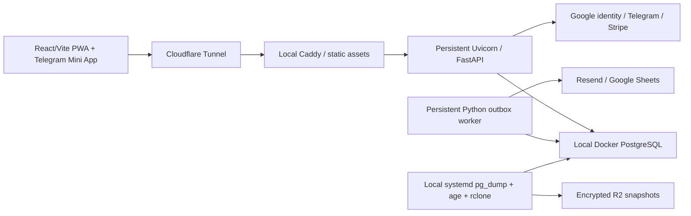
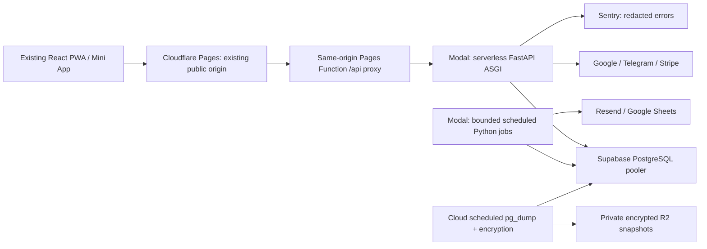

# Adaptive Lifting: serverless migration feasibility

> Historical feasibility analysis from before the completed Supabase
> migration. Its hosting/provider proposals and legacy topology are not current
> deployment instructions. See `supabase/PRODUCTION_CUTOVER.md` for the current
> provider-neutral frontend host contract.

Assessment date: **2026-09-29**. Repository: [qrtman/adaptive_lifting](https://github.com/qrtman/adaptive_lifting), branch `local-save`. Decision: **prepare a small cloud pilot, retain FastAPI, and do not authorize production cutover or a wholesale Edge rewrite yet.**

## 1. Decision and requirement assessment

A bounded deployment can plausibly have a **$0 hosting invoice**, run entirely in the cloud, and preserve the application's behavior after limited changes. **No reliable, fully featured, indefinitely $0 commercial production architecture has been established.** Free quotas, database inactivity suspension, backup capacity, email bursts, and missing hosted validation prevent that conclusion. This is not a claim that free commercial hosting is universally prohibited.

Recommended first compatibility target: **Cloudflare Pages + a small same-origin Pages Function proxy + Modal Starter ASGI FastAPI + Supabase PostgreSQL + bounded scheduled Python jobs on Modal + Resend + Sentry Developer**. Preserve the current backend and its business logic. Modal is a candidate for validation, not an approved production provider: its current agreement's internal-business/direct-service-access wording and additional no-fee conditions need confirmation for this customer-facing SaaS.

The preferred all-Supabase stack is technically possible for most behavior, but requires rewriting essentially every Python HTTP handler and service in TypeScript or SQL. That effort is unnecessary before the Python hosting candidate is tested. Neither route eliminates the database's free-tier constraints.

| Requirement | Preferred Pages/Supabase Edge stack | Recommended FastAPI pilot |
| --- | --- | --- |
| $0/month | Conditional for bounded usage; not demonstrated for reliable production | Conditional within recurring compute credits and database/email quotas; spending controls must be validated |
| No VM to provision or operate | Yes | Yes: serverless Functions/containers, no VM product |
| No locally running production services or computer uptime | Yes after cloud jobs, backups, and cutover | Yes after scheduled cloud jobs, backups, and cutover |
| Preserve existing functionality and data | Possible after extensive rewrite and parity tests; currently unproven | Most code/data unchanged; Telegram tokens, lifecycle, connections, and streaming need adaptation; hosted parity unproven |
| Eventual commercial SaaS | No identified personal-only restriction in reviewed stack terms; Free operational limits remain | Provider terms confirmation remains a commercial launch gate |

**“No VM” interpretation:** no customer-managed VM, VPS, WSL production host, or persistent server rental. Supabase itself describes each hosted project as a dedicated VM and PostgreSQL database in its [billing FAQ](https://supabase.com/docs/guides/platform/billing-faq). If the requirement literally prohibits provider-internal VMs, the preferred database already fails; no such infrastructure-independent assurance is available for these cloud platforms.

**Scope performed:** source/report inspection, current official-document research, existing focused tests, and an isolated local compatibility probe. No deployment, DNS changes, account provisioning, production database access or migration, merge, push, backend rewrite, or worker removal. The compatibility probe migrated only a disposable local test database. All deployment steps below are a future plan.

## 2. Evidence and current implementation

### Inspected source and local state

The authoritative editable checkout is `C:\Users\admin\local-save-source`. Local HEAD, recorded origin tracking ref, and a fresh read-only `git ls-remote origin refs/heads/local-save` all returned `c8c0181a90c9962e779f633c2bc48bca1b971435`. The working tree contains **60 tracked modified files** and additional untracked verification/staging files. They are part of this assessment, not discarded in favor of GitHub's older source.

Read the three requested reports, `AGENTS.md`, `architecture.md`, `design.md`, `knowledge.md`, application routers/services/models, migrations, runtime/security settings, frontend API/auth/sync/storage/worker code, and deployment configuration. Source takes precedence over aspirational/stale documentation.

The latest [email staging report](email-verification-staging-validation.md) supersedes the earlier report's browser-failure classification: 280 backend tests, 219 frontend tests, and focused browser tests were reported passing; the complete E2E run finished 52/53 with a timeout that passed alone. Real verification mail, Google, Telegram, and staging restore/proxy validation were still blocked. Those are prior report results, not rerun results from this task.

Additional **local hosting artifacts** were discovered outside the Git checkout in `C:\Users\admin\local-save-hosting`. Its `deployment-c8c0181/deployment-report.md` records a 2026-09-28 production release at `https://app.goatedmethod.me`, PostgreSQL revision `0010_voucher_redemption_limits`, preserved accounts/data, and successful encrypted R2 backup restores. The hosting scripts define PostgreSQL 17 in Docker, Cloudflare Tunnel, Caddy, WSL/systemd and a nightly backup timer. This historical report was read; its production state was not independently checked or altered. The unpushed verification migration `0011` is therefore an additional release requirement, not assumed already live.

An existing domain is indicated by these artifacts. Reuse is possible if DNS ownership/access is retained; verified Resend sender configuration and continuing domain renewal costs are not established. A new domain is not assumed necessary.

### Current topology and dependencies

The frontend uses IndexedDB snapshots and durable mutation queues, browser service-worker caching, and same-origin `/api` by default. `VITE_BACKEND_URL` can select a separate origin. Browser offline storage is intentional application functionality; it is not a local production service.

The API uses Python/FastAPI, synchronous SQLAlchemy 2, psycopg 3, Alembic, bcrypt, PyJWT, cryptography/Fernet/P-256, requests, Google Auth, Stripe, Pydantic, and dateutil. **No NumPy, SciPy, pandas, Redis, Celery, or external numerical engine is required by the checked-in dependency list.** Production-like settings already require PostgreSQL and fail closed on missing migrations/secrets. Local development may use SQLite; cloud runtime filesystem storage cannot replace the production database.

Persistent infrastructure dependencies:

| Dependency | Actual behavior | Required replacement |
| --- | --- | --- |
| Uvicorn process | One API worker in Docker; startup checks expected Alembic revision | ASGI serverless lifecycle; explicit initialization, no migrations per request |
| Python worker | `backend/worker.py` loops; idle wait every 10 seconds | Bounded scheduled invocations using existing claim/process functions |
| Telegram link-token dictionary | `PENDING_LINK_TOKENS` stores raw ten-minute tokens in one process | Shared hash-only token table; atomic single-use consumption |
| SSE route | Infinite two-second DB polling and heartbeat loop | Bounded stream and authorized reconnect/cursor recovery |
| PostgreSQL volume | `goat_production_postgres`, host Docker storage | Hosted PostgreSQL with restored application data |
| Caddy and Cloudflare Tunnel | Locally serves static files and proxies HTTPS traffic | Pages static hosting and same-origin cloud API proxy |
| WSL keepalive/systemd | `Start-GoatHosting.ps1` runs WSL sleep indefinitely; systemd runs Compose | Remove from production dependency only after validated cutover |
| Backup timer | 03:15 daily, randomized delay; pg_dump → age → local copies and R2; retains 30 snapshots | Cloud scheduled encrypted export, remote checksum verification, restore drills |
| CLI administration | Coach promotion/grants, voucher creation, migration adoption | On-demand operator/cloud jobs; no continuously running admin machine |

SSE events are **already persisted in `domain_events`**, not an in-memory broadcaster. It is the connection/polling lifetime that depends on a persistent process. No active frontend EventSource consumer was found in the inspected `src`; nevertheless the registered live endpoint must be retained.

### Authentication, transactions, and source/document discrepancies

Password hashes use bcrypt; login rejects passwords over 72 UTF-8 bytes. The current session cookie contains an HS256 JWT with `sub`, `role`, `session_id`, `exp`, and versioned signing-key header. Every authenticated request checks the database session identity/expiry/revocation and live account eligibility. Preserve actual issued-token compatibility; documentation mentions additional claims that the issuing code does not currently add.

The unpushed verification flow creates no authenticated session at registration, stores only a token hash, encrypts temporary token material in the outbox, and atomically verifies once. Eligibility is checked on password, Google/Telegram sessions, integrations, and relationships. Existing password accounts retain legacy exemptions; verified Google identity uses stable `sub`. Never merge accounts solely by matching email.

The current sync implementation commits accepted mutations, then recalculation, then its domain event in **separate commits**, despite architecture.md describing a single transaction. `sync_mutations.mutation_id` is a global primary key, although lookup is device-scoped. SSE cursors use string comparison on timestamp-shaped event IDs, ordered by creation time. These existing behaviors are migration risks: add crash/replay parity tests and separately review corrections; do not claim atomicity or per-device uniqueness that the schema does not enforce.

Other existing risks under greater concurrency include Telegram's event claim being committed before command processing, and its select-before-insert deduplication race. Stripe processing has stronger transactional inbox/savepoint handling. Hosting a process in the cloud does not automatically fix these differences.

## 3. Provider capabilities, costs, and commercial suitability

Official pages were checked on the assessment date. Prices/terms can change. Where no unambiguous official statement about signup/card requirements was found, it is explicitly left as a setup gate rather than inferred from a $0 price.

### Preferred stack

| Component | Current official free allowance / limit | Application fit and caveat |
| --- | --- | --- |
| Cloudflare Pages | 500 builds/month; 20,000 files; 25 MiB per asset; preview deployments | Vite `dist` fits; static serving is separate from dynamic Function quota. [Pages limits](https://developers.cloudflare.com/pages/platform/limits/) |
| Pages Function / Worker proxy | Workers Free: 100,000 requests/day, 10 ms CPU/request, 128 MB | Thin streaming HTTP proxy fits conceptually; no bcrypt, analytics or database logic here. All dynamic calls count. [Workers limits](https://developers.cloudflare.com/workers/platform/limits/) |
| Supabase PostgreSQL Free | 500 MB/project, 5 GB uncached egress; Free projects may pause after one inactive week | Standard PostgreSQL supports current schema. Free lacks automatic backups and uptime SLA. Storage and transfer are limiting. [Pricing](https://supabase.com/pricing) |
| Supabase organization | Two active Free projects across owner/admin organizations | Use staging + production; no unlimited extra preview databases. Quota aggregation must be checked, not doubled automatically. [Billing](https://supabase.com/docs/guides/platform/billing-on-supabase) |
| Supabase Edge Functions | 500,000 included invocations; 256 MB; 150 seconds Free worker wall lifetime; 2 seconds CPU/request; 100 functions/project | Deno/TypeScript rather than CPython. 100 functions are sufficient by grouping routes. Async network time is not CPU time; no unbounded worker loop. [Limits](https://supabase.com/docs/guides/functions/limits) |
| Supabase Cron | SQL/HTTP scheduling; recommended ≤8 concurrent jobs and ≤10 minutes per job | Cron duration does not extend Edge's shorter runtime. Database owns schedule and due state. [Cron](https://supabase.com/docs/guides/cron) |
| Resend transactional Free | 3,000 emails/month; 100/day; three sending domains | Existing REST adapter can stay. Daily cap blocks signup bursts even with low MAU. [Pricing](https://resend.com/pricing) |
| Sentry Developer | One operator; 5k errors, 5M spans, 50 replays/month; current table also lists 5 GB logs | Use error monitoring with sampling; disable replay/PII capture initially. No paid automatic overages. [Pricing](https://sentry.io/pricing/) |

Free static hosting does not make a Worker API free of execution limits. Supabase's Auth MAU allowance is irrelevant because this application will continue using its own user/session tables.

Reviewed [Cloudflare agreement](https://www.cloudflare.com/terms/), [Supabase terms](https://supabase.com/terms), [Resend terms](https://www.resend.com/legal/terms-of-service), and [Sentry terms](https://sentry.io/terms/) do not establish a Vercel-style personal/noncommercial-only condition for the proposed Free stack. This is an assessment of the published restrictions, not an uptime guarantee or an assurance of account-specific approval. Hosting your application is distinct from reselling direct access to these providers.

Cloudflare advertises starting free without a card on its [plans page](https://www.cloudflare.com/plans/); Resend does so on its [transactional product page](https://www.resend.com/products/transactional-emails). Supabase/Sentry Free signup card requirements were not conclusively evidenced in the pages retrieved: verify the account flow without selecting a paid plan. No assumption that billing credentials can safely be omitted or that a trial remains free after expiry.

Resend needs a sender domain under your control, with provider-required DNS authentication. Its shared test sender is not a production sender for arbitrary recipients. Reuse `goatedmethod.me` or an already-owned delegated subdomain if permitted. A `pages.dev` hostname alone does not confer mail-sender DNS ownership. [Domain documentation](https://resend.com/docs/dashboard/domains/introduction), [test-domain limitations](https://resend.com/changelog/improved-logs-visibility).

### Option A: compatible Python serverless platforms

| Platform | FastAPI/dependency fit | Free/commercial/card assessment | Execution/database effect | Approximate implementation effort |
| --- | --- | --- | --- | --- |
| **Modal Starter** | Official `asgi_app`; ordinary Linux Python image can install current dependencies; must test pinned versions | $0 subscription plus recurring $30 compute credit; payment method required; usage is charged beyond credit unless controlled. Customer-facing SaaS terms remain unresolved | Web response timeout 150s; background Functions can be configured up to 24h; PostgreSQL pooler works conceptually | 10–20 engineer-days for full pilot/cutover preparation |
| **Google Cloud Run, request-based** | Reuse existing backend Docker image/ASGI server; scale to zero, minimum instances 0 | Ongoing usage allowance, commercial workloads supported; billing account/payment verification required. No hard $0 budget guarantee | 2M requests, 180k vCPU-s, 360k GiB-s/month at Tier-1 allowance; internet egress/build/image charges separate; up to 60-minute HTTP timeout | 8–18 days, but rejected as a strict-budget solution |
| **AWS Lambda on demand** | Linux CPython dependencies, ASGI adapter or Lambda Web Adapter; no Uvicorn listener in ordinary handler mode | Lambda lists 1M requests and 400k GB-s/month. New AWS Free account closes after six months/credit depletion; permanent Paid account can incur costs. Payment verification required | Max execution 15min; short DB transactions; streaming adapter/URL configuration needed; packaging, egress/log costs separate | 12–25 days; not an indefinite no-billing solution |
| **Vercel Python Functions** | Official ASGI/FastAPI support; compatible native wheels/build size still tested | Hobby expressly personal/noncommercial only. Suitable only for eligible personal experiments, not this SaaS | Current Hobby duration up to 300s; no indefinite worker; PostgreSQL pooling required | 7–15 days for experiments; excluded commercially |
| **Azure Functions** | Python ASGI adapter approach; ordinary Python dependencies | Consumption has 1M requests/400k GB-s grant; Flex has 250k/100k. Grants require a paid consumption subscription and exclude storage. Card/subscription verification gate | HTTP duration and host lifecycle vary by plan; required storage/network charges prevent assuming $0 | 12–25 days; excluded as strict $0 candidate |
| **Cloudflare Python Workers** | FastAPI supported, but Pyodide/WebAssembly runtime, not ordinary CPython | Free dynamic limits apply; commercial hosting not identified as personal-only; no paid plan proposed | Pure Python/PyEmscripten/Pyodide packages only; native bcrypt/cryptography/psycopg compatibility and sockets/requests unresolved; 10ms CPU unsuitable for existing bcrypt | Substantial adaptation; not “preserve backend unchanged” |

Sources: [Modal ASGI](https://modal.com/docs/guide/webhooks), [Modal pricing](https://modal.com/pricing), [Modal billing/card requirement](https://modal.com/docs/guide/billing), [Modal HTTP timeouts](https://modal.com/docs/guide/webhook-timeouts), [Modal function timeouts](https://modal.com/docs/guide/timeouts); [Cloud Run pricing](https://cloud.google.com/run/pricing), [Google billing/free program](https://cloud.google.com/free/docs/free-cloud-features), [Cloud Run timeouts](https://cloud.google.com/run/docs/configuring/request-timeout); [Lambda pricing](https://aws.amazon.com/lambda/pricing/), [Lambda limits](https://docs.aws.amazon.com/lambda/latest/dg/gettingstarted-limits.html), [AWS Free program](https://aws.amazon.com/free/), [payment verification](https://repost.aws/knowledge-center/free-tier-payment-method); [Vercel Python](https://vercel.com/docs/functions/runtimes/python), [Hobby restrictions](https://vercel.com/docs/plans/hobby); [Azure pricing](https://azure.microsoft.com/en-us/pricing/details/functions/), [Python Functions developer guide](https://learn.microsoft.com/en-us/azure/azure-functions/functions-reference-python); [Cloudflare Python](https://developers.cloudflare.com/workers/languages/python/), [supported packages](https://developers.cloudflare.com/workers/languages/python/packages/).

No rented VM, Render/Koyeb persistent instance, PythonAnywhere process, self-hosted Supabase, or always-on cloud worker is presented as the solution. Promotional credits with an expiry are distinguished from recurring allowances.

**Modal budget and terms gates:** its [budgets documentation](https://modal.com/docs/guide/budgets) distinguishes gross usage budgets from net spending limits. Set net spend to $0 and gross usage at or below applicable recurring credits **if the account accepts those values**, with margin for other usage; prove enforcement and credit applicability before deploying. Documentation alone does not prove an account-specific zero-dollar control. Its [May 2026 agreement](https://modal.com/legal/terms) permits no-fee use subject to additional conditions, describes use for internal business, and prohibits giving third parties direct service access. Public application traffic should not expose the platform account/API, but customer-facing SaaS permission still needs written clarification. No email or support message was sent.

### Option B: Supabase Edge Functions

All 65 route contracts can be reimplemented; **none of the Python implementation runs unchanged in the hosted TypeScript runtime**. Preserve paths with the Pages proxy, e.g. forward `/api/*` to one routed function or several functional groups under `/functions/v1/*`. Deployment root/path rewriting and OAuth callback redirects require tests.

| Area | Work required in Edge |
| --- | --- |
| Health, catalogs, profile, basic card/note CRUD | Relatively direct contract translation, with authorization and database handling |
| Auth, verification, coach links, entitlements, billing | Reimplement validation, eligibility, locks, state transitions, audit records, provider verification |
| Workout mutation, copying, ordering, canonical response formatting | Rewrite SQLAlchemy services and ORM traversal; preserve optional grouping, numeric fields and tombstones |
| Sync and historical archives | Substantial rewrite: replay/conflict/device/math rules, transactions, history snapshots |
| Math/analytics/export | Port pure formulas and query/aggregation pipeline; differential tests for Python vs JS rounding, dates, nulls, finite values |
| Fernet credentials/email jobs | Implement a tested Fernet-compatible decoder/encrypter or controlled dual-format transition; WebCrypto AES-GCM does not decode Fernet |
| SSE and outbox lifecycle | Redesign execution boundaries and restart recovery; retain authorization and durable state |

Bcrypt cost/salt/hash format must remain compatible; benchmark the selected TypeScript/WASM implementation below Edge CPU limits. Do not reset passwords, weaken work factors, or adopt another auth product to avoid this work. Google ID verification must validate signature, audience, issuer, expiry and email-verification claims; official Python verifier semantics need a tested replacement. Telegram needs exact signed canonicalization, duplicate-key rejection and freshness limits. Stripe requires raw request bytes and signing-secret verification before parsing and mutation.

Direct SQL via a pooler with a restricted database role is the closest equivalent to SQLAlchemy transactions. Independent Supabase REST calls do **not** form an atomic multi-table transaction. Complex writes need one SQL transaction or narrowly scoped transactional database functions; locks must not span unrelated HTTP requests.

| Comparison | Preserve FastAPI on validated Modal | Supabase Edge |
| --- | --- | --- |
| Functionality preservation | Strongest reuse of existing logic/dependencies | Complete behavior parity must be reestablished |
| Security regression risk | Smaller changes; process-state/proxy issues remain | Larger auth/crypto/RBAC/transaction surface |
| Reliability | Cloud execution, quota shutdowns, cold starts, shared DB risks | Runtime CPU/wall limits, quota restrictions, shared DB risks |
| Estimated effort | 10–20 days plus external setup | 35–65 days plus external setup |
| $0 under small bounded load | Plausible after budget/terms gates | Plausible after runtime/parity gates |
| Reliable $0 at 1,000 active users with history | Not supported by DB/egress model | Not supported by DB/egress/invocation model |

Recommendation: validate Option A first. Only proceed with Option B if the Python host fails a necessary contractual/technical gate and Edge proofs pass. A TypeScript rewrite is not itself a fix for free-tier database capacity.

Proposed Option A topology, subject to the validation gates:

Migration and backup jobs use the appropriate direct/session connection rather than the transaction pooler when required. No cloud component depends on the local host remaining online.

### What stays unchanged, changes, or needs rewriting

With Option A, retain password hashes, JWT/session/verification policy, training math, analytics services, coach–athlete ownership and historical archives, billing/vouchers, integration signature checks, Alembic history, and frontend IndexedDB/offline behavior. Existing provider adapters and durable outbox business logic can remain Python.

Modify hosting entrypoints, explicit ASGI startup, database connection settings, secret loading, proxy/redirect/IP trust, durable Telegram token storage, bounded SSE reconnect, cloud job scheduling and backup packaging. Pagination/delta fetch may be needed to preserve whole-history access within bandwidth limits. None is implemented by this report.

Option A requires no complete rewrite of the training/auth/billing business backend. The in-memory Telegram token store and infinite worker/stream execution boundaries need replacement implementations. Option B requires rewriting all Python HTTP/service code in TypeScript/SQL, including transactional operations, provider verification and Fernet handling; frontend appearance and domain rules should remain the same.

## 4. Database design and preservation

Keep existing application-owned PostgreSQL tables; do not import identities into Supabase Auth or rename `users` to `auth.users`. There are **35 ORM tables** (Appendix B), plus Alembic metadata and provider-managed schemas. Preserve identifiers, hashes, verification flags/token lifecycles, timestamp semantics, session expiry/revocation, relationship histories, training trees, tombstones, devices/mutations, subscriptions/grants/reservations/vouchers, encrypted credentials, outbox payload/checkpoints and deduplication rows.

### Operations and transaction inventory

| Operation family / source | Reads and writes that must survive |
| --- | --- |
| `main.py` auth/security | Lookup live users/password or Google subject; create/update user and session; record login/logout/revocation audits; list/create devices; revoke devices/sessions; read account-access state |
| `email_verification.py` | Lock account by UPDATE; create hash-only token and encrypted outbox in caller transaction; cancel prior tokens/jobs; conditional consume and verified timestamp; worker rechecks under same lock |
| `auth_limits.py`, `voucher_rate_limit.py` | Shared subject/counter UPSERT, lock/update, prune old per-subject auth events, count/insert attempt; transactionally enforce limits |
| `main.py` relationships | Hash coach code; upsert invitation; validate eligible participants/capacity; create/reactivate/end relationship; retain athlete data; snapshot ended-link history and audit |
| `main.py` plan/session/set/note/export | Query owner/active links/tree; create grouping/session/exercise/set; replace/reorder sets; clone selected sessions and optionally logs; update labels; soft-delete; recalculate stored metrics; upsert/tombstone day notes; query CSV/JSON and write export audit |
| `sync_service.py`, `set_writes.py` | Validate device/ownership/session lock/schema/math; check durable mutation ID; allowed-field writes and set replacement; tombstone/conflict acknowledgement; accepted/rejected mutation rows; metric writes; domain events |
| `analytics_service.py`, `analytics_router.py` | Authorized joined set query with date/scope filters; pure aggregations; create preset cards on first list; card CRUD/tombstones; idempotent card sync |
| `workspaces.py`, `saas_access.py`, `entitlements.py` | Membership/workspace resolution, active grants/subscription/plan capabilities, capacity counts, authorization; administrative workspace/grant creation |
| `subscriptions.py`, `billing_customers.py`, `billing/*` | Resolve owner/customer; lock workspace for checkout reservation; checkpoint creation intent/provider IDs; inbox event/savepoint/dedup; normalized subscription state and event ordering; audit, grant/reconciliation writes |
| `vouchers.py`, `manage_user.py` | HMAC voucher identity, assigned-user validation, atomic one-time redemption/access grant, code creation/revocation; coach promotion/access administration |
| `integrations.py` | Telegram connection writes, webhook inbox and training actions; consume hashed Sheets OAuth state; encrypted token upserts/refresh/removal; enqueue export; lease claim, increment attempts, cleanup, processing checkpoints/results |
| `database.py`, `accessory_migration.py`, migration adoption/revisions | Legacy accessory-to-exercise/set conversion and tombstones; explicit schema/data upgrades; test-only create_all, never runtime schema mutation |
| `sse_broadcaster.py` | Recheck live user/session/workout/plan permissions and read committed events using cursor; no DB connection held during sleep |
| Operational backup scripts | Consistent pg_dump, encryption, checksum/size verification, retention and restore; not an application mutation job |

This includes non-obvious writes on GET, especially preset-card seeding, first-device creation and export audits. Background cleanup is listed separately below. The machine-readable local inventory is conservative AST call-site evidence, not a count of distinct executed SQL queries.

### SQLAlchemy/Alembic and connection strategy

Option A retains both workflows. Alembic revisions `0001` through `0011` already contain PostgreSQL-compatible schema/data operations, with recorded prior PostgreSQL rehearsals. Retain their history and adoption checks. Run migrations once as a deliberate release job, not in cold-start handlers. Option B can still use Alembic in a separate Python release job even though Edge does not execute ORM code; otherwise convert future revisions deliberately, with one schema authority.

Supabase documents transaction pooling for serverless, direct connections for migration/backup, and session pooling for IPv4-only clients. Transaction mode does not support prepared statements/session-dependent features. [Connection guide](https://supabase.com/docs/guides/database/connecting-to-postgres).

Proposed Python runtime configuration change: TLS validation, psycopg `prepare_threshold=None`, SQLAlchemy `NullPool` or a deliberately small bounded pool, short transactions, and explicit connect/statement/lock timeouts. Current default QueuePool is not serverless-tuned. Never interpolate the connection URI into logs. Use direct IPv6 or documented session-pooler fallback for Alembic/dump; do not buy the IPv4 add-on.

Provisional admission target: ≤20 simultaneous server-side database transactions per project, with reserved operational headroom. This is a design budget, **not an asserted provider connection limit**. Verify actual Free Nano Postgres/max_connections and Supavisor client/pool configuration in the dashboard. Pooler client capacity and database backend connections are different limits; active users are not persistent DB connections. User login currently opens an additional short session while a dependency session can still be active. Rate limits and workers add transactions too.

### Authorization and RLS

Frontend receives no PostgreSQL password, administrator connection URI, service-role key, encryption/private signing key, Stripe secret, Google client secret or Telegram token.

Keep application tables unexposed through Supabase Data API where possible. Revoke unnecessary `anon`/`authenticated` grants, and enable deny-by-default RLS on application tables that remain in an exposed schema. SQLAlchemy-created tables do not automatically inherit secure Supabase dashboard defaults. Test anonymous REST access to each table.

Use separate roles: schema-owning migration role; restricted runtime role with required application DML; job role with only necessary queue/provider access. Existing server authorization remains mandatory regardless of RLS. A table-owner/service-role connection can bypass ordinary RLS; never describe that as user-level enforcement.

If implementing per-user RLS for direct SQL, set validated user/session context with `SET LOCAL` **inside every transaction**, apply policies for athlete ownership/live coach relationships/account eligibility, and clear context at transaction end. Custom HS256 JWTs are not automatically Supabase Auth identities; `auth.uid()` policies and service-role REST calls do not provide these guarantees by magic. Definer RPC functions require pinned search_path, no PUBLIC execution, explicit caller scope and narrow grants.

### Copy/restore strategy

First restore an encrypted existing backup into an isolated staging database and compare every application table's count/digest and referential integrity. PostgreSQL source → PostgreSQL target is the expected production path indicated by local hosting artifacts. If another live source is SQLite, use a separately tested typed export/import in FK order; a SQLite file is not a PostgreSQL backup.

Retain password hashes byte-for-byte, current/previous JWT secrets and kid values, voucher HMAC key, integration encryption key and the **separate** raw Fernet email-payload key. The integration key is SHA-256-derived into a Fernet key in current code; the email key is already a Fernet key. They cannot be substituted. Preserve the P-256 private/public pair for offline grants.

Schema `0011` makes existing password accounts exempt rather than fabricating verification evidence; retain that rule if upgrading a restored `0010` backup. Production rollback must not downgrade `0011` once pending users exist: its downgrade deletes verification jobs/state.

## 5. Replace worker and local scheduled operations

### Existing scheduled/background behavior

The application has no separate daily reminder/analytics scheduler. Telegram `/today`, `/done`, and `/status` behavior is webhook-driven. Provider calls such as Sheets token refresh, Stripe checkout reconciliation and access expiry checks are primarily request/job-driven.

| Current task | Existing guarantee | Cloud strategy |
| --- | --- | --- |
| Verification mail | Durable encrypted outbox; eligibility/token recheck; provider idempotency; ciphertext erasure | Bounded Python job first, or compatible Edge mail function |
| Sheets publish | Durable queue, authorization recheck, token refresh, creation-intent and spreadsheet-ID checkpoints | Bounded Python job; chunk large exports if measured necessary |
| Retry/recovery | Conditional UPDATE claim; 15-minute lease; at most 3 attempts; retry waits 5 then 10 minutes | Same DB transitions; schedule due work, never sleep for backoff |
| Expired OAuth state | Pruned on auth URL/callback and worker claim | Keep request cleanup; add bounded SQL cron cleanup |
| Expired verification/terminal mail | Worker cancels/erases protected payloads | Keep in claim path plus independent bounded SQL maintenance |
| Auth rate-event cleanup | Old events pruned for current subject on attempt | Global stale-event/subject maintenance after documented retention |
| Expired sessions/Telegram links | Sessions denied at auth time; link dict expiry is lazy | Retain revocation evidence as needed; delete only truly expired records with safe retention; new durable link-token expiry job |
| Expired locks | Checked on writes/stream access | Logical expiry unchanged; optional bounded cleanup after semantics tests |
| Billing/integration maintenance | Request-driven reconciliation and refresh | Keep on demand; optional bounded health/reconciliation with provider-safe idempotency |
| Nightly backup/30-snapshot retention | Encrypted dump, R2 verification and restore procedures | Cloud scheduled dump/encryption/upload with bounded retention and restore drill |
| Live telemetry | Authorized two-second polling loop | Bounded reconnectable stream; retain durable event source |

Do not delete tombstones, sync deduplication rows, audit history, subscription evidence, or relationship snapshots just to hit storage limits. Such pruning can change behavior for long-offline clients and violate preservation. A future archive policy must keep required reads/replay behavior and be explicitly validated.

### Recommended Python job boundary

Retain `claim_next_outbox_job` and `process_next_outbox_job`. Add a separate cloud entrypoint that initializes the same fail-closed settings, processes a bounded number of jobs or elapsed-time budget, and exits. The existing `run_worker` remains intact until replacement passes. Modal cron can invoke the bounded entrypoint independently of browser traffic. Do not make production depend on `modal serve` or an operator laptop.

Use one one-minute outbox schedule and one daily maintenance/backup schedule (or separate maintenance and backup schedules); keep within Starter's five cron allowance. Sheets can be executed as a scheduled/spawned **background Function**, avoiding the web timeout. DB outbox stays canonical; in-memory Modal Queue/Dict is not a replacement for durable jobs.

Separate email priority from long exports so exports do not starve recovery mail. For frequent mail, event-triggered dispatch after committed enqueue can reduce latency, but durable scheduled catch-up remains necessary if dispatch is lost.

### Supabase Cron + Edge alternative

Use pg_cron + pg_net to invoke a protected Edge worker. Store cron dispatch credentials in Supabase Vault. Prefer one periodic trigger, batch only bounded work, and use database due times. One-minute ticking costs ~43,200 invocations/month; the current ten-second poll translated literally costs ~259,200 before users do anything. The 10-minute Cron recommendation does not override the Edge runtime ceiling.

Claim via the existing conditional-update semantics or an equivalent transactional `FOR UPDATE SKIP LOCKED` function. Claims need a returned ownership generation/claim token and fenced completion if execution can overlap or leases are shortened. Current attempt count plus status/lease is the baseline, not a fully general exactly-once protocol.

Preserve three-attempt limit, lease recovery, backoff, permanent-vs-temporary mail errors, token cancellation/expiry, ciphertext destruction and stable Resend job ID. Network side effects cannot be guaranteed exactly once by a DB lock. Resend idempotency keys are retained for 24 hours; keep recovery inside that window and reconcile rather than resend blindly after it. [Resend idempotency](https://resend.com/docs/dashboard/emails/idempotency-keys).

Email currently holds an account DB lock across a bounded 15-second provider call to serialize with resend. A chain of REST RPC calls cannot preserve this lock. Keep the operation on one DB transaction/connection, or explicitly redesign reservations/fencing and test concurrent resend/delivery.

### Sheets limits and different execution strategy

Current export gathers all matching workouts and five default tabs (`Sets`, `Workouts`, `INOL`, `ACWR`, `e1RM`) in memory. The provider call path includes token refresh ≤6s, create ≤8s, tab inspection ≤8s, tab changes ≤8s, values write ≤12s: roughly **42 seconds of configured network timeouts**, plus database queries, serialization, compute and connection setup. This is an inspection-derived envelope, not a measured runtime guarantee; requests timeouts are not a strict whole-operation deadline.

Sheets recommends ≤2 MB payloads, enforces 300 read/write requests per minute per project and 60 per user, and may take up to 180 seconds to process a request. The API has no standard usage charge. [Sheets limits](https://developers.google.com/sheets/api/limits). Typical small exports plausibly fit; large multi-year exports may exceed Edge CPU, memory or duration. No live Google throughput benchmark was performed.

Preserve uncertain-create behavior: the code checkpoints intent before create and stops automatic retry if success is uncertain without a recorded sheet ID. Later tab/write retries resume the same spreadsheet. Do not replace this with a retry that can create duplicate sheets.

For large exports: checkpoint row/tab progress and stable spreadsheet ID; fetch pages; write bounded batches; retry quota responses with jitter; reauthorize each chunk; never start duplicate create operations. Preserve whole-history exported results. Use Python background Functions first when Edge limits fail; do not silently drop tabs/history or truncate exports.

### Backups are part of cloud completeness

Supabase recommends off-site exports for Free projects because automatic backups are not included. [Backups](https://supabase.com/docs/guides/platform/backups). Replace the existing local backup timer before decommissioning WSL.

Existing R2 can hold encrypted snapshots within its Standard allowance: 10 GB-month, 1M Class A and 10M Class B operations, no egress charge. It bills excess usage; it is not a guaranteed zero-cost store. [R2 pricing](https://developers.cloudflare.com/r2/pricing/). Existing billing/card setup must be inspected by the owner; R2 activation can require a subscription/payment flow.

Cloud backup jobs should stream pg_dump → age encryption using an external public recipient key, write only encrypted temporary data if unavoidable, upload a private object, verify checksum, and retain bounded snapshots after success. Private decryption keys remain outside the service. Set size/operation safety margins and alerts. A 30-day policy can exceed both R2 storage and Supabase export egress; the scenario model counts it. A backup in the same database is not an off-site backup.

No new R2 subscription or backup policy was configured here. Strict $0 backup enforcement, scheduled job packaging (pg_dump/age/S3 client), and restore measurements remain required validation.

## 6. Authentication, hosting boundaries, and integration security

Recommended public origin remains `https://app.goatedmethod.me` if ownership permits. Serve Pages there and forward `/api/*` through a thin Function to the cloud backend. Staging uses an isolated origin and credentials. A `pages.dev` origin can serve a cloud pilot without buying a new web domain, but moving an existing app origin has implications below.

### Cookie/CORS design

Retain HttpOnly/Secure/SameSite=Lax, host-only cookies, same cookie name/path and session revocation checks. The current cookie has no Domain attribute. With a same-origin proxy, upstream Set-Cookie must be passed intact, redirects must point to the public frontend and API paths, and credentials should not be copied into logs. Preserve raw webhook bytes and signature headers. Streaming must not be buffered or cached.

Direct browser requests from `pages.dev` to `supabase.co` or `modal.run` are cross-site. `credentials: include` and CORS alone do not make a SameSite=Lax cookie available to fetch. Changing to SameSite=None requires Secure, explicit CORS/CSRF controls, and still encounters third-party-cookie blocking, particularly Telegram/Safari. Same-site custom subdomains reduce that problem but still need CORS; the same-origin proxy is the clearest preservation route.

Use exact allowlisted origins with credentials; never wildcard. Continue rejecting untrusted Origin/Referer writes; service/provider webhooks use provider authentication rather than browser cookies. Previews must not gain production CORS access by broad suffix matching. Verify OPTIONS, registration/login/logout/me, cookie persistence, CSRF and Mini App across browsers.

Only trust forwarding headers inserted by a known ingress. Current Docker Uvicorn trusts forwarded IPs broadly. The proxy must remove attacker-supplied client-address headers and inject the validated address with a backend-verifiable ingress mechanism; untrusted direct backend traffic cannot spoof it. Otherwise shared-IP authentication limits can be bypassed or all users collapse to one proxy address. Do not expose a credential in the frontend to solve this.

### Secrets, auth gateway, and data continuity

Keep existing application JWTs rather than installing Clerk/Supabase Auth. For Edge, configure gateway JWT verification appropriately for the custom JWT: ordinary Supabase gateway validation is not validation of this application's independent signing secret. Functions with `verify_jwt=false` must perform full application session/eligibility authorization inside the handler. Webhooks verify provider signatures; cron endpoints require private service credentials. [Function auth](https://supabase.com/docs/guides/functions/auth), [authorization headers](https://supabase.com/docs/guides/functions/auth-headers). Disabling gateway checks is never equivalent to permitting unauthenticated database access.

Keep sensitive keys in backend/platform secret stores. Runtime keys must preserve ciphertext/token compatibility during cutover; staging must use separate keys except isolated restored data testing with controlled access. Build outputs may contain the Google browser client ID and offline public key, not corresponding secrets.

The signed ES256 offline capability is bounded by the server session and 24 hours. Preserve issuer/audience/session/scope/time checks, pinned public key, and clear authorization on reconnect denial/logout while retaining training snapshots/queues. Immediate offline revocation is impossible; retain existing bounded semantics.

**Origin changes matter:** IndexedDB/service-worker caches and host-only cookies do not transfer to another origin. To preserve users' unsynced data and existing browser sessions, retain the public production origin and frontend DB naming/schema. Repoint that origin only after staging validation. If an origin move is unavoidable, require an explicit queue-drain/export/recovery migration; do not assume a server dump captures offline browser mutations.

### External integration gates

Google browser client authorized origins/audience must match the deployed frontend. Sheets redirect URI must route to the cloud callback, preserving one-time hashed OAuth state and encrypted refresh tokens. External OAuth consent in Testing issues refresh tokens expiring after seven days for this Sheets scope. Commercial release needs the correct publishing/verification workflow, not perpetual testing mode. [Google OAuth lifecycle](https://developers.google.com/identity/protocols/oauth2).

Telegram: preserve initData signature/freshness validation and verified session creation; migrate both Mini App link-token and bot `/start` consumption to a durable table. Webhook HTTPS URL/secret and bot Mini App URL must be updated in staging and later production. Concurrent callback replay needs one winner; keep command authorization and provider event evidence.

Stripe: retain owner-only checkout/portal, plan allowlists, mode checks, customer mapping, reservation idempotency, signed webhook inbox/event ordering and subscriptions as entitlement authority. Do not grant access from the checkout-return page. Use test keys/events until later operator enablement. Live Stripe transaction/subscription-processing fees are business costs, even if hosting remains $0. Domain renewals likewise are not a free hosting allowance; disclose whether the infrastructure budget includes them.

Monitoring: redact passwords, cookies, authorization headers, verification fragment/token, provider bodies, refresh tokens, encryption keys, voucher codes, and training/private profile content. Sentry is not currently wired into dependencies; a small monitored/redacted SDK addition is required. Do not let exhausted monitoring quotas interrupt workouts.

## 7. $0 feasibility and capacity model

### Explicit assumptions

These are planning estimates, not measurements of production data. No production database was queried. All scenarios use a 30-day month, one year of retained athlete data, no paid upgrades, and an already-owned sender/web domain.

Per active user: 12 sessions/month × 5 exercises × 4 sets = **240 sets/month**; 2,880/year. At an assumed 450 bytes/set including indexes = 1.30 MB. Two retained mutation rows per set × 200 bytes = 1.15 MB/year. Add ~0.55 MB for exercises/workouts/users/cards/notes/audits/integration data: **3 MB/user/year**, plus **20 MB** project baseline. Actual index/text/history/bloat sizes can be much larger; database size includes inactive users too.

Traffic: **600 API calls/user/month**, average **15 KB uncached response**, plus ~1 MB/user integration/telemetry overhead = approximately **10 MB/user/month**. Allow 10% extra invocations for OPTIONS/retries. Email: 20% new accounts/month × 1.5 attempts = **0.3 messages/user/month**. Job volume: **8 Sheets exports/user/month** as a conservative mixed-user envelope plus verification mail; five seconds average export wall time, 0.5 seconds mail time. The current mail function may hold locks up to its provider timeout.

Backup transfer: one daily dump assumed to compress to **30% of measured database size**, retained 30 days. Monthly backup egress and retained backup capacity are therefore approximately **9 × database size**. pg_dump does not export index pages, so this must be measured, not treated as a guaranteed compression ratio. Public static assets are served by Pages, not charged as Supabase database/API egress.

Baseline Edge CPU: 20ms average per API call and 10ms per empty Cron tick, excluding large analytics/login benchmarks. Baseline API wall time: 0.5 seconds/call. Mail/SSE/analytics peaks must meet per-request limits separately.

### Scenario estimates

Development/staging means two tiny projects with ten synthetic users each, about 1,000 combined API calls/month, ten real test emails and 100 exports. Staging jobs tick every five minutes rather than one minute; 50 builds/month across previews. The table is that combined staging workload; a separate live production workload must be added against shared provider allowances.

| Monthly resource | Development + staging | 10 active users | 100 active users | 1,000 active users |
| --- | --- | --- | --- | --- |
| Database size | ~50 MB/project, ~100 MB combined | ~50 MB | ~320 MB | ~3,020 MB: exceeds 500 MB |
| DB growth per month | Test-dependent | ~2.5 MB | ~25 MB | ~250 MB |
| Concurrent DB transaction target | 1–4 | 2–4 | 4–10 | 10–20 admission cap; spikes queue |
| API invocations incl. 10% overhead | ~1,100 | 6,600 | 66,000 | 660,000 |
| Periodic Edge job ticks | 17,280 across two projects | 43,200 | 43,200 | 43,200 |
| Total Edge invocations, before extra chunks/SSE | ~18,380 | 49,800 | 109,200 | 703,200: exceeds 500k |
| API + idle-tick CPU estimate | ~193s | ~552s | ~1,632s | ~12,432s |
| API + actual job wall time | ~1,005s | ~3,402s | ~34,015s | ~340,150s |
| User-facing/integration uncached egress | ~0.02 GB | ~0.10 GB | ~1.0 GB | ~10 GB |
| Daily backup egress | ~0.90 GB combined | ~0.45 GB | ~2.88 GB | ~27.18 GB |
| Total estimated DB/API/export egress | ~0.92 GB | ~0.55 GB | ~3.88 GB | ~37.18 GB: exceeds 5 GB |
| Email messages | 10 | 3 | 30 | 300 |
| Sheets exports + mail jobs | ~110 | 83 | 830 | 8,300 |
| Retained encrypted backups | ~0.90 GB combined | ~0.45 GB | ~2.88 GB | ~27.18 GB: exceeds R2 Free |
| Sentry errors at 0.5% of API calls | ~5 | 30 | 300 | 3,000 |
| Spans at 10% sampling × 5 spans/call | ~500 | 3,000 | 30,000 | 300,000 |
| Build volume | ~50 | ~30 | ~30 | ~30 |

CPU totals are estimated usage, not a Supabase monthly CPU entitlement: the binding runtime limit is per request. The baseline CPU row excludes actual export CPU, crypto-heavy paths and cold starts. Wall time is summed function work; it is not directly billed as CPU on Edge. Empty-tick latency must be measured. Connections depend on simultaneous work, not MAU.

**Email burst case:** onboarding 1,000 users in one day requires at least 1,000 messages before resends, over Resend's 100/day. Even 100 new users can breach the daily cap with retries. Queuing for ten days conflicts with 24-hour token expiry. Low steady-state email volume does not prove launch suitability.

**Unchanged full-plan response case:** `GET /api/microcycles`, JSON/CSV exports and some archives fetch full trees. If 300 monthly reloads/user average 200 KB each, that is ~60 MB/user/month, so 100 users consume ~6 GB before backups. The 15KB baseline is optimistic for established training history. Response/date pagination or delta fetch with equivalent UX is a modification likely needed before 100-user confidence.

**First likely bottleneck:** at small scale, verified mail setup/live staging is the immediate gate; operationally inactive Free project suspension can interrupt even ten users. With growth, retained history and full-plan/export/backup bandwidth are likely before compute. In the baseline model, database storage reaches 500 MB near **160 year-old user equivalents**; transfer reaches 5 GB near **130**, counting daily backup. At 100 users, another ~7 months of retained growth exhausts storage even if MAU is flat. Inactive user data and larger history shorten that horizon.

No deletion of old user data, reduced training math, disabled billing/integrations, or unprotected backups is counted as a $0 solution.

### Python cost illustration

Modal's listed rate is $0.0000131/physical-core-second and $0.00000222/GiB-second. At **0.5 core + 0.5 GiB**, estimated chargeable allocation is $0.00000766/second. Actual memory peaks, image build/startup/idle allocation, concurrency, region multipliers, egress and other workloads must be included. [Modal rates](https://modal.com/pricing).

With 0.5s/API call, five seconds/export and 0.5s/email, plus five allocated seconds per one-minute outbox tick:

`monthly allocation seconds = 340.15 × N + 216,000`.

| Users | Modeled compute consumption before $30 credit | Net hosting compute within applicable credit |
| --- | --- | --- |
| 10 | ~$1.68 | $0 |
| 100 | ~$1.92 | $0 |
| 1,000 | ~$4.26 | $0 for compute alone; database/egress fails |

Daily backups, staging, container idle windows/builds and live telemetry are **additional**, so these are a lower bound. There is no separate function-invocation price used in this model; Modal meters allocated resources.

For illustration, 100 simultaneous-user equivalents each opening twelve 30-minute streams/month adds 216,000 allocated seconds, ~$1.65 if all billed separately at those resources. At 1,000 users with 10% using that stream pattern, the same increment applies; if all 1,000 use it, add ~$16.55, and doubling stream duration adds ~$33.09. Warm idle windows can also dominate. Bounded reconnect prevents indefinitely billed streams but must maintain updates. Observed host billing, not local CPU benchmarks, settles the estimate.

Starter credits are recurring rather than six-month AWS credits. They still do not guarantee uninterrupted service: a zero-spend limit halts chargeable work when the credit/usage ceiling is exhausted. Sharing a workspace between staging and production shares credits and spending limits.

Cloud Run's free allowance can make a light workload's compute invoice $0, but database export egress to/from regions, public network transfer, registry/image storage, builds and other services can incur costs. A budget alert is not a hard stop. It is not recommended under the non-negotiable budget.

### Free staging versus commercial production

Staging may accept pause/wake delays, synthetic/resettable data, provider test mode, limited recipients, and temporary experimental hosts. Commercial production needs durable data, recovery, genuine provider credentials/verification, payment entitlement correctness, dependable email recovery and a documented capacity policy.

A small commercial pilot may be technically legal and temporarily $0. It must still explicitly accept free-plan availability limitations and account enforcement. **At 1,000 users under the stated preserved-history model, neither evaluated stack is within Free quotas.** A fixed $0 bill can be maintained by denying new workload, but denial is not preservation of uninterrupted application functionality.

Closest workable alternative: a small quota-monitored cloud pilot on the recommended Python candidate, retain the existing domain, keep encrypted cloud backups, and set $0 spending controls before exposure. Scale/production cutover stays blocked until measured capacity and contractual/security gates pass. No paid plan is proposed as the answer to this task.

## 8. Phased implementation, acceptance, and rollback

Effort estimates are engineering judgments for one experienced developer, excluding provider review, owner credential setup, DNS propagation and live test scheduling. Phase estimates overlap; a minimal Option A pilot is roughly **2–4 working weeks (10–20 days)**. Complete Edge parity is roughly **7–13 weeks (35–65 days)**. Neither is an hours-long configuration change.

| Phase | Work and dependencies | Measurable acceptance criteria | Rollback |
| --- | --- | --- | --- |
| 1. Infrastructure preparation | Record current release/domain/backup ownership; preserve dirty tree; choose candidate only after terms and $0 controls reviewed | Account inventory, verified spending settings, two-project quota plan, secret ownership matrix, no paid upgrade | No traffic changes; remove unused staging resources |
| 2. Database provisioning | Separate Free stage; restricted roles/deny exposure; restore backup then migrate to 0011 with Alembic | All table counts/digests/FKs preserved; repeat upgrade succeeds; Alembic check clean; measured size/egress headroom | Discard isolated restore; existing DB untouched |
| 3. Backend compatibility testing | Build pinned Python 3.12 image with all requirements; ASGI lifecycle; pooler/TLS/prepared-statement settings | All 65 contracts; cold start health; denied pending account; old bcrypt/JWT/Fernet compatibility; no leaked keys; ≤20 DB transactions under load | Remove compatibility app; original code/deployment remains |
| 4. Serverless implementation | Option A wrapper + durable Telegram tokens + bounded SSE + proxy; only if A fails, gated Edge work | Cross-instance token consumption has one winner; reconnect updates/cursors; auth/math/RBAC/sync differential parity; CPU/memory/time headroom | Feature/routing switches return stage to old implementation; additive schemas remain readable |
| 5. Background migration | Bounded worker/cron, job priority, cleanup, cloud backup | Concurrent claims, killed-worker recovery, max-three retries, ciphertext lifecycle, uncertain Sheets creation protection; no duplicate provider effects in tests; daily encrypted backup restore succeeds | Disable new scheduler before restarting old worker; preserve outbox rows/leases; no simultaneous uncoordinated consumers |
| 6. Frontend deployment preparation | Pages build, public-key/client-ID-only build vars, same-origin API routing, SPA verification route and PWA caching | Build/typecheck/unit tests pass; HTTPS cookie/CSRF/no-store/no-referrer; /verify-email direct load; no secrets in bundle; SW excludes APIs | Revert stage frontend/proxy artifact |
| 7. Auth/integration validation | Stage sender/DNS, Google sign-in and Sheets OAuth, Telegram bot, Stripe test billing/vouchers | Real inbox delivery; expiry/reuse/resend; eligible/legacy/pending flow; Google collision/no merge; Telegram cross-instance links; signed webhooks/replay/out-of-order correctness | Revoke stage credentials/URLs; preserve production provider registrations |
| 8. E2E and failure testing | Exercise roles, training, offline, denial, analytics/export, integration loss, concurrent writes and restore | Full suite passes including prior timeout case; no lost queue after restart; zero unauthenticated/cross-athlete reads; p95/API and max export within runtime; tested crash recovery | Fix stage or revert artifacts; no release authorization |
| 9. Staging soak | Seven-day cloud run with quota monitoring and computer off; test inactivity behavior separately | No local runtime dependency; bounded queue lag, authenticated health, quota projection with ≥30% margin; controlled restart and restore | Disable stage; retain evidence and existing production |
| 10. Production cutover, future only | Owner-authorized maintenance, queue drain, final consistent backup/restore, target sync, same-origin switch, provider webhook transition | Exact data reconciliation; accounts/sessions/relationships/subscriptions survive; old frontend queues drain; cloud jobs/backup active; observed quotas pass | Before writes: switch origin back. After target writes: pause writes, reconcile/export target delta into compatible old runtime, then route back; never restore stale source and lose new writes |

Suggested measurable pilot budgets: verification mail accepted p95 within two minutes when quota available; ordinary authenticated API p95 under two seconds warm; bounded SSE authorization refresh within one polling/reconnect interval; typical export under 60 seconds wall; Edge implementation, if chosen, p95 CPU below 1 second and memory below 180 MB. Cold start/provider tails are separately measured. These are proposed acceptance targets, not current performance claims.

Cutover requires preserving the existing public origin and browser IndexedDB schema. Additive release changes should support both runtimes during rollback. Preserve source PostgreSQL and encrypted snapshots until target reconciliation succeeds. There must be exactly one canonical writable database; dual writes without a reconciliation design are not a safe shortcut.

Do not downgrade away verification state or relaunch the old production c8c0181 auth code against newly pending users. Roll back hosting to a compatible **verification-aware** runtime, or use a validated forward fix. Backups are a recovery point, not permission to discard post-cutover writes.

## 9. Required tests and validation performed

### Performed now

1. Read local source/required reports and hosting artifacts; inspected git status; verified live remote branch hash with read-only ls-remote.
2. AST inventory plus runtime OpenAPI comparison on a newly migrated disposable SQLite database: **65/65 application routes match**, **35 ORM tables**, startup revision check passes.
3. Focused existing suite:

   `.venv\Scripts\python.exe -B -m pytest -p no:cacheprovider --basetemp=C:\Users\admin\serverless-feasibility-evidence\pytest-20260929 -q backend/test_email_verification.py backend/test_math.py backend/test_worker.py backend/test_integrations_logic.py`

   **57 passed, 12 warnings, 13.16 seconds.** Fake/test adapters and disposable data only; no email/provider calls or production behavior changes. Warnings concern short test JWT keys and TestClient deprecation.
4. Existing cost-12 bcrypt checks measured locally: median **203.125 ms CPU**, range 187.5–203.125ms across five checks. A synthetic 18,200-set ACWR calculation over 363 days took **15.625ms local CPU**. These CPython measurements support rejecting a naïve 10ms Python-Worker transplant; they do **not** benchmark hosted Edge/Modal or an entire analytics endpoint.
5. No live PostgreSQL/Supabase/Modal/Resend/Google/Telegram/Stripe proof was performed. Earlier PostgreSQL results are attributed to the supplied reports.

Initial narrow test order exposed an existing circular import (`integrations` imported before `main`). Reordering existing test collection to load main first corrected that collection issue without code changes. A subsequent run had 54 passes and three temporary-folder permission errors before workspace permissions changed; the completed isolated-temp rerun passed all 57. The compatibility probe was also corrected to use OpenAPI because current FastAPI lazily includes routers. These are documented tooling observations, not hidden failed production checks.

Local supporting artifacts: `C:\Users\admin\serverless-feasibility-evidence\inspect_compatibility.py`, `inventory.json`, `probe-results.json`, and `.firecrawl\` official-page snapshots. They are outside the repository. The AST operation list conservatively includes some non-DB methods with matching names, so it is navigational evidence, not an exact SQL-query count.

### Must pass before migration

- Target PostgreSQL migration upgrade/repeat/check, import/restore checks, all-table counts/digests and FK consistency, partial unique indexes and numeric/timestamp parity.
- Multi-instance auth abuse limits, verification one-winner/resend/delivery races, old bcrypt hash checks, JWT current/previous keys, ES256 offline grants, eligibility on all protected entrypoints.
- Password and Google/Telegram identity collision/linking matrix; preserve coach-code links, capacity/entitlements, unlink and frozen history.
- Raw Stripe webhook signatures, duplicate/concurrent/stale/out-of-order events, mode checks, customer/workspace mapping, failed processing retry, checkout reservation uncertainty and vouchers.
- Sync math-version/schema checks, device revocation, mutation replay, tombstones, finished/locked sessions, cross-workout field attacks, crash between existing commits and complete queue reconciliation.
- Copy/reorder/prescription logging parity, day notes, CSV/JSON, all insight-card types, date windows/comparison scopes, Python rounding and shared `tests/math_vectors.json`.
- Durable Telegram link-token mint/consume on different instances; short token expiry, one-time replay; interrupted webhook-command recovery.
- SSE bounded restart, Last-Event-ID ordering, no gaps/duplicates visible to clients, lost-session/coach unlink/verification denial and proxy disconnect.
- Real verification delivery/DNS/quota exhaustion, expired pending jobs, provider errors without sensitive logs, Fernet cross-runtime known-answer vectors if Edge is used.
- Google token refresh after restart and after publishing-state change; revoked provider access; full multi-year exports, 429 handling, ambiguous create, replayed tab/chunk writes.
- Browser same-origin cookies/CSRF/preflight, Safari/Telegram WebView, service-worker updates, offline authorization expiry/denial, unchanged-origin IndexedDB mutation retention.
- Target runtime memory/CPU/wall/packaging/DB connection and cold-start tests; ten/100-user simulated load with real response sizes, all scheduler/backup traffic included.
- Actual spending controls, credit exhaustion behavior, project pause/recovery, provider outage, backup size/SHA-256 verification and isolated restore with measured RPO/RTO.

## 10. Exact owner actions and unresolved blockers

These are setup/checklist actions for later work, not deployments performed by this report.

1. Preserve the unpushed working tree and review this report before choosing a cloud candidate. Keep the running old stack and backup artifacts intact.
2. Confirm continued ownership/control of `goatedmethod.me`, its Cloudflare DNS, existing R2 account and backup decryption material. Record renewal/account costs separately.
3. For Modal, inspect Starter eligibility/payment verification; confirm net $0 spend controls and the $30 recurring credit's applicability. Obtain provider clarification that this customer-facing commercial SaaS on Starter is permitted. Do not enable paid Team/reservations/always-on resources.
4. Create a Free Supabase staging project, then reserve the second active project for eventual production. Record actual region, size, client/backend connection quotas, exposed schemas and free-plan restrictions. Supply credentials only through the selected backend secret manager.
5. Set staging backend/runtime values: `APP_ENV=staging`, target TLS database URI, exact `APP_URL`/`CORS_ALLOWED_ORIGINS`, Secure cookies, independent JWT/integration/email/voucher keys as applicable, `EMAIL_VERIFICATION_NEW_ACCOUNTS=true`, `EMAIL_VERIFICATION_ENFORCE_LEGACY=false`, and matching offline signing/public keys. Retain production keys when migrating existing ciphertext/sessions later, not during unrelated stage account creation.
6. Configure Resend Free with a controlled sending subdomain, verify its required SPF/DKIM and staged DMARC, create a sending API key, and provide real test mailboxes. Keep paid overages disabled.
7. Create/update a staging Google web OAuth client and consent configuration, exact authorized frontend/redirect origins, Sheets API/scopes, and test users. Plan production publishing/verification and seven-day refresh-token constraints before commercial release.
8. Provision a separate staging Telegram bot/secret and Mini App URL. Use Stripe test-mode credentials/webhook secret/price mapping and stage-only vouchers; leave live billing disabled.
9. Set up Pages staging build (`npm ci`, `npm run build`, output `dist`) with public values only. Prepare the same-origin proxy; do not redirect existing production traffic.
10. Set up Sentry Developer without paid overages/trial dependencies; one owner, strong redaction, sampled spans and replay disabled. Inspect Free signup/card flow explicitly.
11. Authorize and run only the phased staging validation after all setup gates. Have the cloud backup job restore an isolated snapshot and record measured storage/egress/cost, response sizes and function timings.
12. Production cutover is a separate later authorization after every acceptance gate passes. Keep the current origin, data, sessions, offline queues and integration webhooks reconciled; do not simply turn off the computer's stack first.

Unresolved architectural blockers:

- No proven provider-account configuration enforces a genuinely $0 total invoice while all required service/storage/backup usage remains available.
- Modal's SaaS/no-fee terms, payment verification and zero-spend setting acceptance remain unvalidated; no hosted dependency/lifecycle benchmark yet.
- Preferred Edge alternative requires a substantial backend/crypto/transaction rewrite and hosted CPU/large-export parity evidence.
- Supabase Free inactivity suspension, absent automatic backups and capacity limits constrain dependable production, regardless of backend language.
- Current production data size/history and source/target quotas are unmeasured; supplied deployment report indicates only 18 original workouts at that release, not a current capacity measurement.
- Existing encrypted R2 backup setup must become fully cloud scheduled and fit both storage and database egress without relying on local scripts.
- Live email/DNS/Google/Telegram staging proof remains missing; Sheets consent publishing and Resend daily signup capacity can block launch.
- Process-local Telegram tokens and unbounded SSE require changes. Proxy client-IP trust and unchanged-origin cookie/offline continuity need hosted browser tests.
- Existing sync multi-commit behavior, mutation-key scope, SSE cursor ordering and Telegram processing/dedup races need explicit crash/concurrency coverage.
- Full browser suite must pass cleanly; previous isolated timeout success does not prove the entire release suite passes under target deployment.

**Final assessment:** cloud-only operation without customer-managed VMs or computer uptime is achievable. A small, bounded $0 pilot is plausible, with FastAPI preservation as the first validation path. A dependable, fully featured $0 commercial production deployment satisfying every non-negotiable requirement has **not** been validated, and the 1,000-user preserved-history model does **not** fit the proposed Free stack. Retain current implementation until a replacement passes the stated gates.

## Appendix A. Complete registered endpoint inventory

The following inventory is generated from the inspected working tree, including unpushed files, and matched against runtime OpenAPI plus the intentionally undocumented health route. FastAPI's framework documentation routes (`/docs`, `/redoc`, `/openapi.json` and docs OAuth redirect) are separate automatic routes, not business handlers; disable/restrict them if required by production policy. The development-login route stays registered but is disabled by production settings.

D = relatively direct TypeScript translation; S = substantial service/transaction/security port; R = execution/state redesign. These labels concern Option B; every handler still needs a TypeScript implementation. Option A generally retains handler code except the R-marked paths and lifecycle/configuration changes.

| Method and path | Actual operation | Edge effort | Source |
| --- | --- | --- | --- |
| GET `/api/analytics/catalog` | Static metric/preset catalog; authenticated | D | [backend/analytics_router.py:55](../backend/analytics_router.py) |
| POST `/api/analytics/query` | Authorized joined-set query and aggregation | S | [backend/analytics_router.py:66](../backend/analytics_router.py) |
| GET `/api/insight-cards` | May seed preset cards, then read owner cards | S | [backend/analytics_router.py:76](../backend/analytics_router.py) |
| POST `/api/insight-cards` | Validate config; insert owner card | D | [backend/analytics_router.py:85](../backend/analytics_router.py) |
| PUT `/api/insight-cards/{card_id}` | Owner config/layout update | D | [backend/analytics_router.py:108](../backend/analytics_router.py) |
| DELETE `/api/insight-cards/{card_id}` | Owner card tombstone | D | [backend/analytics_router.py:134](../backend/analytics_router.py) |
| POST `/api/insight-cards/sync` | Device/mutation idempotency and card writes | S | [backend/analytics_router.py:151](../backend/analytics_router.py) |
| POST `/api/billing/stripe/webhook` | Raw signature/mode validation; transactional inbox/subscription updates | S | [backend/billing/stripe_adapter.py:276](../backend/billing/stripe_adapter.py) |
| GET `/api/billing/plans` | Owner/configuration checks; provider price retrieval and catalog validation | D | [backend/billing/stripe_checkout.py:102](../backend/billing/stripe_checkout.py) |
| POST `/api/billing/stripe/checkout-session` | Owner/customer lookup; serialized workspace reservation; provider creation/checkpoint | S | [backend/billing/stripe_checkout.py:128](../backend/billing/stripe_checkout.py) |
| POST `/api/billing/stripe/portal-session` | Owner/customer mapping; provider billing portal operation | S | [backend/billing/stripe_checkout.py:203](../backend/billing/stripe_checkout.py) |
| POST `/api/billing/vouchers/redeem` | Assigned-user voucher/grant redemption and rate limit | S | [backend/billing/voucher_router.py:27](../backend/billing/voucher_router.py) |
| POST `/api/integrations/telegram/link-token` | Mint process-local 10-minute link token | R | [backend/integrations.py:142](../backend/integrations.py) |
| POST `/api/integrations/telegram/miniapp/session` | Verify initData; link/reuse connection; revocable session | R | [backend/integrations.py:152](../backend/integrations.py) |
| DELETE `/api/integrations/telegram` | Revoke connection | S | [backend/integrations.py:228](../backend/integrations.py) |
| GET `/api/integrations/telegram/status` | Read current connection | D | [backend/integrations.py:240](../backend/integrations.py) |
| POST `/api/integrations/telegram/webhook` | Secret/dedup; /start, /today, /done, /status and provider replies | R | [backend/integrations.py:252](../backend/integrations.py) |
| GET `/api/integrations/google-sheets/auth-url` | Prune expired state; hash/persist OAuth state | S | [backend/integrations.py:462](../backend/integrations.py) |
| GET `/api/integrations/google-sheets/callback` | Consume state; provider exchange; encrypted credentials | S | [backend/integrations.py:494](../backend/integrations.py) |
| GET `/api/integrations/google-sheets/status` | Read connection and outbox results | D | [backend/integrations.py:628](../backend/integrations.py) |
| DELETE `/api/integrations/google-sheets` | Revoke connection and delete credentials | S | [backend/integrations.py:666](../backend/integrations.py) |
| POST `/api/integrations/google-sheets/publish` | Recheck coach/capability/relationship; enqueue durable export | S | [backend/integrations.py:682](../backend/integrations.py) |
| GET `/api/health` | Database SELECT 1; no user authentication | D | [backend/main.py:86](../backend/main.py) |
| POST `/api/auth/login` | Credential/eligibility checks; database session + cookie | S | [backend/main.py:302](../backend/main.py) |
| POST `/api/dev/login/{role}` | Explicit development shortcut; production disabled | S | [backend/main.py:338](../backend/main.py) |
| POST `/api/auth/google` | Verified Google identity; collision/link rules; session | S | [backend/main.py:353](../backend/main.py) |
| POST `/api/auth/logout` | Revoke database session; clear cookie | S | [backend/main.py:449](../backend/main.py) |
| POST `/api/auth/register` | Generic pending registration; user/token/outbox transaction | S | [backend/main.py:782](../backend/main.py) |
| POST `/api/auth/verify-email` | Atomic token consume, verify, cancel pending mail | S | [backend/main.py:816](../backend/main.py) |
| POST `/api/auth/resend-verification` | Generic eligible resend; cooldown/rolling quota; replace jobs | S | [backend/main.py:822](../backend/main.py) |
| GET `/api/auth/me` | Session/account revalidation; signed offline grant | S | [backend/main.py:829](../backend/main.py) |
| PATCH `/api/auth/profile` | Update own display name | D | [backend/main.py:843](../backend/main.py) |
| GET `/api/account/access` | Workspace/member/grant/subscription capability state | S | [backend/main.py:854](../backend/main.py) |
| POST `/api/auth/coach-code` | Eligible coach/capacity rules; hashed code | S | [backend/main.py:858](../backend/main.py) |
| GET `/api/auth/coach-code` | Read active code state | D | [backend/main.py:879](../backend/main.py) |
| POST `/api/auth/link` | Eligible coach-code link/reactivation and capacity/audit | S | [backend/main.py:894](../backend/main.py) |
| POST `/api/auth/link-athlete` | Eligible coach-code link/reactivation and capacity/audit | S | [backend/main.py:894](../backend/main.py) |
| DELETE `/api/auth/link` | End live relationship and create frozen history | S | [backend/main.py:936](../backend/main.py) |
| DELETE `/api/auth/link/{athlete_id}` | Coach ends relationship and snapshots history | S | [backend/main.py:955](../backend/main.py) |
| GET `/api/coach/roster` | Read active eligible relationships and plan counts | S | [backend/main.py:972](../backend/main.py) |
| GET `/api/coach/roster/history` | Read ended-link archive metadata | S | [backend/main.py:993](../backend/main.py) |
| GET `/api/coach/roster/history/{relationship_id}` | Read authorized frozen snapshot | S | [backend/main.py:1028](../backend/main.py) |
| POST `/api/coach/push-program` | Authorization/capability checks; acknowledgement, no demo injection | S | [backend/main.py:1047](../backend/main.py) |
| GET `/api/microcycles` | Read athlete-owned full plan tree | S | [backend/main.py:1085](../backend/main.py) |
| POST `/api/sets/log` | Authorized numeric log; canonical recalculation/audit | S | [backend/main.py:1095](../backend/main.py) |
| GET `/api/export/csv` | Authorized all-set query; CSV math/serialization and audit | S | [backend/main.py:1234](../backend/main.py) |
| GET `/api/export/json` | Authorized full-plan JSON serialization and audit | S | [backend/main.py:1327](../backend/main.py) |
| POST `/api/workouts/{id}/sync` | URL/ownership/status gate; mutation/metrics/events commits | S | [backend/main.py:1354](../backend/main.py) |
| GET `/api/security/devices` | Read devices; may insert first default device | S | [backend/main.py:1361](../backend/main.py) |
| DELETE `/api/security/devices/{id}` | Revoke owned device | S | [backend/main.py:1382](../backend/main.py) |
| GET `/api/security/sessions` | Read own auth sessions | D | [backend/main.py:1392](../backend/main.py) |
| DELETE `/api/security/sessions/{id}` | Revoke owned session | S | [backend/main.py:1402](../backend/main.py) |
| GET `/api/security/audit-events` | Read own security audit events | D | [backend/main.py:1412](../backend/main.py) |
| POST `/api/sessions/copy-week` | Authorized multi-session plan/log clones and grouping | S | [backend/main.py:1683](../backend/main.py) |
| POST `/api/sessions` | Create athlete-owned dated session and optional grouping | S | [backend/main.py:1742](../backend/main.py) |
| GET `/api/day-notes` | Authorized live date notes | D | [backend/main.py:1810](../backend/main.py) |
| PUT `/api/day-notes` | Create/update/resurrect/tombstone date note | D | [backend/main.py:1824](../backend/main.py) |
| POST `/api/sessions/{session_id}/exercises` | Authorized exercise/set insertion | S | [backend/main.py:1865](../backend/main.py) |
| PUT `/api/sessions/{session_id}/exercises/{exercise_id}/sets` | Numeric prescription/set replacement | S | [backend/main.py:1931](../backend/main.py) |
| DELETE `/api/sessions/{session_id}/exercises/{exercise_id}` | Exercise/set tombstones | S | [backend/main.py:1951](../backend/main.py) |
| PATCH `/api/sessions/{session_id}/exercises/{exercise_id}` | Prescription/catalog/order updates | S | [backend/main.py:1972](../backend/main.py) |
| PATCH `/api/sessions/{session_id}` | Date/grouping/title/status updates; plan authorization | S | [backend/main.py:2033](../backend/main.py) |
| DELETE `/api/sessions/{session_id}` | Authorized session tombstone; completed-state guard | S | [backend/main.py:2084](../backend/main.py) |
| PATCH `/api/sessions/labels` | Bulk optional label changes | S | [backend/main.py:2104](../backend/main.py) |
| GET `/api/workouts/{workout_id}/live` | Authorized durable events; unbounded DB polling stream | R | [backend/sse_broadcaster.py:55](../backend/sse_broadcaster.py) |

## Appendix B. Complete application table inventory

Migration history and PostgreSQL-owned/system tables are additional. Preserve all application tables even when only CLI/legacy code currently writes them.

| Table | Preservation and operations |
| --- | --- |
| `users` | Account creation/profile/role/verification/Google subject/tombstone; preserve bcrypt and exemptions |
| `email_verification_tokens` | Hash-only issue/consume/invalidate/expiry/resend history |
| `auth_security_subjects` | Serialized IP/category subject lock and shared limiter state |
| `auth_security_events` | Rolling auth attempt insert/count/prune |
| `workspaces` | Administrative creation and billing-owner/checkout serialization |
| `workspace_members` | Workspace role/membership reads and administrative writes |
| `access_grants` | Plan/capability access grants, expiry/revocation and voucher entitlement |
| `subscriptions` | Provider-authoritative status/plan/period/event-order updates |
| `billing_customers` | Provider customer ↔ workspace/user mapping |
| `billing_checkout_reservations` | Creation intent, active checkout/provider ID, expiry/reconciliation |
| `vouchers` | HMAC identity/assignment/issued plan/atomic redemption/revocation |
| `voucher_redemption_limits` | Shared redemption abuse counter/lock |
| `coaching_relationships` | Live link/reactivation/unlink, ownership access/capacity reads |
| `coaching_history_snapshots` | Frozen unlink archives; retained historical read access |
| `mesocycles` | Legacy grouping; ownership/copy/export relationships |
| `microcycles` | Athlete ownership/optional grouping; tree queries and create/copy |
| `workouts` | Dated session create/update/status/tombstone; metric fields |
| `exercises` | Catalog/variation/prescription/order/metrics; insert/update/tombstone |
| `exercise_sets` | Numeric planned/logged fields; insert/replace/update/tombstone |
| `accessories` | Legacy accessory rows; explicit conversion/tombstone |
| `client_devices` | Register/last-seen/revoke; sync namespace and offline queue association |
| `sessions` | Application authentication sessions; issue/expiry/revocation, JWT identity |
| `sync_mutations` | Accepted/rejected durable replay acknowledgement; global primary mutation ID |
| `workout_locks` | Concurrent write-holder/expiry/version; read enforcement |
| `audit_events` | Security/link/billing/export/administrative event inserts and reads |
| `invite_codes` | Hashed coach code issue/status/link validation |
| `domain_events` | Committed sync-event inserts and SSE cursor reads |
| `integration_connections` | Telegram/Sheets identity/scope/status/revocation; provider access |
| `oauth_states` | Hash-only one-time Sheets OAuth correlation; create/consume/expiry deletion |
| `integration_credentials` | Encrypted access/refresh tokens; refresh/upsert/remove |
| `webhook_events` | Provider inbox/dedup/status; Stripe transactional versus Telegram precommit |
| `integration_outbox` | Enqueue, atomic lease/attempt claim, retry/cancel/success/failed/checkpoint/payload erasure |
| `day_notes` | Owner/date unique create/update/resurrection/tombstone and plan reads |
| `insight_cards` | Owner preset seeding, config/layout CRUD/tombstone/idempotent sync |
| `sheet_publications` | Publication metadata; retain existing records even if current export does not populate them |

## Appendix C. Change scope

Only `docs/serverless-migration-feasibility.md` is added to the repository by this task. All existing unpushed code/reports and deployment configurations remain intact. Supporting read-only inventory/probe/evidence files are outside the repository. Source-of-truth architecture and design documents are not rewritten to imply a migration has occurred.
